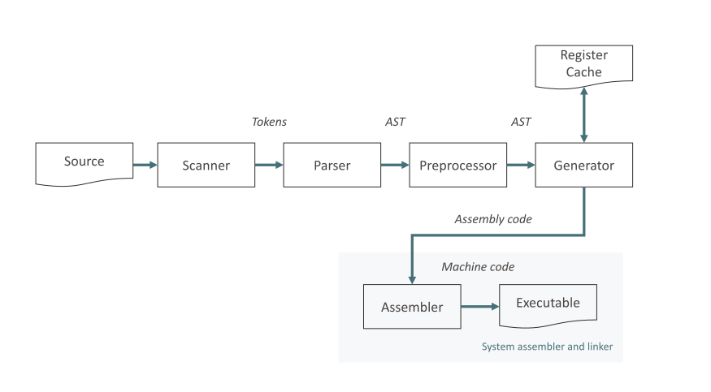
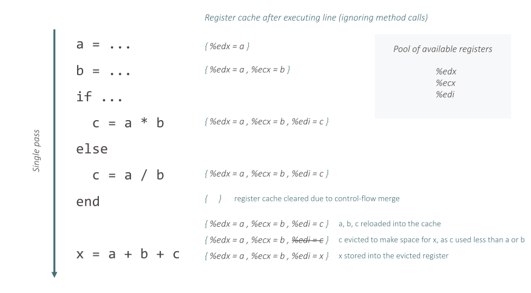

[Vidar Hokstad's](https://hokstad.com) Ruby compiler doesn't really have a name, so we'll refer to it as just *Hokstad*. This compiler is from the ongoing [Writing a compiler in Ruby, bottom up](https://hokstad.com/compiler) article series. It's bottom-up in that the design began with code generation and moved gradually towards higher-level Ruby.

Hokstad is an AOT native compiler for Ruby. It's a complete re-implementation of the language, with a runtime system entirely implemented in Ruby using a system that allows you to directly write snippets of the internal AST in Ruby source code. The internal AST includes operations not available in normal Ruby such as native calls and access to registers. It uses a custom parser for Ruby source code to their AST, runs a single lowering phase on the AST, and then runs a template compiler to emit assembly code as text which is passed to the system assembler and linker.

Compilation in Hokstad is pessimistic and static, all objects are heap-allocated, and it uses a virtual method table for method calls. It doesn't claim to be a significantly complete or high-performance implementation of Ruby and it doesn't apply any optimisations.

## Orientation

The Hokstad compiler source code is available at [our mirror](https://github.com/ruby-compiler-survey/hokstad/) or the [original repository](https://github.com/vidarh/writing-a-compiler-in-ruby/).

We're discussing Hokstad `052df9eee662`, 28 October 2019, which is the most recent commit as at 4 January 2020.

The entry-point to the compiler, `driver.rb` is a simple Ruby script and gives a good overview of the compilation pipeline. It loads a main file, creates the scanner and parser, parses to an AST `prog`, creates an assembly writer or `Emitter`, which it passes to a code generation visitor object or `Compiler`. The compiler runs in two phases - `preprocess`, which is a lowering phase, and `compile` which is a code generation phase. The assembly output is written directly to standard out in `compile`, so never exists complete in memory.

```ruby
s = Scanner.new(input_source)
parser = Parser.new(s)
prog = parser.parse
e = Emitter.new
c = Compiler.new(e)
c.preprocess(prog)
c.compile(prog)
```

<p class="coderef"><a href="https://github.com/ruby-compiler-survey/hokstad/blob/052df9eee662be6b24f448706297bb179e501732/driver.rb#L65-L77">driver.rb:65-77</a></p>

<figure>

</figure>

The parser and compiler lives in top-level files. Code is structured as mix-ins, with a `Compiler` class implemented across several different files such as [`compile_calls.rb`][hokstad-compile-calls] and [`compile_control.rb`][hokstad-compile-control], each grouping methods involved in compiling those parts of the language. Alongside that are some small supporting classes to model constructs in the Ruby language such as [functions and arguments][hokstad-function-arguments] or [name scopes][hokstad-name-scopes].

[hokstad-compile-calls]: https://github.com/ruby-compiler-survey/hokstad/blob/052df9eee662be6b24f448706297bb179e501732/compile_calls.rb
[hokstad-compile-control]: https://github.com/ruby-compiler-survey/hokstad/blob/052df9eee662be6b24f448706297bb179e501732/compile_control.rb
[hokstad-function-arguments]: https://github.com/ruby-compiler-survey/hokstad/blob/052df9eee662be6b24f448706297bb179e501732/function.rb
[hokstad-name-scopes]: https://github.com/ruby-compiler-survey/hokstad/blob/052df9eee662be6b24f448706297bb179e501732/scope.rb

The [core library directory][hokstad-core] contains the implementation of the Ruby core library in Ruby, containing AST snippets for low-level implementation not possible in standard Ruby.

[hokstad-core]: https://github.com/ruby-compiler-survey/hokstad/tree/052df9eee662be6b24f448706297bb179e501732/lib/core

There's no runtime code - nothing written in C or some other language - except for the garbage collector, which will be described later. There are [assembly snippets in the template compiler][hokstad-asm-snippets], but never more than a few instructions long.

[hokstad-asm-snippets]: https://github.com/ruby-compiler-survey/hokstad/blob/052df9eee662be6b24f448706297bb179e501732/compile_control.rb#L162-L187

There's no build system - it's just a Ruby program - but for development there is a `Dockerfile` and `Makefile` to automate some tasks. Hokstad isn't packaged as gem, but it could easily be and would have no runtime dependencies if it was. There is a `compile` front-end script but we don't use this as it's mainly there to use Docker for a 32-bit Linux environment. We simply run the whole thing in 32-bit Linux.

## Building and running

Hokstad can run in a standard Ruby interpreter, so there is no separate build step for the compiler itself. It takes Ruby source code files as input and writes [IA&#x2011;32](#ia-32) assembly code in AT&T syntax to standard output, which can be redirected to a file. This can be assembled to machine code and linked into an executable using `gcc`. `hokstad/tgc.c` is the garbage collector runtime that we'll describe later. This example shows using it on 32-bit system for simplicity. On a 64-bit system you may need to install additional libraries and compile using extra flags (the binary will still be 32-bit.)

We'll call Hokstad when running on the system Ruby interpreter `hokstad-1`.

```
% hokstad-1 fib.rb > fib.s
% gcc fib.s hokstad/tgc.c -o fib
% ./fib
832040
832040
832040
...
```

Hokstad aims to be *self-hosting*. This means that we can compile the Hokstad Ruby source code itself using `hokstad-1`, to produce a static executable binary which now does not need the system Ruby anymore, which we'll call `hokstad-2`.

```
% hokstad-1 -Ihokstad hokstad/driver.rb > hokstad-2.s
% gcc hokstad-2.s hokstad/tgc.c -o hokstad-2
```

```
% hokstad-2 fib.rb > fib.s
% gcc fib.s hokstad/tgc.c -o fib
% ./fib
832040
832040
832040
...
```

Can we iterate again, and use `hokstad-2` to produce `hokstad-3`? No, at this point we encounter bugs and `hokstad-2` fails.

We'll use these flags to help us understand what Hokstad is doing:

* `--parsetree` shows the AST before code generation
* `--notransform` stops the compiling from performing the AST transformation (a lowering phase described later)

More details on [building and running Hokstad](building.md) are available in the appendix.

## Front-end

Hokstad parses Ruby from source code using a hand-written lexer and recursive descent parser, coupled with operator precedence parsing with [the shunting yard algorithm](https://en.wikipedia.org/wiki/Shunting-yard_algorithm) for parsing expressions.

The output of the parser is an AST modelled using Ruby arrays and symbols, which you can view using the `--notransform --parsetree` options, here shown for `fib.rb`.

```
(defm fib (n) (
    (if
      (<= n 2)
      (do 1)
      (do
        (+ (call fib (
              (- n 1)))
           (call fib (
              (- n 2))))))))
```

This AST runs all the way through the compiler and is Hokstad's sole intermediate representation. Note that the AST doesn't include any typing information.

Hokstad effectively includes two front-ends - one which parses Ruby code, and one which parses their AST snippet language which is used for low-level functionaltiy in the core library. In the past during the bootstrap phase it had a third front-end - literal ASTs expressed directly as literal Ruby arrays.

## Core library

The core library in Hokstad is implemented in Ruby. High-level operations such as something like `Enumerable#select` use standard idiomatic Ruby.

```ruby
module Enumerable
  def select
    items = Array.new
    self.each do |item|
      if yield(item)
        items << item
      end
    end
    return items
  end
end
```

<p class="coderef"><a href="https://github.com/ruby-compiler-survey/hokstad/blob/052df9eee662be6b24f448706297bb179e501732/lib/core/enumerable.rb#L167-L175">lib/core/enumerable.rb:167-175</a></p>

Operations which cannot practically be written in Ruby such as memory allocation and arithmetic are implemented via compiler intrinsics. In Hokstand intrinsics are accessed by writing inline snippets of their AST format. AST snippets are written by writing `%s()` string, which is legal Ruby code so it does not confuse existing Ruby tooling, but it won't run on a standard implementation of Ruby.

Their AST has additional nodes than those you can express by writing Ruby code. In `Fixnum#+` a snippet is used which uses the additional internal `add` operation which reads the machine integer value from the `Fixnum` objects, using `@value` to read from self and calling the method `__get_raw` to get it from the other integer, and then performs a native addition. It calls `__int` to box that into an object.

```ruby
class Fixnum
  def + other
    %s(call __int ((add @value (callm other __get_raw))))
  end
end
```

<p class="coderef"><a href="https://github.com/ruby-compiler-survey/hokstad/blob/052df9eee662be6b24f448706297bb179e501732/lib/core/fixnum.rb#L85-L87">lib/core/fixnum.rb:85-87</a></p>

Support routines can be defined entirely in AST snippets out Ruby methods, which is how `__int` is defined.

```ruby
%s(defun __int (val)
    (let (num)
      (if (and (ge val 0) (lt val FixNum_cache_size))
        (do
          (assign num (add FixNum_cache (mul val 8)))
          (if (eq (index num 0) 0) (do
            (assign (index num 0) Fixnum)  # class-ptr
            (callm num __set_raw (val))
            (return num)
          ))
          (return num)
        )
      )
      (assign num (callm Fixnum allocate))
      (callm num __set_raw (val))
      (return num)
    )
  )
```

<p class="coderef"><a href="https://github.com/ruby-compiler-survey/hokstad/blob/052df9eee662be6b24f448706297bb179e501732/lib/core/fixnum.rb#L174-L192">lib/core/fixnum.rb:174-192</a></p>

AST snippets can call C functions from come from the C standard library, or from the garbage collector runtime that we link in such as `__alloc_mem`, in order to interface with the system. This snippet defines a function `__array` to allocate an array of integers which is a low-level building block in the core library.

```ruby
%s(defun __array (size)      (__alloc_mem  (mul size 4)))
```

<p class="coderef"><a href="https://github.com/ruby-compiler-survey/hokstad/blob/052df9eee662be6b24f448706297bb179e501732/lib/core/base.rb#L37">lib/core/base.rb:37</a></p>

Top-level AST snippets are also used to close the `Class` bootstrap problem, where the `class` or `Class` needs to be set to `Class`. This can't be done in Ruby as superclasses are set on class creation, and of course when creating `Class`, it's not available to use as its own superclass.

```ruby
%s(assign (index Class 0) Class)
```

<p class="coderef"><a href="https://github.com/ruby-compiler-survey/hokstad/blob/052df9eee662be6b24f448706297bb179e501732/lib/core/class.rb#L179">lib/core/class.rb:179</a></p>

## AST transformation

The AST transformation is a lowering phase, replacing high-level operations with lower-level operations, so that the code generation only needs to handle the smaller set of simpler low-level operations. One high-level operation may become several low-level operations.

You can see the effect of AST transformation by comparing a program between `--notransform --parsetree` and just `--parsetree`, here shown for `fib.rb`.

```
(defm fib (n) (
    (if
      (<= n 2)
      (do 1)
      (do
        (+ (call fib (
              (- n 1)))
           (call fib (
              (- n 2))))))))
```

```
(defm fib (n) (do
    (if
      (callm n <= ((sexp __I2)))
      (do (sexp __I1))
      (do
        (callm (call fib (
              (callm n - (
                  (sexp __I1))))) + (
            (call fib (
                (callm n - (
                    (sexp __I2)))))))))))
```

Integer literals have been replaced with references to actual cached integer objects, such as `__I1`, and operators have been replaced with explicit method calls, such as `a + b` to `(callm a + b)` (where `+` is now a method name, not an operator).

Transformation operates on the AST, searching the tree for recognised patterns and mutating them in-place. For example this transformation which finds values that meet the predicate `v.is_a?(Integer)` and replaces them with a reference to a cached integer object.

```ruby
  def rewrite_integer_constant(exp)
    @integers = Set[]
    exp.depth_first do |e|
      next :skip if e[0] == :sexp
      is_call = e[0] == :call || e[0] == :callm
      ex = e
      e.each_with_index do |v,i|
        if v.is_a?(Integer)
          if !@integers.member?(v)
            @integers << v
          end
          ex[i] = E[:sexp, int_name(v)]
          ex[i] = E[ex[i]] if is_call && i > 1
        end
      end
    end
  end
```

<p class="coderef"><a href="https://github.com/ruby-compiler-survey/hokstad/blob/052df9eee662be6b24f448706297bb179e501732/transform.rb#L122-L144">transform.rb:122-144</a></p>

## Code generation

Hokstad is a *template compiler*, meaning that for each operation in the transformed AST a compiler method generates a small sequence of assembly instructions, recursively calling compiler methods for child AST nodes as required to insert instructions into blank spaces in the template. This example (simplified to remove abstraction for clarity) shows compiling an addition with a template the recurses into the two operands and then emits the `addl` instruction.

```ruby
def compile_add(scope, left, right)
  src = compile_eval_arg(scope, left)
  dest = compile_eval_arg(scope, right)
  @e.addl(src, dest)
end
```

<p class="coderef"><a href="https://github.com/ruby-compiler-survey/hokstad/blob/052df9eee662be6b24f448706297bb179e501732/compile_arithmetic.rb#L15-L19">compile_arithmetic.rb:15-19</a></p>

In Hokstad the template compiler also performs some actions similar to the AST transformer dynamically, sometimes recursing into a synthesised sub-tree. This compile action for increment operations synthesises a `left.+(right)` sub-tree.

```ruby
def compile_incr(scope, left, right)
  compile_assign(scope, left, [:callm, left, :+, [right]])
end
```

<p class="coderef"><a href="https://github.com/ruby-compiler-survey/hokstad/blob/052df9eee662be6b24f448706297bb179e501732/compiler.rb#L294-L296">compiler.rb:294-296</a></p>

Code generation of control-flow branching is by emitting jump instructions to temporary labels which are allocated for the compiler by the emitter in `get_local` (local label, not local variable). As the output is assembly with labels (or we could say it is *symbolic*) generation of these forward branches can be in a single-pass - we don't need to know what the address of the target label before we can use it.

```ruby
def compile_if(scope, cond, if_arm, else_arm)
  res = compile_eval_arg(scope, cond)
  l_else_arm = @e.get_local + "_else"
  compile_jmp_on_false(scope, res, l_else_arm)
  ifret = compile_eval_arg(scope, if_arm)
  l_end_if_arm = @e.get_local + "_endif"
  @e.evict_all
  @e.jmp(l_end_if_arm) if else_arm
  @e.local(l_else_arm)
  @e.evict_all
  elseret = compile_eval_arg(scope, else_arm) if else_arm
  @e.evict_all
  @e.local(l_end_if_arm) if else_arm
  @e.evict_all
end
```

<p class="coderef"><a href="https://github.com/ruby-compiler-survey/hokstad/blob/052df9eee662be6b24f448706297bb179e501732/compile_control.rb#L76-L103">compile_control.rb:76-103</a></p>

Code generation of loops is by a helper method `loop` that supplies the block a `br` label to break out of the loop and a `l` label to return to the top of the loop.

```ruby
def compile_while(scope, cond, body)
  @e.loop do |br,l|
    var = compile_eval_arg(scope, cond)
    compile_jmp_on_false(scope, var, br)
    compile_exp(ControlScope.new(scope, br,l), body)
  end
end
```

<p class="coderef"><a href="https://github.com/ruby-compiler-survey/hokstad/blob/052df9eee662be6b24f448706297bb179e501732/compile_control.rb#L117-L125">compile_control.rb:117-125</a></p>

```ruby
def loop
  evict_all
  br = get_local
  l = local
  yield(br,l)
  evict_all
  jmp(l)
  local(br)
end
```

<p class="coderef"><a href="https://github.com/ruby-compiler-survey/hokstad/blob/052df9eee662be6b24f448706297bb179e501732/emitter.rb#L530-L538">emitter.rb:530-538</a></p>

The template compiler emits instructions via the `Emitter`, which is an assembly writer for IA&#x2011;32. `Emitter` doesn't actually contain methods for each instruction - as it emits text it can use `method_missing` and the name of the called method as the instruction name. For example when the compiler calls `@e.addl(4,:eax)`, there is not actually a method call `addl`.

```ruby
def method_missing(sym, *args)
  raise if sym == :reg
  emit(sym, *args)
end

def emit(op, *args)
  a = args.collect{ |a| to_operand_value(a) }.join(', ')
  puts "\t#{op}\t#{a}"
end
```

<p class="coderef"><a href="https://github.com/ruby-compiler-survey/hokstad/blob/052df9eee662be6b24f448706297bb179e501732/emitter.rb#L425-L445">emitter.rb:425-445</a></p>

## Local variables

Hokstad stores local variables initially either on the stack or in an *environment* object, which is itself stored in an `__env__` local variable. The environment is only used for local variables which are captured in blocks, and is allocated on the heap using `malloc`.

`capture.rb` shows the difference between `a` which is stored on the stack, and `b` which is stored in the environment because it is captured in the later block.

```
(defm capture () (
  (assign a value)
  (assign b value)
  (assign c (call value () (proc () (b))))
  (+ (+ a b) c)))
```

This transformation is applied during AST transformation, which replaces `(assign b value)` with `(assign (index __env__ 1) value)`, storing the value into the array element `__env__[1]`. The transformation also adds the code to allocate `__env__` using `__alloc_mem`, which we'll describe later.

```
(defm capture ()
  (let (a c __env__ __tmp_proc)
    (sexp (assign __env__ (call __alloc_mem (12))))
    (assign (index __env__ 2) __closure__)
    (assign a value)
    (assign (index __env__ 1) value)
    (assign c (call value () ... ))
    (callm (callm a + (
          (index __env__ 1))) + (c))))
```

When a local variable is on the stack storing it from `%eax` requires just one instruction.

```
  movl  %eax, -16(%ebp)
```

When a local variable is in the environment storing it from `%eax`, with the environment itself in `-20(%ebp)`, requires six instructions.

```
  pushl  %eax
  movl  -20(%ebp), %eax
  movl  %eax, %ecx
  addl  $4, %ecx
  popl  %eax
  movl  %eax, (%ecx)
```

## Method calls and virtual dispatch

As Hokstad does not do any type profiling or inference, a method call does not know which class it will be calling the method on. Most Ruby implementations implement the case where they have no type information available by looking up in a hash table of method names for a class.

```
object.class.method_hash[:my_method].call(...)
```

This is usually a slow fallback operation, but Hokstad are using it in all cases so they need it to be faster. Instead they use a *virtual table* in each class. A virtual table is simpler than a hash table - instead of method names as symbols they use integer IDs that are allocated consectively from zero upwards. We can allocate indicies in multiples of 4 so that they correspond to the byte address within an array of pointers.

```
MY_METHOD_ID = 0
ANOTHER_METHOD_ID = 4
SOME_OTHER_METHOD_ID = 8
...

object.class.virtual_table[MY_METHOD_ID].call(...)
```

In IA&#x2011;32 this can be implemented in two machine instructions.

```
  movl (%eax), %eax
  call *MY_METHOD_ID(%eax)
```

The object comes in stored in `%eax`. The `movl` instruction reads the class pointer from the object. In Hokstad the virtual table is stored inside the class object so that extra indirection is not needed. The second instruction adds `MY_METHOD_ID` to the class pointer in `%eax`, and then call the function found at that address.

The problem with this approach is that `MY_METHOD_ID` needs to be a valid offset in every virtual table, as there is no bounds check here. Classes that do not have a method with a name have that name's slot filled with a forward to `method_missing`. Every method also needs to have a unique ID. For a typical Rails application that may have tens of thousands of classes and unique method names, a gigabyte of memory could be needed just to store virtual tables.

The blog post on Hokstad's virtual tables suggests that some kind of analysis could be done to limit the virtual table to the most frequently called methods, and to use a hash-table lookup for others. As method names are known at conventional method calls, the two-instruction call could still be used for a method that is in the virtual table.

Hokstad has to maintain a hash-table of methods to method IDs even with the full virtual table, for `send` and `respond_to?` that take a dynamic method name. `send` looks up the method ID and then uses AST snippets to index into the virtual table and make the call. Interestingly, `respond_to?` looks up the method's address but then instead of calling it, it checks to see if the address is in them location as `method_missing`, and if so knows that the object does not respond to that name.

```ruby
def send obj,sym,*args
  sym  = sym.to_sym
  voff = Class.method_to_voff[sym]
  if !voff
    return obj.method_missing(sym, *args)
  else
    %s(assign raw (callm voff __get_raw))
    %s(callm obj (index self raw) ((splat args)))
  end
end
```

<p class="coderef"><a href="https://github.com/ruby-compiler-survey/hokstad/blob/052df9eee662be6b24f448706297bb179e501732/lib/core/class_ext.rb#L22-L35">lib/core/class_ext.rb:22-35</a></p>


```ruby
def respond_to?(method)
  # The vtable thunks make up a contiguous sequence of memory,
  # bounded by __vtable_thunks_start and __vtable_thunks_end
  m = Class.method_to_voff
  voff = m[method]
  return false if !voff
  %s(assign raw (callm voff __get_raw))
  %s(assign ptr (index (index self 0) raw))
  %s(if (lt ptr __vtable_thunks_start) (return true))
  %s(if (gt ptr __vtable_thunks_end) (return true))
  return false
end
```

<p class="coderef"><a href="https://github.com/ruby-compiler-survey/hokstad/blob/052df9eee662be6b24f448706297bb179e501732/lib/core/object.rb#L71-L84">lib/core/object.rb:71-84</a></p>

Hokstad uses a calling convention that we can see implemented in `Compiler#compile_args_nosplat`. `adj` is the space it needs to store the arguments, plus four words of padding. The caller subtracts `adj` from the stack pointer `%esp` to make space on the stack for all arguments (subtract because the stack grows downwards), and then moves them to the stack relative to the already adjusted `%esp`. The number of arguments are passed in `%ebx`. After the call the caller then restores the stack pointer to remove the arguments by adding `adj` back to `%esp`.

```ruby
adj = Emitter::PTR_SIZE * (args.length+4)
@e.subl(adj, :esp)
args.each_with_index do |a, i|
  param = compile_eval_arg(scope, a)
  @e.save_to_stack(param, i)
end
@e.movl(args.length, :ebx)
# call
@e.addl(adj, :esp)
```

<p class="coderef"><a href="https://github.com/ruby-compiler-survey/hokstad/blob/61cdff8f7e26fd23933d40dd2cd2e4e852114448/compile_calls.rb#L9-L46">compile_calls.rb:9-46</a></p>

This is the *C declaration* calling convention with the addition of using the normally callee-saved `%ebx` for the number of arguments. The `push` instruction, which modifies the stack pointer and loads to the stack in one operation that is optimised for by processor designers, is not used probably because this would require pushing arguments backwards on the stack, and this would effect the order of any side effects in arguments.

## Objects

Hokstad allocates all objects on the heap, using the system `calloc`. This is done via `Class#allocate`, which calls `__array`, which calls `__alloc_mem`, which uses the system `calloc` and notifies the garbage collector about the allocation using `tgc_add`, which will be described later. `#allocate` also stores the class in the first word in the object.

```ruby
class Class
  def allocate
    %s(assign ob (__array @instance_size))
    %s(assign (index ob 0) self)
    ob
  end
end

%s(defun __array (size)      (__alloc_mem  (mul size 4)))
%s(defun __alloc_mem (size)  (return (__alloc size 0)))
%s(defun __alloc (size opt)
  (let (ptr)
    (assign ptr (calloc size 1))
    (if (eq ptr 0) (return 0))
    (return (tgc_add ptr size opt))
  )
)
```

<p class="coderef"><a href="https://github.com/ruby-compiler-survey/hokstad/blob/61cdff8f7e26fd23933d40dd2cd2e4e852114448/lib/core/class.rb#L89-L97">lib/core/class.rb:89-97</a></p>

Instance variables are allocated within the object, following the class pointer. Each class maintains a hash of instance variables to their offsets in objects, and this can be per-class unlike the virtual table as instance variables are normally encapsulated in Ruby.

```ruby
def save_to_instance_var(arg, ob, aparam)
  movl(arg,"#{aparam.to_i*PTR_SIZE}(#{to_operand_value(ob)})")
end

def save_to_instance_var(arg, ob, aparam)
  movl(arg,"#{aparam.to_i*PTR_SIZE}(#{to_operand_value(ob)})")
end
```

The hash would need to be available at runtime, and some extension mechanism would be needed to support `instance_variable_get` and `_set`.

## Garbage collection

For garbage collection, Hokstad uses a modified version of the existing [Tiny Garbage Collector](https://github.com/orangeduck/tgc), which is itself based on the [Cello](http://libcello.org/learn/garbage-collection) garbage collector. It's a conservative, mark and sweep collector. `tgc_add` is the interface to the garbage collector, called by code compiled by Hokstad to ask it to manage an object which it has already allocated, and to collect unreachable objects if the allocation has gone above some threshold.

Earlier in development, before a garbage collector was added, `__array` just called `malloc` directly. If you don't need memory to be collected, you could use this and not require any runtime!

```ruby
%s(defun __array (size) (malloc (mul size 4)))
```

## Register allocation

For Hokstad's architecture as a template compiler the usual approach to register allocation is to always put the result of each operation into one known register - often called the *accumulator*, and perhaps use some other registers for simple known values such as *self*. Other registers would be *scratch* registers and only used within a template.

Hokstad augments this with a single-pass, incremental register allocator, that caches local variable reads and writes in available registers. Register allocation runs during code generation. After any argument or non-captured local variable read or write it will cache the value in a register. On subsequent reads it will read from the cache in the register if its still available.

This code shows `Compiler#get_arg`, which emits code to evaluate an expression `a`. If the expression is a local variable read, then emit code for that and then cache the value in a register, which is gotten from `Compile#cache_reg!`. This looks up if there is already a register allocated for this variable. If not it asks the allocator for a new variable, from `RegAlloc#cache_reg!`, which it gets from its list of free variable if there are any left. `Emitter#load_local_var` loads the value into the register.

```ruby
class Compiler
  def get_arg(scope, a, save = false)
    ...
    # If the expression is a local variable read...
    arg = scope.get_arg(a)
    reg = @e.cache_reg!(name, arg.first, arg.last, save)
    ..
  end
end
```

<p class="coderef"><a href="https://github.com/ruby-compiler-survey/hokstad/blob/61cdff8f7e26fd23933d40dd2cd2e4e852114448/compiler.rb#L122-L168">compiler.rb:122-168</a></p>

```ruby
class Emitter
  def cache_reg!(var, atype, aparam, save = false)
    reg = @allocator.cached_reg(var)
    ...
    return reg if reg
    ...
    reg = @allocator.cache_reg!(var)
    ...
    load_local_var(aparam,reg)
    return reg
  end

  def load_local_var(aparam, reg = result_value)
    movl(local_var(aparam), reg)
    return reg
  end
end
```

<p class="coderef"><a href="https://github.com/ruby-compiler-survey/hokstad/blob/61cdff8f7e26fd23933d40dd2cd2e4e852114448/emitter.rb#L341-L358">emitter.rb:341-358</a></p>

```ruby
class RegAlloc
  def cache_reg!(var)
    ...
    free = @free_registers.shift
    # If free is nil then no new register was available
    ...
  end
end
```

<p class="coderef"><a href="https://github.com/ruby-compiler-survey/hokstad/blob/61cdff8f7e26fd23933d40dd2cd2e4e852114448/regalloc.rb#L215-L240">regalloc.rb:215-240</a></p>

After calls and control-flow merges the entire cache is emptied. Individual registers are also removed from the cache when they're needed as a temporary.

```ruby
def compile_if(scope, cond, if_arm, else_arm = nil)
  ...
  # At the moment, we're not keeping track of exactly what might have gone on
  # in the if vs. else arm, so we need to assume all bets are off.
  @e.evict_all
  ...
end
```

<p class="coderef"><a href="https://github.com/ruby-compiler-survey/hokstad/blob/61cdff8f7e26fd23933d40dd2cd2e4e852114448/compile_control.rb#L76-L103">compile_control.rb:76-103</a></p>

The register allocator does use one heuristic - the number of static times a variable is used, which Hokstad calls the *frequency*. This is counted during AST transformation and used to evict the least-used variable from the cache when a new register is required. This doesn't take into account whether it's actually used after the current point in the program.

On IA&#x2011;32 the only registers Hokstad actually has available after reserving some for things like `self` are `edx`, `ecx`, and `edi`. Register allocation is much more significant on the AMD64 architecture where there are more registers.

<figure>

</figure>

This diagram shows the principle of the register allocation algorithm, but due to method call boundaries it's hard to see it this clearly in practice. As each local variable is assigned the value is cached in a register. When control flow merges at the end of the `if` block the cache is emptied and the local variables have to be reloaded, and put back into the cache, for the next statement. A fourth local variable is assigned, which exceeds the three available registers, so the least frequently used, `c`, is evicted and `x` is stored in that vacated register.

## Evaluation

Hokstad's compilation of **`fib.rb`** shows us how almost everything is a call in Ruby unless you perform inlining. Apart from the `if` branch, this method is just calls. For `n <= 2` for example we can see the call to the virtual table entry for `#<=`.

```
  subl  $28, %esp             # create space on the stack for arguments
  # load self...
  # load n...
  # load 2...
  movl  $3, %ebx              # we're passing three arguments
  movl  (%esp), %esi          # load self back off the stack where we loaded it
  movl  (%esi), %eax          # get the virtual table of the class of self
  call  *__voff____le(%eax)   # make the call via the virtual table
  addl  $4, %ebx
  sall  $2, %ebx
  addl  %ebx, %esp             # restore the size of the stack
```

Most of the generated code is these sequences of calls - the actual arithmetic of the `fib` function is not present here - the arithmetic instructions are all in other individual methods which we call. The actual `cmp` instruction that `fib` uses is found in `__method_Fixnum___le`.

```
  cmpl  %eax, %edi    # compare a and b
  setle %al           # set %al to whether a is less than or equal to b
  movzbl  %al, %eax   # convert the byte to a full word
```

The control flow logic is visible though. The return value of `#<=` is in `%eax`. It's compared against `nil` and `false` which are constants, both times jumping to the `else` branch if they're equal. If not it runs the `then` branch and jumps over the `else` branch.

```
  cmpl  %eax, nil
  je  .L2398_else
  cmpl  %eax, false
  je  .L2398_else
  # then branch...
  jmp .L2399_endif
.L2398_else:
  # else branch...
.L2399_endif:
```

**`area.rb`** fails to compile due to missing support for floating point numbers.

**`sum-simple.rb`** shows us a loop. The top of the loop is labelled, then the condition comes and we jump out of the loop if it fails. Then we have the body of the loop, and a jump back to the top.

```
.L2399:
  # condition...
  cmpl  %eax, nil
  je  .L2398          # jump out of loop
  cmpl  %eax, false
  je  .L2398          # jump out of loop
  # body...
  jmp  .L2399
.L2398:
```

**`sum-block.rb`** shows us the limitation of not inlining again. Like how the actual arithmetic operations were not found in the code for `fib`, the loop and its body are not found in `sum` when `Array#each` is used. Instead we just have a call to `#each`, passing it the address of the code for the block which is compiled as a separate method with the synthetic name `__lambda_L108`, wrapped up as a `Proc` object. The code generated for `Array#each` then actually contains the loop.

```
  movl  $__lambda_L108, %eax
  ...
  call  __new_proc
  ...
  call  *__voff__each(%eax)
```

**`point.rb`** works. The allocation of the `Point` object isn't visible in the code for `create_point` - it calls `#new`, which calls `#allocate`, which calls `__array`, which calls the system `calloc`, which returns it to `#initialize` to load the field.

```
__method_Object_create_point:
  ...
  call  *__voff__new(%eax)
  ...

__method_Class_new:
  ...
  call  *__voff__allocate(%eax)
  ...

__method_Class_allocate::
  ...
  call  __array
  ...

__array:
  ...
  call  __alloc_mem
  ...

__alloc_mem:
  ...
  call  __alloc
  ...

__alloc:
  ...
  call  calloc
  ...
  call  tgc_add
  ...
```

This is a pretty deep stack - seven calls to the just reach the system allocator interface!

Loading the two fields and storing them into the `Point` object is just a write to an offset in the object.

```
  # load the Point instance into %esi
  # load x into %edi
  movl  %edi, 4(%esi)
  # load y into %ecx
  movl  %ecx, 8(%esi)
```

The `point_point` code just calls `to_s`.

**`monkey.rb`** works and doesn't generate different code for the `multiply` than the unpatched version - the only thing that changes is the entry in the virtual table for `Integer#*`. This shows a real benefit of the virtual table approach - the same code works before and after monkey patching.

**`capture.rb`** shows Hokstad trying to determine which local variables need to be stored in the environment and which can be stored in local variables but this is unfrotunately incorrect. This could be demonstrated using `capture-meta.rb`, but Hokstad does not support `Proc#binding` which this example uses to show the problem.

Hokstad does not have `Array#min`, so a simple version of this method was added to **`canary.rb`** in order to run it.

```ruby
class Array
  def min
    min = first
    each do |e|
      min = e if e < min
    end
    min
  end
end
```

As with many of the other example, `canary` just compiles to a method call to `#min`. The program runs correctly, but it isn't passing the canary test as it isn't being compiled to code equivalent to `a < b ? a : b`.

```
  call  *__voff__min(%eax)
```

**`render.rb`** fails to compile - the standard library is not available and Hokstad does not support `eval` anyway.

## History

Hokstad was started in 2008, although there are references to earlier unreleased prototypes. The project was built through a serious of blog posts published between 2008 and 2015, although small contributions to the code have continued since.

## Commentary

Hokstad is a simple compiler that's able to compile a surprisingly large part of the Ruby language given how little code it involves.

The inline AST snippets are an interesting approach - richer than the primitives of Rubinius or TruffleRuby.

Hokstad applies some optimisations which are not sound in standard Ruby, such as not capturing local variables not statically referenced in blocks. This makes it seem like statically compiling Ruby is more simple than it actually is. However if this was fixed with no inlining this would leave a lot of variables allocated on the heap.

Inlining would be needed to expose more of the program to optimisation, such as removing the heap-allocated environment objects and enabling optimisation of arithmetic. This would have to be speculative so a system of fast-path and fallback would need to be added and some kind of type analysis phase. Hokstad does not pass the *canary test* due to none of these optimisations being possible.

Hokstad was the work of a talented amateur and it's impressive how much has been achieved and the volume of notes written on its development. It'd be great if the project was packaged as a gem and promoted more - there are many opportunities for little interesting contributions at this stage and the basic approach could possibly work to run Real Ruby applications even without additional optimisations.

## Corporate support

Hokstad hasn't received any corporate support.

## Building and running

See the [appendix on building and running Hokstad](building).
