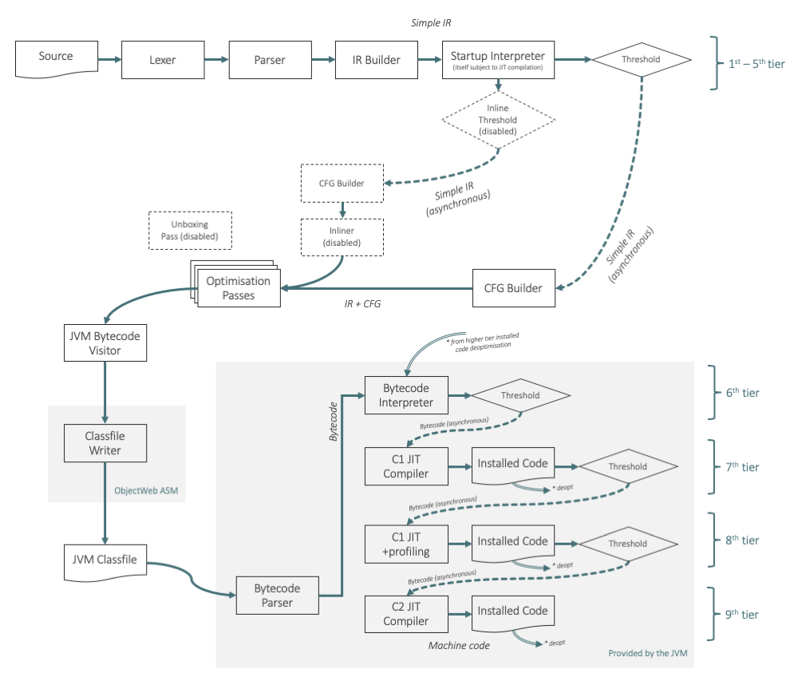

JRuby is an implementation of Ruby written in Java and running on the JVM. It's a complete re-implementation of the language, core library, some of the standard library and wider ecosystem, and started as an interpreter somewhat directly translated from the MRI C code. JRuby's JIT emits JVM classes and bytecode in-memory using the ASM library, which may then be compiled to native machine code by the JVM's existing powerful JIT compilers for Java. Translation from Ruby to JVM bytecode is via an intermediate representation with a CFG of basic blocks of linear register-transfer instructions, upon which high-level optimisations using knowledge of Ruby semantics are performed. This IR is also used for interpretation. Profiling is conducted both by JRuby on the IR and other runtime structures, and also then by the JVM on the generated bytecode.

As both the compiled Ruby code and runtime code and extension libraries are available as JVM bytecode, the JVM is able to then inline between these levels. However restricting to languages that can conventionally compile to bytecode means that JRuby does not support C extensions.

JRuby is significant within the JVM ecosystem, as the `invokedynamic` instruction and associated framework was added to the JVM specifically to improve the performance of JRuby. JRuby was the only significant user of `invokedynamic` until the Nashorn JavaScript implementation and then use in Java itself for implementing lambdas. However the use of `invokedynamic` for Ruby method calls is still not enabled by default in JRuby today. We have enabled it in most of our discussion below as it shows JRuby at its best in terms of optimisations and generated code, with an overhead in warmup time.

JRuby is likely the only Ruby JIT that has ever had significant use in production.

## Orientation

The JRuby source code is available at [our archive](https://github.com/ruby-compiler-survey/jruby) or the [original repository](https://github.com/jruby/jruby).

We're discussing JRuby 9.2.9.0, `458ad3ed9cdb`, 30 October 2019, which is the latest release as at 3 February 2020. JRuby by default will compile the entire entry-point script on load. This makes it hard to understand the compilation of individual methods, the effect of profiling, and things like compilation threshold. This feature cannot be disabled with an option, so we turn it off by patching the source code.

JRuby is usable on many different implementations of the JVM. In order for us to be able to talk in concrete terms, we're going to explain JRuby in the context of running on OpenJDK 8 (HotSpot). This JVM is the default in this version of JRuby's CI system and in practice is probably the platform that most people will be running JRuby on. We're also going to enable JRuby's `invokedynamic` support, even though this is not the default, in order to show JRuby's compiler in its most sophisticated configuration.

<figure>

</figure>

JRuby parses Ruby code to an AST, and then to an intermediate representation of linear instructions simply called the *IR*, which is interpreted. When a threshold is reached, the IR is transformed to create additional structure and to optimise it. JRuby translates this transformed IR to JVM bytecode in-memory, and then switches to executing the resulting methods, which are effectively synthesised Java code.

The compilation pipeline continues inside the JVM with the generated bytecode as it would for any other JVM bytecode such as a Java or Scala program. Initially the bytecode runs in an interpreter, but on meeting another threshold it is compiled to native machine code by the C1 compiler, also known as the *client* compiler, which performs simple optimisations and is designed to produce reasonable machine code reasonably quickly. When a final threshold is reached it is compiled again by the C2 compiler, also known as the *server* or *opto* compiler, which performs more powerful optimisations and is tuned to produce the best quality machine code.

C2 can be replaced with Graal, which is another JVM compiler used by TruffleRuby, and so discussed in more depth there. We'll also talk about how JRuby has been experimenting with Graal in the history section below.

The JVM can deoptimise from code produced by C1 and C2, back to the JVM bytecode, and in some sense back to the JRuby IR. We'll discuss this when talking about deoptimisation.

JRuby is unusual in that it involves at least nine identifiable execution tiers. There is the IR interpreter, generated JVM bytecode running in the JVM interpreter, bytecode compiled by the C1 compiler, bytecode compiled by the C2 compiler, and some more subtle configurations we'll describe later.

## Building and running

JRuby is easy to build using standard Java ecosystem tools. We don't need to do much more than install a JDK and Maven and run `mvn`. This will give you a `bin/ruby` command.

We'll JRuby run with `-Xcompile.invokedynamic` to enable more extensive use of the `invokedynamic` instruction.

We'll use these flags to help us understand what the JRuby JIT is doing:

* `-Xjit.logging` to show when the JRuby (Ruby to JVM bytecode) JIT is running
* `-Xir.print` to print full IR when it is JIT compiled to JVM bytecode
* `-Xir.print.all` to print all IR, including simple IR for the first tier of interpretation
* `-Xir.print.opt` to print all IR as it is optimized (added in a patch)
* `-Xir.inliner.verbose` to print inlining decisions
* `-Xcompile.dump` to show the bytecode output from the JIT
* `-J-XX:+PrintCompilation` to show when the JVM (JVM bytecode to machine code) JIT is running
* `-J-XX:CompileCommand=print,*::*foo*` to print the disassembly of `foo`
* `-J-XX:CompileCommand=dontinline,*::*` to disable JVM inlining so that methods are more understandable

We'll use the separate `ast` command to print JRuby's AST.

## Frontend

JRuby uses a modified parser from MRI, with the lexer translated to Java, and the parser itself compiled using a port of Berkeley Yacc to Java. The parser directly creates Java objects representing the AST. Here we show the simplified AST for `fib.rb`.

```
AST:
    DefnNode:fib 0
      ArgsNode 0
          ArgumentNode:n 0
      IfNode 1
        CallNode:<= 1
          LocalVarNode:n 1
          ArrayNode 1
            FixnumNode 1
        FixnumNode 2
        CallNode:+ 4
          FCallNode:fib 4
            ArrayNode 4
              CallNode:- 4
                LocalVarNode:n 4
                ArrayNode 4
                  FixnumNode 4
          ArrayNode 4
            FCallNode:fib 4
              ArrayNode 4
                CallNode:- 4
                  LocalVarNode:n 4
                  ArrayNode 4
                    FixnumNode 4
```

The AST includes a few methods for limited transformations, such as negating a numeric value, but these are used just during construction. In the past this AST was also used for interpretation and compilation, which we'll describe later, but this is not the case any more.

For interpretation and compilation, JRuby translates the AST to its own data structure, called the *intermediate representation* or IR. We could describe it as a bytecode format, but don't confuse it with JVM bytecode. JRuby's IR is a *register-transfer* language, or RTL, meaning that instructions take operands from and write results to a set of temporary variables.

The IR for `fib.rb` is more verbose than the equivalent YARV bytecode in MRI. This is partly because it uses named temporary variables instead of an implicit stack, with expressions such as `%v_6 :=` assigning a temporary. Also some logic which is implicit in YARV, like receiving `self` and checking the arity of the method against the supplied arguments, are made explicit in JRuby. Note that labels are represented in the same way as instructions.

```
INFO MixedModeIRMethod : Printing simple IR for fib:
begin INSTANCE_METHOD<fib>
flags: [FLAGS_COMPUTED]
signature(pre=1,opt=0,post=0,rest=NONE,kwargs=0,kwreq=0,kwrest=-1)
declared variables:
  n(0:0)

  00:           %self := recv_self
  01:            %v_0 := load_implicit_closure
  02:  %current_scope := copy(scope<>)
  03: %current_module := copy(mod<0>)
  04:                    check_arity(required: 1, ...)
  05:              *n := recv_pre_reqd_arg(argIndex: 0)
  06:                    line_num(lineNumber: 1)
  07:            %v_3 := call_1f(*n, fix<2>, fixNum: 2, name: <=, ...)
  08:                    b_false(ipc<LBL_0:13>, %v_3, jumpTarget: LBL_0:13, value: %v_3)
  09:                    line_num(lineNumber: 2)
  10:            %v_4 := copy(fix<1>)
  11:                    jump(ipc<LBL_1:21>)
  12:                    label(ipc<LBL_0:13>)
  13:                    line_num(lineNumber: 4)
  14:            %v_6 := call_1f(*n, fix<1>, fixNum: 1, name: -, ...)
  15:            %v_5 := call_1o(self<%self>, %v_6, name: fib, ...)
  16:            %v_9 := call_1f(*n, fix<2>, fixNum: 2, name: -, ...)
  17:            %v_8 := call_1o(self<%self>, %v_9, name: fib, ...)
  18:            %v_7 := call_1o(%v_5, %v_8, name: +, ...)
  19:            %v_4 := copy(%v_7)
  20:                    label(ipc<LBL_1:21>)
  21:                    return(%v_4)
```

An interesting design point of the JRuby IR is that the set of things that can be an operand to an instruction is quite rich. For example instead of loading a literal `Integer` value into a temporary variable in one instruction and then using the temporary variable as an operand to a subsequent instruction, the literal value can directly be an operand to the instruction using it. Even expressions as complex as an `Array` or `Hash` literal can be expressed directly as operands. For example the array literal in `canary.rb` is created as a single operand `ary<*a, *b>` (the `copy` instruction copies a value, it doesn't create a new copy of an object.)

```
  05:              *a := recv_pre_reqd_arg(argIndex: 0)
  06:              *b := recv_pre_reqd_arg(argIndex: 1)
 ...
  08:            %v_3 := copy(ary<*a, *b>)
```

These operands don't nest, however, and if we were to write `[[a, b], c]` we'd get two instructions with `ary` operands.

```
  05:              *a := recv_pre_reqd_arg(argIndex: 0)
  06:              *b := recv_pre_reqd_arg(argIndex: 1)
  07:              *c := recv_pre_reqd_arg(argIndex: 2)
...
  09:            %v_3 := copy(ary<*a, *b>)
  10:            %v_4 := copy(ary<%v_3, *c>)
```

Other interesting features of the IR include that it is serialisable and it can be dumped for visualisation. Unfortunately the format dumped isn't supported by currently available versions of the *Ideal Graph Visualizer* (IGV) tool.

## Interpreter and profiling

Interpretation is normally done using a simple loop over IR instruction objects in `StartupInterpreterEngine`.

```java
while (ipc < n) {
    Instr instr = instrs[ipc];
    Operation operation = instr.getOperation();
    switch (operation.opClass) {
        case ARG_OP:
            receiveArg(...);
            break;
        case CALL_OP:
            processCall(...);
            break;
        case RET_OP:
            return processReturnOp(...);
        case BRANCH_OP:
            switch (operation) {
                case JUMP:
                    JumpInstr jump = ((JumpInstr)instr);
                    ipc = jump.getJumpTarget().getTargetPC();
                    break;
                default:
                    ipc = instr.interpretAndGetNewIPC(....);
                    break;
            }
            continue;
        case OTHER_OP:
            processOtherOp(...);
            break;
    }
    ipc++;
}
```

This loop handles some instruction types such as calls and simple jumps inline, but most instructions are executed from a `switch` in another method, or by calling an interpret method. For example the `BNilInstr` branches if the operand is `nil`.

```java
@Override
public int interpretAndGetNewIPC(..., int ipc) {
    Object value1 = getArg1().retrieve(context, self, currScope, currDynScope, temp);
    return value1 == context.nil ? getJumpTarget().getTargetPC() : ipc;
}
```

The `getArg1()` call return a logical operand object, which can be used to get the actual value of the operand. A literal operand would just return a value, but a local variable or IR temporary name would read from the context. The rich operands that we described in the previous section mean that you may need to dispatch again for the type of operand, which is fairly unusual in interpreters.

While the interpreter runs profiling information is gathered. In JRuby this is primarily done at the level of the call site. Call sites are represented as Java objects. A simple `MonomorphicCallSite` has a single cache entry and rewrites on a miss. Ruby classes have a *generation number*. Each class, module, or modification of one of those, gets a unique number. The cache check compares the generation number against what was cached. This number can overflow in a long-running application.

```java
if (cache.typeOk(selfType)) {
    return cache.method.call(context, self, cache.sourceModule, methodName, arg1);
}
return cacheAndCall(caller, selfType, context, self, arg1);
```

A `BimorphicCallSite` can do bimorphic caching but it is only used to build call sites specialised for common methods, for example `PlusCallSite`, `MulCallSite`. These calls site have logic inline for these methods on `Fixnum` and `Float` types, and are bimorphic so they can handle both types in the fast path.

```java
if (self instanceof RubyFixnum) {
    CacheEntry cache = this.cache;
    if (cache instanceof FixnumEntry && cache.typeOk(getMetaClass(self))) {
        return ((RubyFixnum) self).op_plus(context, arg1);
    }
} else if (self instanceof RubyFloat) {
    CacheEntry cache = this.secondaryCache;
    if (cache instanceof FloatEntry && cache.typeOk(getMetaClass(self))) {
        return ((RubyFloat) self).op_plus(context, arg1);
    }
}
return super.call(context, caller, self, arg1);
```

There are more specialised call sites for things like `respond_to?`. There isn't a general polymorphic call site class.

These call site objects aren't just used from user code - they're also used where the Ruby core library implemented in Java needs to make a call. For example if you have a subclass of `Numeric` that does not have its own `%` operator, `Numeric` implements it for you as `a - b * a.div(b)`. So the implementation of `%` needs to make three calls back into arbitrary Ruby code, but when a Java method needs a call site object where does it store it? It can't create one per call, as that would defeat the purpose of caching. In JRuby this is solved by having a global library of call sites in `JavaSites`. For the `Numeric#%` example, JRuby uses `JavaSites.NumericSites.div`/`op_times`/`op_minus`, so you can see that it tries to split up the call sites, these only being used for `Numeric` methods, but they're still vulnerable to contention, pollution and megamorphisation.

We'll talk about profiling a bit more when we talk about inlining during IR optimisation, later.

## Compilation threshold

Methods maintain a call count which is incremented for each interpreter call. The threshold is set at relatively low default of 50 calls. When the threshold is met the method is submitted for compilation.

```java
if (self.callCount < 0) return;
// we don't synchronize callCount++ it does not matter if count isn't accurate
if (self.callCount++ >= runtime.getInstanceConfig().getJitThreshold()) {
    synchronized (self) { // disable same jit tasks from entering queue twice
        if (self.callCount >= 0) {
            self.callCount = Integer.MIN_VALUE; // so that callCount++ stays < 0
            runtime.getJITCompiler().buildThresholdReached(context, self);
        }
    }
}
```

The compiler has a background pool of two threads and the interpreter continues after submitting the compilation task.

## Optimisation as IR

On a background compilation thread, JRuby now optimises the method's IR by annotating it and applying a series of compilation passes. The annotations include finding basic blocks from the linear sequence of instructions and building a control-flow graph.

The control flow graph of basic blocks is built from a linear pass of the instructions, dividing them into blocks and connecting the blocks as it goes.

```java
for (Instr i: instrs) {
    Operation iop = i.getOperation();
    if (iop == Operation.LABEL) {
        Label l = ((LabelInstr) i).getLabel();
        newBB = createBB(l, nestedExceptionRegions);
        // Jump instruction bbs dont add an edge to the succeeding bb by default
        if (nextBBIsFallThrough) graph.addEdge(currBB, newBB, EdgeType.FALL_THROUGH);
        currBB = newBB;
        bbEnded = false;
        nextBBIsFallThrough = true;

        // Add forward reference edges
        List<BasicBlock> frefs = forwardRefs.get(l);
        if (frefs != null) {
            for (BasicBlock b : frefs) {
                graph.addEdge(b, newBB, EdgeType.REGULAR);
            }
        }
    } else if (bbEnded && iop != Operation.EXC_REGION_END) {
        newBB = createBB(nestedExceptionRegions);
        // Jump instruction bbs dont add an edge to the succeeding bb by default
        if (nextBBIsFallThrough) graph.addEdge(currBB, newBB, EdgeType.FALL_THROUGH); // currBB cannot be null!
        currBB = newBB;
        bbEnded = false;
        nextBBIsFallThrough = true;
    }

    if (iop.endsBasicBlock()) {
        bbEnded = true;
        currBB.addInstr(i);
        Label tgt = null;
        nextBBIsFallThrough = false;
        if (i instanceof BranchInstr) {
            tgt = ((BranchInstr) i).getJumpTarget();
            nextBBIsFallThrough = true;
        } else if (i instanceof MultiBranchInstr) {
            Label[] tgts = ((MultiBranchInstr) i).getJumpTargets();
            for (Label l : tgts) addEdge(currBB, l, forwardRefs);
        } else if (i instanceof JumpInstr) {
            tgt = ((JumpInstr) i).getJumpTarget();
        } else if (iop.isReturn()) { // BREAK, RETURN, CLOSURE_RETURN
            tgt = null;
            returnBBs.add(currBB);
        } else if (i instanceof ThrowExceptionInstr) {
            tgt = null;
            exceptionBBs.add(currBB);
        } else {
            throw new RuntimeException("Unhandled case in CFG builder for basic block ending instr: " + i);
        }

        if (tgt != null) addEdge(currBB, tgt, forwardRefs);
    } else if (iop != Operation.LABEL) {
        currBB.addInstr(i);
    }
}

```

For `fib.rb` it produces these five blocks - block `#1` and `#6` appear redundant, but may special entrance and generic exit blocks.

```
block #1 (out: 6,2): LBL_2:-1

block #2 (out: 3,4): LBL_3:-1
  0:   %self := recv_self
  1:            check_arity(required: 1, .)
  2: %t_n_10 := recv_pre_reqd_arg(argIndex: 0)
  3:            line_num(lineNumber: 1)
  4:    %v_3 := call_1f(%t_n_10, fix<2>, fixNum: 2, name: <=, ...)
  5:            b_false(ipc<LBL_0:13>, %v_3, jumpTarget: LBL_0:13, value: %v_3)

block #3 (out: 6): LBL_4:-1
  0:            line_num(lineNumber: 2)
  1:            return(fix<1>)

block #6: LBL_5:-1
  0:            return(nil<>)

block #4 (out: 6): LBL_0:13
  0:            line_num(lineNumber: 4)
  1:    %v_6 := call_1f(%t_n_10, fix<1>, fixNum: 1, name: -, ...)
  2:    %v_5 := call_1o(self<%self>, %v_6, name: fib, ...)
  3:    %v_9 := call_1f(%t_n_10, fix<2>, fixNum: 2, name: -, ...)
  4:    %v_8 := call_1o(self<%self>, %v_9, name: fib, ...)
  5:    %v_7 := call_1o(%v_5, %v_8, name: +, potentiallyRefined: false)
  6:            return(%v_7)
```

Default optimisations are:

* **Local optimisation**, which does peep-home replacement of individual instructions with simpler equivalents, such as replacing a `ToAry` instruction on an `Array` literal with a direct reference to the array
* **Dead code elimination,** which locally removes side-effect-free instructions that generate results that are not used
* **Optimise dynamic scopes**, which turns local variables, which are stored on the heap in case the frame escapes, into temporaries, which are stored in JVM local variables when JVM bytecode is generated - but this optimisation is [unsound](https://gist.github.com/headius/5758887) with `Binding.of_caller` as there is no way to retrieve JVM local variables from outside an activation
* **Optimise delegation**, which limits the need for reifying blocks
* **Add call protocol instructions**, which makes handling the frame stack explicit so that it can be optimised
* **Add missing inits**, which ensures local variables are always initialised, if they have been left uninitialised by earlier optimisations

The JRuby IR when annotated with the CFG provides a powerful base to build optimisations that are specific to Ruby's semantics and would not be applied by the JVM's optimiser when lowered to bytecode. There's two further optimisations which use this that demonstrate the potential, unboxing and inlining.

### Unboxing

JRuby boxes primitives so that they can be passed as an `Object`. It uses its own boxes rather than the Java boxes, so a small Ruby `Integer` is a `RubyFixnum` object, and a Ruby `Float` is a `RubyFloat`. Like Java, there's a cache for common values, with `0` for `RubyFloat` and a small range for `RubyFixnum`. JRuby normally boxes everywhere, but there is an IR optimisation pass to remove the boxing.

Using `-Xir.print.opt` we can see how it works. We're going to use some fairly contrived code to illustrate a few points.

```ruby
def unbox(a)
  1 + 2 + a
end
```

When we compile this without the unboxing pass the calls are through generic call instructions, `call_` (and then with an arity and argument type suffix.) You result of the first call instruction can be fed straight into another call as the receiver, and the result of the second can be simply returned.

```
check_arity(;req: 1, opt: 0, *r: false, kw: false)
%t_a_5 = recv_pre_reqd_arg(;i:0)
line_num(;n: 1)
%v_3 = call_1f(Fixnum:1, Fixnum:2 ;n:+, t:NO, cl:false)
%v_4 = call_1o(%v_3, %t_a_5 ;n:+, t:NO, cl:false)
return(%v_4)
```

When we run the unboxing pass the `1 + 2` can be run unboxed. The operands are now `UnboxedFixnum` rather than `Fixnum`, and instead of the first call instruction we have an unboxed primitive operation, `iadd`. This is also effectively inlining `Integer#+` at the same time. The second `+` operation stays as a full `call_` instruction as the type of `a` coming into the method is not known (JRuby does not profile the types of arguments) and to use the unboxed result of the first `+` as a receiver, we now have a new `box_fixnum` instruction.

```
check_arity(;req: 1, opt: 0, *r: false, kw: false)
%t_a_5 = recv_pre_reqd_arg(;i:0)
line_num(;n: 1)
%i_0 = iadd(UnboxedFixnum:1, UnboxedFixnum:2)
%v_3 = box_fixnum(%i_0)
%v_4 = call_1o(%v_3, %t_a_5 ;n:+, t:NO, cl:false)
return(%v_4)
```

We can already see how calls severely limit the unboxing here. As almost everything is a call in Ruby, unboxing only goes so far without extensive inlining to support it. If we try the unboxing pass on `sum-simple.rb` we can see that the iteration variable `n` is increment in an unboxed format, but then is reboxed on every iteration to compare against `size`.

```
BB [3:_LOOP_BEGIN_0:14] -FALL_THROUGH->4 -REGULAR->6 -EXCEPTION->9
	%t_n_8 = box_fixnum(%i_1)
	%v_4 = call_1o(%t_n_8, %t_size_9 ;n:<, t:NO, cl:false)
	b_false(LBL_4:26, %v_4)
	
...
	
BB [4:_ITER_BEGIN_2:17] -REGULAR->3 -EXCEPTION->9
	thread_poll()
	line_num(;n: 5)
	%v_5 = call_1o(%t_array_6, %t_n_8 ;n:[], t:NO, cl:false)
	%t_sum_7 = call_1o(%t_sum_7, %v_5 ;n:+, t:NO, cl:false)
	line_num(;n: 6)
	%i_1 = iadd(%i_1, UnboxedFixnum:1) # increment n
	%i_0 = unbox_fixnum(%t_sum_7)
	jump(_LOOP_BEGIN_0:14)
```

The unboxing optimisation is disabled by default - you need to enable it with `-Xir.unboxing`. We'll explain why it's disabled when we talk about deoptimisation later. Keep in mind the JVM's compiler may later unbox with or without this optimisation pass anyway.

### Inlining

JRuby has an interesting experimental inlining mechanism, where when an inlinable call site reaches a threshold of 20 consecutive monomorphic cache hits, the call site triggers compilation of the outer method, with that particular call site only inlined. Inlining isn't a separate compilation pass that reads cache profiles - it's a separate trigger to compilation. The threshold is also implemented in an interesting way - checking that the count is a multiple of the threshold rather than exceeding it. This may be to support deoptimisation without having to zero the counter.

```java
if (cache.typeOk(selfType)) {              // if the cache hits
    if ((totalMonomorphicCalls++ % IRManager.IR_INLINER_THRESHOLD) == 0)
      inlineCheck(context, self, cache);   // inline and compile the outer method
    return cache.method.call(context, self, cache.sourceModule, methodName);
} else {
    totalMonomorphicCalls = 1;             // reset the monomorphic call counter on a miss, making the counter only for consecutive calls
    return cacheAndCall(caller, selfType, context, self);
}
```

JRuby's experimental inlining is currently only set up to work with method calls with an explicit receiver, and there is a hard-coded heuristic for it to only work with method calls that pass a literal block but we removed that heuristic in a patch.

```ruby
class Bar
  def bar
    14
  end
end

def foo(bar)
  bar.bar
end
```

We can see the return value `14` of `bar` inlined into `foo`, and also the resulting mix of line numbers in a single method. First we see that the `ProfilingCachingCallSite` has met the threshold logic described above. and that it will inline a call from `foo` to `bar`. Then we see the IR of `foo` with a conventional call to `bar`. Then it reports success and we see the resulting IR.

```
INFO ProfilingCachingCallSite : PROFILE: INSTANCE_METHOD foo[inline.rb:6]<startup> -> INSTANCE_METHOD bar[inline.rb:1]<startup> - 21

...

	check_arity(;req: 1, opt: 0, *r: false, kw: false)
	%t_bar_4 = recv_pre_reqd_arg(;i:0)
	line_num(;n: 7)
	%v_3 = call_0o(%t_bar_4 ;n:bar, t:NO, cl:false)
	return(%v_3)

...

INFO IRScope : Inline of INSTANCE_METHOD bar[inline.rb:1]<full> into INSTANCE_METHOD foo[inline.rb:6]<full> succeeded.

...

INFO JVMVisitor : Printing JIT IR for foo:
begin INSTANCE_METHOD<foo>
flags: [HAS_EXPLICIT_CALL_PROTOCOL, DYNSCOPE_ELIMINATED, FLAGS_COMPUTED]
signature(pre=1,opt=0,post=0,rest=NONE,kwargs=0,kwreq=0,kwrest=-1)
declared variables:
  bar(0:0)

  0:             check_arity(required: 1, opt: 0, rest: false, receivesKeywords: false, restKey: -1)
  1: %t_bar_4 := recv_pre_reqd_arg(argIndex: 0)
  2:             line_num(lineNumber: 7)
  3:     %v_5 := copy(nil<>)
  4:     %v_6 := copy(scope<org.jruby.ir.operands.Scope@74a820bf>)
  5:     %v_7 := copy(mod<0>)
  6:             line_num(lineNumber: 2)
  7:     %v_3 := copy(fix<14>)
  8:             return(%v_3)
```

A down-side of this unique approach is that the compilation unit is a combination of one outer method and one inlined method. There's no recursive inlining yet and no consideration of inlining other methods in the outer method - whichever hits the threshold first wins.

Like unboxing, the inlining optimisation is disabled by default - you need to enable it with `-Xir.inliner` - and we'll explain why it's disabled when we talk about deoptimisation later. Also like unboxing, keep in mind the JVM's compiler may later inline with or without this optimisation pass anyway.

If translation to JVM bytecode is not enabled, then at this point the optimised IR can be used for interpretation. This is done using a separate interpreter loop in `InterpreterEngine` that handles the additional structure that was added during optimisation.

## Translation to JVM bytecode

After the IR has been prepared, translation to JVM bytecode is done by simply walking the IR and running a template compiler to emit a snippet of bytecode for each instruction. Each snippet expects operands to have been loaded onto the JVM stack by the previous instruction's snippet, and pushes its own result onto the stack. This means that the order of visiting needs to match the stack ordering of the JVM's instructions.

We'll look at two instructions from the IR from `fib.rb` - a `call_1f` and a `b_false` and look at how these are translated.

```
  4:    %v_3 := call_1f(%t_n_10, fix<2>, fixNum: 2, callType: NORMAL, name: <=, potentiallyRefined: false)
  5:            b_false(ipc<LBL_0:13>, %v_3, jumpTarget: LBL_0:13, value: %v_3)
```

`call_1f` is a call instruction. Note that we're going to explain the simpler non `invokedynamic` case for now and cover the use of `invokedynamic` later. For this instruction we'll start with what the generated bytecode is and work back from there. It generates a call to another generated method, `fib.invokeOtherOneFixnum0:\=\^=`.

```java
INVOKESTATIC fib.invokeOtherOneFixnum0:\=\^= (Lorg/jruby/runtime/ThreadContext;Lorg/jruby/runtime/builtin/IRubyObject;Lorg/jruby/runtime/builtin/IRubyObject;)Lorg/jruby/runtime/builtin/IRubyObject;
```

This generated method is a lazy initializer - it creates a call site object from a field, and creates it if it wasn't there. Then it runs `CallSite.call` to actually make the call. `MethodIndex` is a factory responsible for making call sites, and in this case it would return us a `LeCallSite`, which is one of the bimorphic caching call sites.

```java
L0
  LINENUMBER 2 L0
  GETSTATIC Users/chrisseaton/Documents/ruby_minus_compiler_minus_survey/examples/fib.invokeOtherOneFixnum0:\=\^= : Lorg/jruby/runtime/CallSite;
  DUP
  IFNONNULL L1
  POP
  LDC "<="
  INVOKESTATIC org/jruby/runtime/MethodIndex.getFastFixnumOpsCallSite (Ljava/lang/String;)Lorg/jruby/runtime/CallSite;
  DUP
  PUTSTATIC Users/chrisseaton/Documents/ruby_minus_compiler_minus_survey/examples/fib.invokeOtherOneFixnum0:\=\^= : Lorg/jruby/runtime/CallSite;
L1
  ALOAD 0
  ALOAD 1
  ALOAD 2
  LDC 2
  INVOKEVIRTUAL org/jruby/runtime/CallSite.call (Lorg/jruby/runtime/ThreadContext;Lorg/jruby/runtime/builtin/IRubyObject;Lorg/jruby/runtime/builtin/IRubyObject;J)Lorg/jruby/runtime/builtin/IRubyObject;
  ARETURN
```

So the call in this case involves a call to a helper, loading a field which will usually be initialized, and then going into the call site's call routine.

```java
@Override
public IRubyObject call(ThreadContext context, IRubyObject caller, IRubyObject self, IRubyObject arg1) {
    if (self instanceof RubyFixnum) {
        CacheEntry cache = this.cache;
        if (cache instanceof FixnumEntry && cache.typeOk(getMetaClass(self))) {
            return ((RubyFixnum) self).op_le(context, arg1);
        }
    } else if (self instanceof RubyFloat) {
        ...
    }
    return super.call(context, caller, self, arg1);
}
```

Which goes into a method in `RubyFixnum` which actually does contain a primitive `<=`.

```java
@Override
public IRubyObject op_le(ThreadContext context, IRubyObject other) {
    if (other instanceof RubyFixnum) {
      return RubyBoolean.newBoolean(context.runtime, value <= ((RubyFixnum) other).value);
    }
    ...
}
```

So the real primitive operation is three calls away from the actual bytecode call site! The JVM JIT compiler, described later, is relied upon to flatten this.

The second instruction, `b_false`, is branch-if-false. In our case, `call_1f` returns a `TemporaryLocalVariable`, which contains a `RubyBoolean.newBoolean`, so a boxed Boolean value, so we see that we'll get two instructions to invoke the `isTrue` interface method on the returned value, and them to branch based on that.

```java
@Override
public void BFalseInstr(BFalseInstr bFalseInstr) {
    Operand arg1 = bFalseInstr.getArg1();
    visit(arg1);
    if (arg1 instanceof TemporaryBooleanVariable || arg1 instanceof UnboxedBoolean) {
        ...
    } else {
        jvmAdapter().invokeinterface(p(IRubyObject.class), "isTrue", sig(boolean.class));
        jvmMethod().bfalse(getJVMLabel(bFalseInstr.getJumpTarget()));
    }
}
```

```java
INVOKEINTERFACE org/jruby/runtime/builtin/IRubyObject.isTrue ()Z (itf)
IFEQ L4   // note that IFEQ is monadic in Java - it means branch-if-equal-to-zero, or branch-if-false
```

If we follow the methods all the way down we can see the actual bytes of the bytecode being written for the `bfalse` call, and how surprisingly complicated it is.

```
public void visitJumpInsn(final int opcode, final Label label) {
  lastBytecodeOffset = code.length;
  // Add the instruction to the bytecode of the method.
  // Compute the 'base' opcode, i.e. GOTO or JSR if opcode is GOTO_W or JSR_W, otherwise opcode.
  int baseOpcode =
      opcode >= Constants.GOTO_W ? opcode - Constants.WIDE_JUMP_OPCODE_DELTA : opcode;
  boolean nextInsnIsJumpTarget = false;
  if ((label.flags & Label.FLAG_RESOLVED) != 0
      && label.bytecodeOffset - code.length < Short.MIN_VALUE) {
    // Case of a backward jump with an offset < -32768. In this case we automatically replace GOTO
    // with GOTO_W, JSR with JSR_W and IFxxx <l> with IFNOTxxx <L> GOTO_W <l> L:..., where
    // IFNOTxxx is the "opposite" opcode of IFxxx (e.g. IFNE for IFEQ) and where <L> designates
    // the instruction just after the GOTO_W.
    if (baseOpcode == Opcodes.GOTO) {
      code.putByte(Constants.GOTO_W);
    } else if (baseOpcode == Opcodes.JSR) {
      code.putByte(Constants.JSR_W);
    } else {
      // Put the "opposite" opcode of baseOpcode. This can be done by flipping the least
      // significant bit for IFNULL and IFNONNULL, and similarly for IFEQ ... IF_ACMPEQ (with a
      // pre and post offset by 1). The jump offset is 8 bytes (3 for IFNOTxxx, 5 for GOTO_W).
      code.putByte(baseOpcode >= Opcodes.IFNULL ? baseOpcode ^ 1 : ((baseOpcode + 1) ^ 1) - 1);
      code.putShort(8);
      // Here we could put a GOTO_W in theory, but if ASM specific instructions are used in this
      // method or another one, and if the class has frames, we will need to insert a frame after
      // this GOTO_W during the additional ClassReader -> ClassWriter round trip to remove the ASM
      // specific instructions. To not miss this additional frame, we need to use an ASM_GOTO_W
      // here, which has the unfortunate effect of forcing this additional round trip (which in
      // some case would not have been really necessary, but we can't know this at this point).
      code.putByte(Constants.ASM_GOTO_W);
      hasAsmInstructions = true;
      // The instruction after the GOTO_W becomes the target of the IFNOT instruction.
      nextInsnIsJumpTarget = true;
    }
    label.put(code, code.length - 1, true);
  } else if (baseOpcode != opcode) {
    // Case of a GOTO_W or JSR_W specified by the user (normally ClassReader when used to remove
    // ASM specific instructions). In this case we keep the original instruction.
    code.putByte(opcode);
    label.put(code, code.length - 1, true);
  } else {
    // Case of a jump with an offset >= -32768, or of a jump with an unknown offset. In these
    // cases we store the offset in 2 bytes (which will be increased via a ClassReader ->
    // ClassWriter round trip if it turns out that 2 bytes are not sufficient).
    code.putByte(baseOpcode);
    label.put(code, code.length - 1, false);
  }
  ...
```

The JVM bytecode is written to a `byte[]` and loaded in-memory using a `Classloader`, producing a Java `Class`.

## Frame representation

JRuby represents Ruby frames using Java objects - `DynamicScope`, of which `ManyVarsDynamicScope` is currently the only implementation. The stack of frames is stored in a `ThreadContext`, a reference to which is usually passed around as a method argument. An issue with this is that pushing a frame to the stack causes it to escape (become visible outside the method compilation unit) meaning that the JVM is not able to replace the frame with actual JVM local variables.

JRuby stores Ruby local variables using an `IRubyObject[]` array in the frame object, but will elide doing this where it thinks they cannot be accessed from outside the method. We'll talk more about this when we talk about deoptimisation later.

## Object representation

JRuby represents all Ruby objects using the interface `IRubyObject`. The concrete `RubyBasicObject` stores instance variables as a `Object[] varTable`. Core and some standard library classes are represented as direct Java subclasses such as `RubyArray`, and there are even some further specialized variants for example `RubyArrayOneObject` that use a field to store elements to reduce a level of indirection.

JRuby have also experimented with subclasses of `RubyObject` that contain fields for instance variables to reduce indirection in the same way. These used to be present as source code in JRuby but they're now generated on demand at runtime. They are always of type `Object` - they aren't specialised for unboxed primitives.

```
for (int i = 0; i < size; i++) {
    final int offset = i;
    defineField("var" + offset, ACC_PUBLIC, ci(Object.class), null);
}
```

This option to *reify classes* is off by default.

<!-- 10e8156c15a2c5ae452138ba62401823dbeb2742, fae319108d9673e71e2bd17d87e97486a72ae78e -->

## Use of `invokedynamic`

The JVM bytecode instruction `invokedynamic` practically allows VM patterns like inline caching to be built for dynamic languages running on the JVM. An `invokedynamic` can be bound to a *method handle* which can either point to an actual Java method to be called, or it can point to a tree of operations called a *lambda form* that transform arguments, apply guards, and then make a call. These lambda forms are all inlined during JIT compilation. The construction of the lambda forms and binding to the `invokedynamic` call site can be done lazily through *bootstrapping* and it can be re-bound on the failure of a guard.

JRuby uses `invokedynamic` in two ways. First, JRuby uses it to implement the JVM bytecode for several IR instructions. For an instruction that loads `nil` uses `invokedynamic` to do it.

```java
ALOAD 0 // load the ThreadContext argument
INVOKEDYNAMIC nil(Lorg/jruby/runtime/ThreadContext;)Lorg/jruby/runtime/builtin/IRubyObject; [
  // handle kind 0x6 : INVOKESTATIC
  org/jruby/ir/targets/Bootstrap.contextValue(Ljava/lang/invoke/MethodHandles$Lookup;Ljava/lang/String;Ljava/lang/invoke/MethodType;)Ljava/lang/invoke/CallSite;
  // arguments: none
]
```

What this instruction is saying that it wants to call the `nil` method, but it should resolve that method to code using a method called `Bootstrap.contextValue`.

```java
public static CallSite contextValue(Lookup lookup, String name, MethodType type) {
    MutableCallSite site = new MutableCallSite(type);

    MethodHandle dmh;
    switch (name) {
        ...
        case "nil":
            dmh = NIL_HANDLE;
            break;
        ...
    }
    site.setTarget(Binder.from(type).append(site).invoke(dmh));
    return site;
}
```

Note that `contextValue` returns a `CallSite` - code to produce the value - it doesn't return the value itself.

<!-- https://github.com/jruby/jruby/commit/a7484ba4398365673d988a85157f4ce791e3248c -->

```java
private static final MethodHandle NIL_HANDLE =
        Binder
                .from(IRubyObject.class, ThreadContext.class, MutableCallSite.class)
                .invokeStaticQuiet(LOOKUP, Bootstrap.class, "nil");
```

This mechanism allows JRuby to insert a constant reference to a runtime object into the bytecode, something which is not possible with a conventional `LDC` instruction, so that the reference to `nil` becomes in the compiled code literally a load of the OOP into a register.

```s
0x000000012542468c:   movabs $0x60005db90,%rax            ;   {oop(a 'org/jruby/RubyNil'{0x000000060005db90})}
```

Secondly, JRuby can optionally use `invokedynamic` for Ruby call sites. For `fib.rb` this changes the call site for the recursive call from an `invokestatic` to the call helper and into the `CallSite` logic as already described, to an `invokedynamic`.

```
INVOKEDYNAMIC callFunctional:fib(Lorg/jruby/runtime/ThreadContext;Lorg/jruby/runtime/builtin/IRubyObject;Lorg/jruby/runtime/builtin/IRubyObject;Lorg/jruby/runtime/builtin/IRubyObject;)Lorg/jruby/runtime/builtin/IRubyObject; [
  // handle kind 0x6 : INVOKESTATIC
  org/jruby/ir/targets/SelfInvokeSite.bootstrap(Ljava/lang/invoke/MethodHandles$Lookup;Ljava/lang/String;Ljava/lang/invoke/MethodType;ILjava/lang/String;I)Ljava/lang/invoke/CallSite;
  // arguments:
  false, 
  "examples/fib.rb", 
  5
]
```

The bootstrap method in `SelfInvokeSite` eventually sets up a `MethodHandle` to call `invoke`. This contains a `SwitchPoint` (discussed later)

```java
MethodHandle updateInvocationTarget(MethodHandle target, IRubyObject self, RubyModule testClass, DynamicMethod method, SwitchPoint switchPoint) {
    MethodHandle fallback;
    MethodHandle gwt;

    CacheAction cacheAction = testThresholds(testClass);
    switch (cacheAction) {
        ...
        case PIC:
            // stack it up into a PIC
            logPic(method);
            fallback = getTarget();
            break;
        ...
    }

    // Continue with logic for PIC, BIND, and REBIND
    tracker.addType(testClass.id);

    SmartHandle test;

    test = SmartBinder
                .from(signature.changeReturn(boolean.class))
                .permute("self")
                .insert(0, "selfClass", RubyClass.class, testClass)
                .invokeStaticQuiet(Bootstrap.LOOKUP, Bootstrap.class, "testType");

    gwt = MethodHandles.guardWithTest(test.handle(), target, fallback);

    // wrap in switchpoint for mutation invalidation
    gwt = switchPoint.guardWithTest(gwt, fallback);

    setTarget(gwt);

    return target;
}
```

Both the difference `invokedynamic` makes and how it's working are most clear when we look at the resulting machine code. First the non-`invokedynamic` case shows how calls are being made into our call helper and then into `CachingCallSite#call`, both of which have actually been inlined here. We cam see the `cmp` and `jne` which checks that the class is as expected and that the cache is valid for this method call. Then there is an `invokevirtual` to call the cached method.

```s
  0x000000011e788604:   mov    %rbx,%r8                     ;*checkcast {reexecute=0 rethrow=0 return_oop=0}
                                                            ; - org.jruby.RubyBasicObject::getMetaClass@1 (line 526)
                                                            ; - org.jruby.runtime.callsite.CachingCallSite::call@1 (line 137)
                                                            ; - inline::invokeOther0:bar@8 (line 8)
                                                            ; - inline::RUBY$method$foo$0@9 (line 8)
  0x000000011e788607:   mov    0x14(%r8),%ebp               ;*getfield metaClass {reexecute=0 rethrow=0 return_oop=0}
                                                            ; - org.jruby.RubyBasicObject::getMetaClass@4 (line 526)
                                                            ; - org.jruby.runtime.callsite.CachingCallSite::call@1 (line 137)
                                                            ; - inline::invokeOther0:bar@8 (line 8)
                                                            ; - inline::RUBY$method$foo$0@9 (line 8)
  0x000000011e78860b:   movabs $0x61fd78d40,%rsi            ;   {oop(a 'org/jruby/runtime/callsite/MonomorphicCallSite'{0x000000061fd78d40})}
  0x000000011e788615:   mov    0x14(%rsi),%r9d              ;*getfield cache {reexecute=0 rethrow=0 return_oop=0}
                                                            ; - org.jruby.runtime.callsite.CachingCallSite::call@7 (line 139)
                                                            ; - inline::invokeOther0:bar@8 (line 8)
                                                            ; - inline::RUBY$method$foo$0@9 (line 8)
  0x000000011e788619:   mov    0xc(%r12,%r9,8),%r8d         ; implicit exception: dispatches to 0x000000011e7886d4
  0x000000011e78861e:   mov    0x20(%r12,%rbp,8),%ecx       ; implicit exception: dispatches to 0x000000011e7886f4
  0x000000011e788623:   cmp    %ecx,%r8d
  0x000000011e788626:   jne    0x000000011e788670           ;*if_icmpne {reexecute=0 rethrow=0 return_oop=0}
                                                            ; - org.jruby.runtime.callsite.CacheEntry::typeOk@8 (line 27)
                                                            ; - org.jruby.runtime.callsite.CachingCallSite::call@16 (line 140)
                                                            ; - inline::invokeOther0:bar@8 (line 8)
                                                            ; - inline::RUBY$method$foo$0@9 (line 8)
  0x000000011e788628:   mov    0x10(%r12,%r9,8),%r8d
  0x000000011e78862d:   mov    0xc(%rsi),%ecx
  0x000000011e788630:   mov    0x14(%r12,%r9,8),%r11d
  0x000000011e788635:   mov    %r8,%rsi
  0x000000011e788638:   shl    $0x3,%rsi                    ;*getfield method {reexecute=0 rethrow=0 return_oop=0}
                                                            ; - org.jruby.runtime.callsite.CachingCallSite::call@24 (line 141)
                                                            ; - inline::invokeOther0:bar@8 (line 8)
                                                            ; - inline::RUBY$method$foo$0@9 (line 8)
  0x000000011e78863c:   mov    %r11,%r8
  0x000000011e78863f:   shl    $0x3,%r8                     ;*getfield sourceModule {reexecute=0 rethrow=0 return_oop=0}
                                                            ; - org.jruby.runtime.callsite.CachingCallSite::call@31 (line 141)
                                                            ; - inline::invokeOther0:bar@8 (line 8)
                                                            ; - inline::RUBY$method$foo$0@9 (line 8)
  0x000000011e788643:   mov    %rcx,%r9
  0x000000011e788646:   shl    $0x3,%r9                     ;*getfield methodName {reexecute=0 rethrow=0 return_oop=0}
                                                            ; - org.jruby.runtime.callsite.CachingCallSite::call@35 (line 141)
                                                            ; - inline::invokeOther0:bar@8 (line 8)
                                                            ; - inline::RUBY$method$foo$0@9 (line 8)
  0x000000011e78864a:   mov    %r10,%rdx
  0x000000011e78864d:   mov    %rbx,%rcx
  0x000000011e788650:   nop
  0x000000011e788651:   movabs $0x800c31d80,%rax
  0x000000011e78865b:   callq  0x000000011e77e680           ; ImmutableOopMap {}
                                                            ;*invokevirtual call {reexecute=0 rethrow=0 return_oop=1}
                                                            ; - org.jruby.runtime.callsite.CachingCallSite::call@38 (line 141)
                                                            ; - inline::invokeOther0:bar@8 (line 8)
                                                            ; - inline::RUBY$method$foo$0@9 (line 8)
                                                            ;   {virtual_call}
```

With `invokedynamic`, the code has come from the lambda forms, rather than an inlined method. We get the same `cmp` and `jne` which checks that the *class* is a cache-hit, but it doesn't check the generation, which is done via a `SwitchPoint` (defined later), instead it's done by comparing the class object, and it can be done as a comparison against a constant as the class object can be compiled as a constant into the machine code. We then get a *static*, not *virtual* call into `bar`.

```s
  0x000000011cf2c1de:   mov    %r8,%rcx                     ;*checkcast {reexecute=0 rethrow=0 return_oop=0}
                                                            ; - org.jruby.RubyBasicObject::getMetaClass@1 (line 526)
                                                            ; - org.jruby.ir.targets.Bootstrap::testType@2 (line 933)
                                                            ; - java.lang.invoke.DirectMethodHandle$Holder::invokeStatic@11
                                                            ; - java.lang.invoke.LambdaForm$MH/0x000000080104d440::invoke@25
                                                            ; - java.lang.invoke.LambdaForm$MH/0x000000080104e440::guard@37
                                                            ; - java.lang.invoke.DelegatingMethodHandle$Holder::delegate@17
                                                            ; - java.lang.invoke.LambdaForm$MH/0x000000080104e440::guard@78
                                                            ; - java.lang.invoke.Invokers$Holder::linkToCallSite@17
                                                            ; - inline::RUBY$method$foo$0@9 (line 8)
  0x000000011cf2c1e1:   mov    0x14(%rcx),%ebp              ;*getfield metaClass {reexecute=0 rethrow=0 return_oop=0}
                                                            ; - org.jruby.RubyBasicObject::getMetaClass@4 (line 526)
                                                            ; - org.jruby.ir.targets.Bootstrap::testType@2 (line 933)
                                                            ; - java.lang.invoke.DirectMethodHandle$Holder::invokeStatic@11
                                                            ; - java.lang.invoke.LambdaForm$MH/0x000000080104d440::invoke@25
                                                            ; - java.lang.invoke.LambdaForm$MH/0x000000080104e440::guard@37
                                                            ; - java.lang.invoke.DelegatingMethodHandle$Holder::delegate@17
                                                            ; - java.lang.invoke.LambdaForm$MH/0x000000080104e440::guard@78
                                                            ; - java.lang.invoke.Invokers$Holder::linkToCallSite@17
                                                            ; - inline::RUBY$method$foo$0@9 (line 8)
  0x000000011cf2c1e4:   cmp    $0xc02803c9,%ebp             ;   {oop(a 'org/jruby/RubyClass'{0x0000000601401e48})}
  0x000000011cf2c1ea:   jne    0x000000011cf2c22c           ;*if_acmpne {reexecute=0 rethrow=0 return_oop=0}
                                                            ; - org.jruby.ir.targets.Bootstrap::testType@5 (line 933)
                                                            ; - java.lang.invoke.DirectMethodHandle$Holder::invokeStatic@11
                                                            ; - java.lang.invoke.LambdaForm$MH/0x000000080104d440::invoke@25
                                                            ; - java.lang.invoke.LambdaForm$MH/0x000000080104e440::guard@37
                                                            ; - java.lang.invoke.DelegatingMethodHandle$Holder::delegate@17
                                                            ; - java.lang.invoke.LambdaForm$MH/0x000000080104e440::guard@78
                                                            ; - java.lang.invoke.Invokers$Holder::linkToCallSite@17
                                                            ; - inline::RUBY$method$foo$0@9 (line 8)
  0x000000011cf2c1ec:   movabs $0x601402318,%rdx            ;   {oop(a 'org/jruby/parser/StaticScope'{0x0000000601402318})}
  0x000000011cf2c1f6:   movabs $0x61fe96ea8,%rdi            ;   {oop("bar"{0x000000061fe96ea8})}
  0x000000011cf2c200:   movabs $0x601401e48,%r9             ;   {oop(a 'org/jruby/RubyClass'{0x0000000601401e48})}
  0x000000011cf2c20a:   movabs $0x600008008,%r8             ;   {oop(a 'org/jruby/runtime/Block'{0x0000000600008008})}
  0x000000011cf2c214:   data32 xchg %ax,%ax
  0x000000011cf2c217:   callq  0x00000001152e3400           ; ImmutableOopMap {}
                                                            ;*invokestatic linkToStatic {reexecute=0 rethrow=0 return_oop=1}
                                                            ; - java.lang.invoke.DirectMethodHandle$Holder::invokeStatic@20
                                                            ; - java.lang.invoke.LambdaForm$MH/0x000000080104c840::invoke@50
                                                            ; - java.lang.invoke.DelegatingMethodHandle$Holder::delegate@17
                                                            ; - java.lang.invoke.LambdaForm$MH/0x000000080104e440::guard@78
                                                            ; - java.lang.invoke.DelegatingMethodHandle$Holder::delegate@17
                                                            ; - java.lang.invoke.LambdaForm$MH/0x000000080104e440::guard@78
                                                            ; - java.lang.invoke.Invokers$Holder::linkToCallSite@17
                                                            ; - inline::RUBY$method$foo$0@9 (line 8)
                                                            ;   {static_call inline::RUBY$method$bar$0}
```

The `invokedynamic` code checks that the class is what was expected, but how is it checking that the class has not been modified? This is done using a `SwitchPoint`. The `SwitchPoint.guardWithTest` method takes two method handles - a fast path and a fallback. After compilation the fast path is always run, but compiled code using the fast path will be invalidated and deoptimised if the `SwitchPoint` is switched to the fallback. The `SwitchPoint` is switched when the class is modified. There's no evidence of the `SwitchPoint` in the compiled code, beyond the safepoint poll, which would be there anyway due it being used by the JVM for garbage collection and other services anyway. The safepoint poll access an address in memory, which is protected to cause a protection fault in order to trigger deoptimisation. You don't get an extra safepoint for each `SwitchPoint` and you don't get them in any extra locations - they're always there and always in the same locations.

```s
  0x000000011cf2c228:   test   %eax,(%r10)                  ;   {poll_return}
```

The result of `invokedynamic` is a lot less indirection, and a lot less loading from memory. It isn't quite enough to actually inline the call to `bar` though!

Using `invokedynamic` for IR instructions is always enabled. Using it for Ruby call sites is disabled by default and can be enabled by the user. There's a tradeoff here between hopefully higher performance but longer warmup time. For the purposes of this study we've enabled it using `-Xcompile.invokedynamic` as it shows best what JRuby is capable of. The section on history says more about `invokedynamic` and JRuby.

## Compilation by the JVM JITs

When the JVM bytecode has been loaded into a `Class` and the compiled method is called, it will initially run in the JVM's bytecode interpreter. So we have gone through a compilation process, but we have ended up initially interpreting the result.

Remembering that we're talking specifically about HotSpot, the JVM will apply its own call threshold on the new method. When it reaches that threshold it goes through several compilation tiers. We'll talk about these in more depth later, but essentially there are two compilers, C1 and C2. The JVM also supports *on-stack-replacement* meaning that it can compile a loop within compiled Ruby code.

We talked in the orientation about the number of execution tiers (they're compilation tiers, and then we count the interpreters to talk more generally about execution tiers) that JRuby involves. We can show four of the more important tiers by watching the log.

```
% ruby -Xjit.logging -J-XX:+PrintCompilation fib.rb
...
2020-06-07T21:22:59.161Z [Ruby-0-JIT-1] INFO JITCompiler : method done jitting: Object fib at /var/examples/fib.rb:0
...
   2889 2699       2       var.examples.fib::RUBY$method$fib$0 (93 bytes)
...
   2956 2716       3       var.examples.fib::RUBY$method$fib$0 (93 bytes)
...
   2957 2717       4       var.examples.fib::RUBY$method$fib$0 (93 bytes)
...
```

The first line is JRuby telling us it has compiled to JVM bytecode, which will now run in the JVM bytecode interpreter. The third line has `2` in the third column, which is the JVM itself telling us that it has been compiled by the C1 compiler with call and back-edge profiling to detect when the method gets even hotter. The third line has `3` , which means the C1 compiler but now with full profiling in order to gather more information for the next phase of compilation. The fourth line has `4`, which means it will be running in the C2 compiler (or the Graal compiler, but we'll call the top tier C2 for simplicity.) There's no log entries for the first tier (compiling to IR to run in the interpreter) as all methods go through this tier.

We can also expose the hidden tiers we talked about where the  JRuby IR interpreter is itself promoted up through the JVM compilation tiers - we can it passing here through tiers `2`,  `3` and `4`. The first invocation of tier `3` has a `%` and an `@ 108`, which means it is just the body of the interpreter loop that was being compiled, not the whole method, using *on-stack-replacement*, or OSR. The exclamation point `!` indicates that the method has an exception handler.

```
...
   2029 1920   !   2       org.jruby.ir.interpreter.StartupInterpreterEngine::interpret (671 bytes)
...
   2247 2115 % !   3       org.jruby.ir.interpreter.StartupInterpreterEngine::interpret @ 108 (671 bytes)
...
   2444 2295   !   3       org.jruby.ir.interpreter.StartupInterpreterEngine::interpret (671 bytes)
...
   2784 2597   !   4       org.jruby.ir.interpreter.StartupInterpreterEngine::interpret (671 bytes)
...
```

With all this taken into account, an activation of a Ruby method running in JRuby could be in any of at least nine distinct execution tiers at a given moment, and other methods may be in their own different tier of execution.

* IR interpreter (itself running in the JVM bytecode interpreter)
* IR interpreter (itself compiled by C1 with limited profiling)
* IR interpreter inner loop (itself compiled by C2 with full profiling)
* IR interpreter (itself compiled by C2 with full profiling)
* IR interpreter (itself compiled by C2)
* Generated bytecode running in the JVM bytecode interpreter
* Generated bytecode compiled by C1 with limited profiling
* Generated bytecode compiled by C1 with full profiling
* Generated bytecode compiled by C2

We could probably find some more tiers if we had a Ruby method that itself had a loop where the generated bytecode was compiled using OSR.

## Deoptimization

Like many things in JRuby, deoptimization is a concept that can be implemented both at the guest-language level in the Java code implementing JRuby, and within the underlying JVM. We've already seen one example of deoptimisation at the JVM level, with `SwitchPoint`, that allows the JIT compiled code to disregard a slow-path fallback case and to handle it instead in the interpreter. However the fallback case with `SwitchPoint` is just another method. Inside it you don't have access to the state of the calling method where the `SwitchPoint` has failed.

Not being able to access the state of the calling method imposes some pretty severe constraints on the design of JRuby. We can show this in a concrete way using the `binding` method.

```ruby
def bar(b)
  raise unless b.local_variable_get(:x) == 14
end

def foo
  x = 14
  y = 2
  bar binding
  x * y
end
```

When we compile this, JRuby sees that the local variables in `foo` need to be stored in the heap-allocated frame, as `binding` needs to access them. These are the assignments to `*x` and `*y`.

```
  03:    *x := copy(fix<14>)
  05:    *y := copy(fix<2>)
  07:  %v_4 := call_0o(self<%self>, callType: VARIABLE, name: binding, potentiallyRefined: false)
  08:  %v_3 := call_1o(self<%self>, %v_4, callType: FUNCTIONAL, name: bar, potentiallyRefined: false)
  10:  %v_5 := call_1f(*x, fix<2>, fixNum: 2, callType: NORMAL, name: *, potentiallyRefined: false)
  11:          pop_binding
  12:          pop_method_frame
  13:          return(%v_5)
```

If we confuse JRuby, by aliasing `binding`, then JRuby cannot see that there will be a call to `binding` and it stores values in actual JVM local variables instead.

```ruby
module Kernel
  alias_method :aliased_binding, :binding
end

def bar(b)
  # raise unless b.local_variable_get(:x) == 14    this will fail
end

def foo
  x = 14
  y = 2
  bar aliased_binding
  x * y
end
```

```
  03: %t_x_6 := copy(fix<14>)
  06:   %v_4 := call_0o(self<%self>, callType: VARIABLE, name: aliased_binding, potentiallyRefined: false)
  07:   %v_3 := call_1o(self<%self>, %v_4, callType: FUNCTIONAL, name: bar, potentiallyRefined: false)
  09:   %v_5 := call_1f(%t_x_6, fix<2>, fixNum: 2, callType: NORMAL, name: *, potentiallyRefined: false)
  10:           return(%v_5)
```

By the time it gets into the implementation of `binding`, via the aliased call, the values of `x` and `y` are in JVM local variables in the caller. There's now now way for JRuby to get them. It doesn't matter if the JVM deoptimised compiled machine code - they're still encapsulated and there's no API to access them. Even a `SwitchPoint` fallback case is a method handle - it has no access to the local variables in the method which called it. This optimisation to look statically for method names like `binding` is actually on by default, and as we can see it's unsound.

This is also why the unboxing and inlining optimisations are off by default - they leave state encapsulated inside methods with no way to access it if the the optimisation needs to be undone, because for example a method is redefined.

There is a possible way around this. If you throw an exception then in a `finally` block in each method you can access the inner state of the method. This destroys your execution state, but if you stored enough information while unwinding then you'd be able to recreate it. This would be very complicated to implement - you'd need multiple copies of methods with entry points for any point where they could have been unwound from. There's also issues around what to do for third-party Java code on the stack, and if JRuby supported C extensions, then native code as well.

Nashorn called their exception for this deoptimisation `UnwarrantedOptimismException` - at one point JRuby was joking about their own `InsufficientPessimismException` to match. Nashorn is covered in more depth in the section on history below.

## Evaluation

We're going to use Graal to compile some of these examples, as its graph visualisation makes it really easy to understand the whole method. The way Graal understands the code at the early stages of compilation that we're going to show are very similar. Machine code shown is from the setup already described.

(`-J-X:-Tiering` disabled due to https://github.com/jruby/jruby/issues/6280)

If allowed to, JRuby will inline `fib` in **`fib.rb`** once in each of the two call sites by the JVM, making the full method very large. We disabled recursive inlining of `fib` in order to show the resulting code.

```
  00:           %self := recv_self
  01:            %v_0 := load_implicit_closure
  02:  %current_scope := copy(scope<>)
  03: %current_module := copy(mod<0>)
  04:                    check_arity(required: 1, opt: 0, rest: false, receivesKeywords: false, restKey: -1)
  05:              *n := recv_pre_reqd_arg(argIndex: 0)
  06:                    line_num(lineNumber: 1)
  07:            %v_3 := call_1f(*n, fix<2>, fixNum: 2, callType: NORMAL, name: <=, potentiallyRefined: false)
  08:                    b_false(ipc<LBL_0:13>, %v_3, jumpTarget: LBL_0:13, value: %v_3)
  09:                    line_num(lineNumber: 2)
  10:            %v_4 := copy(fix<1>)
  11:                    jump(ipc<LBL_1:21>)
  12:                    label(ipc<LBL_0:13>)
  13:                    line_num(lineNumber: 4)
  14:            %v_6 := call_1f(*n, fix<1>, fixNum: 1, callType: NORMAL, name: -, potentiallyRefined: false)
  15:            %v_5 := call_1o(self<%self>, %v_6, callType: FUNCTIONAL, name: fib, potentiallyRefined: false)
  16:            %v_9 := call_1f(*n, fix<2>, fixNum: 2, callType: NORMAL, name: -, potentiallyRefined: false)
  17:            %v_8 := call_1o(self<%self>, %v_9, callType: FUNCTIONAL, name: fib, potentiallyRefined: false)
  18:            %v_7 := call_1o(%v_5, %v_8, callType: NORMAL, name: +, potentiallyRefined: false)
  19:            %v_4 := copy(%v_7)
  20:                    label(ipc<LBL_1:21>)
  21:                    return(%v_4)
```

<!-- illustration -->

We can see the integer value being read from the box and then the `<` operation appearing inline. Graal has canonicalised `<= 2` to `< 3`. Two branches then load the boxed `true` or `false` value. This is then immediately compared for truthiness. This be simplified, even though known values have just been selected, because truthiness in JRuby is tested by reading a mutable `flags` field, so the logic merges and diverges again. This diamond pattern with a diverge-merge-diverge is common in code generated by JRuby.

<!-- illustration -->

On one side of the branch is the constant return, and on the other, the chain of two subtractions and calls. The call interface needs boxed values, and that's where most of this logic is from.

<!-- boxing -->

The final `+` from the result of the two calls is not done inline - there is a call to `RubyFixnum.op_plus`. I think the reason for this is that the result of the `fib` calls comes back boxed anyway, so JRuby is inclined to make a call rather than trying to handle it inline.

In **`area.rb`** the constant reference to `Math::PI` is successfully compiled to an inline constant, but the value is read from it.

```s
0x0000000104544173: movabs $0x5c01d4e08,%r9   ;   {oop(a 'org/jruby/RubyFloat')}
```

The `**` operation is a runtime call to `RubyFixnum#op_pow` - the logic for this operation in Ruby is actually a little complicated and it doesn't map directly to anything in Java.

The `*` operation is represented inline with `vcvtsi2sdq` to convert the argument to a double, and then `vmulsd`. These are AVX vector operations, but this is the standard way to do floating point on modern hardware - the operation hasn't really been vectorised.

```s
  0x0000000104544276: vcvtsi2sdq 0x20(%rax),%xmm0,%xmm0
  0x000000010454427c: mov    0x10(%rsp),%r10
  0x0000000104544281: vmulsd 0x20(%r10),%xmm0,%xmm0  ;*dmul
```

In **`sum-simple.rb`** we get a simple loop exactly as we would in Java. Operations on the loop counter are inlined, but on the accumulator remain as calls, as operands from reading from the arrays are boxed.

The array index sites show a really interesting problem with compilation on top of the JVM. The array index eventually gets to `RubyArray#eltOk` which alls `eltInternal`, which may be overridden by one of the three implementation classs.

```java
public T eltOk(long offset) {
    try {
        return (T) eltInternal((int)offset);
    } catch (ArrayIndexOutOfBoundsException ex) {
        throw concurrentModification(getRuntime(), ex);
    }
}
```

When the JVM compiler sees the call to `eltInternal` with multiple implementations it'll consider which could be called, and emit a switch between them. In **`sum-simple.rb`** you may be surprised to find that it inlines _all_ the implementations at this call site. Why would it do that when we only ever use it? It's because there is a single profile site for the call in `eltOk`, used by the entire Ruby runtime. As soon as you use any instances of `RubyArrayOneObject` and `RubyArrayTwoObjects` then these get inlined everywhere as they count as having being used. The probabilities of them being used, even according to the global profiling information is tiny, and we know that in fact at this call site the probability is zero.

These extra implementations of `RubyArray` are not _pay as you go_ as we may hope - in practice everyone pays a cost for them wherever an array is indexed.

If the JVM profiled the call to `eltInternal` with context sensitivity - having multiple profile sites for each location that called the call site - this problem could be fixed. Unfortunately, due to lambda forms there are _eleven_ levels of indirection between the useful context and the the profiled call, which is likely not a tractable level of context sensitivity.

```
	org.jruby.RubyArray.elt (RubyArray.java:864) [bci:13]
	org.jruby.RubyArray.entry (RubyArray.java:894) [bci:22]
	org.jruby.RubyArray.aref (RubyArray.java:1492) [bci:15]
	java.lang.invoke.LambdaForm$DMH/1297963999.invokeVirtual (LambdaForm$DMH:-1) [bci:11]
	java.lang.invoke.LambdaForm$MH/721704146.invoke (LambdaForm$MH:-1) [bci:37]
	java.lang.invoke.DelegatingMethodHandle$Holder.delegate (DelegatingMethodHandle$Holder:-1) [bci:19]
	java.lang.invoke.LambdaForm$MH/1657760388.guard (LambdaForm$MH:-1) [bci:82]
	java.lang.invoke.DelegatingMethodHandle$Holder.delegate (DelegatingMethodHandle$Holder:-1) [bci:19]
	java.lang.invoke.LambdaForm$MH/1657760388.guard (LambdaForm$MH:-1) [bci:82]
	java.lang.invoke.Invokers$Holder.linkToCallSite (Invokers$Holder:-1) [bci:19]
	Users.chrisseaton.Documents.ruby_minus_compiler_minus_survey.examples.sum_minus_simple.RUBY$method$sum$0 (/Users/chrisseaton/Documents/ruby-compiler-survey/examples/sum-simple.rb:6) [bci:73]
```

In **`sum-block.rb`** we get the outer method and the block compiled separately, and the call to `Array#each` is an opaque call, so there isn't much optimisation here. We can see a couple of interesting details in the IR - both the method and the block refer to `*sum`, which is the reified variable but it's great that it's this simple to express in IR - it isn't lowered to a field access or something like that. 

```
  03:   *sum := copy(fix<0>)
```

```
  2:    *sum := call_1o(*sum, %t_n_5, callType: NORMAL, name: +, potentiallyRefined: false)
```

For the object allocation in **`point.rb`** we have an inline allocation site for a generated `RubyObject3` - this is impressive when we think about Ruby's levels of indirection with `new`, `alloc`, and `initialize`. Astoundingly, the fields are also connected up directly into the allocation as well, and it's worth showing the full code.

The `ja` is a jump to the allocation slow-path if needed. The size of the object we're going to allocate is 28 bytes, so `lea 0x28(%rax),%rsi` is adding the size to the top of the allocation buffer, and then we write fields into the new space and return it. Also note how the JVM prefetches `prefetchw` the object's memory as it starts to write it.

```s
  0x000000010e1da5a0: mov    %eax,-0x14000(%rsp)
  0x000000010e1da5a7: sub    $0x18,%rsp
  0x000000010e1da5ab: mov    %rbp,0x10(%rsp)
  0x000000010e1da5b0: mov    %rsi,%r10
  0x000000010e1da5b3: movabs $0x60035e0b8,%rax  ;   {oop(a 'org/jruby/RubyClass'{0x000000060035e0b8})}
  0x000000010e1da5bd: mov    0x14(%rax),%eax
  0x000000010e1da5c0: cmp    $0xc0093c1f,%eax   ;   {oop(a 'org/jruby/MetaClass'{0x000000060049e0f8})}
  0x000000010e1da5c6: jne    0x000000010e1da670  ;*if_acmpne {reexecute=0 rethrow=0 return_oop=0}
                                                ; - org.jruby.ir.targets.Bootstrap::testType@5 (line 933)
                                                ; - java.lang.invoke.DirectMethodHandle$Holder::invokeStatic@11
                                                ; - java.lang.invoke.LambdaForm$MH/0x0000000840597c40::invoke@25
                                                ; - java.lang.invoke.LambdaForm$MH/0x0000000840598840::guard@41
                                                ; - java.lang.invoke.DelegatingMethodHandle$Holder::delegate@21
                                                ; - java.lang.invoke.LambdaForm$MH/0x0000000840598840::guard@86
                                                ; - java.lang.invoke.LambdaForm$MH/0x0000000840595c40::linkToCallSite@21
                                                ; - Users.chrisseaton.Documents.ruby_minus_compiler_minus_survey.examples.point::RUBY$method$create_point$0@26 (line 13)

  0x000000010e1da5cc: mov    0x118(%r15),%rax
  0x000000010e1da5d3: lea    0x28(%rax),%rsi
  0x000000010e1da5d7: movabs $0x84053c0c8,%r11  ;   {metadata('org/jruby/gen/RubyObject3')}
  0x000000010e1da5e1: cmp    0x128(%r15),%rsi
  0x000000010e1da5e8: ja     0x000000010e1da659
  0x000000010e1da5ee: mov    %rsi,0x118(%r15)
  0x000000010e1da5f5: prefetchw 0xe8(%rax)
  0x000000010e1da5fc: mov    0xb8(%r11),%rsi
  0x000000010e1da603: mov    %rsi,(%rax)
  0x000000010e1da606: movl   $0x80a7819,0x8(%rax)  ;   {metadata('org/jruby/gen/RubyObject3')}
  0x000000010e1da60d: movl   $0x0,0xc(%rax)
  0x000000010e1da614: movq   $0x0,0x10(%rax)
  0x000000010e1da61c: movq   $0x0,0x18(%rax)
  0x000000010e1da624: movq   $0x0,0x20(%rax)
  0x000000010e1da62c: shr    $0x3,%r9
  0x000000010e1da630: mov    %r9d,0x20(%rax)
  0x000000010e1da634: shr    $0x3,%r8
  0x000000010e1da638: mov    %r8d,0x1c(%rax)
  0x000000010e1da63c: movl   $0xc006bc17,0x14(%rax)  ;   {oop(a 'org/jruby/RubyClass'{0x000000060035e0b8})}
  0x000000010e1da643: mov    0x10(%rsp),%rbp
  0x000000010e1da648: add    $0x18,%rsp
  0x000000010e1da64c: mov    0x108(%r15),%rcx
  0x000000010e1da653: test   %eax,(%rcx)        ;   {poll_return}
  0x000000010e1da655: vzeroupper 
```

The logic to create the string is mostly inlined into `to_s`, with character array allocation sites being directly in the generated code.

The IR for **`monkey.rb`** is exactly the same as the non-monkey-patched version.

```
  0:           check_arity(required: 2, opt: 0, rest: false, receivesKeywords: false, restKey: -1)
  1: %t_a_4 := recv_pre_reqd_arg(argIndex: 0)
  2: %t_b_5 := recv_pre_reqd_arg(argIndex: 1)
  3:           line_num(lineNumber: 1)
  4:   %v_3 := call_1o(%t_a_4, %t_b_5, callType: NORMAL, name: *, potentiallyRefined: false)
  5:           return(%v_3)
```

```
  0:           check_arity(required: 2, opt: 0, rest: false, receivesKeywords: false, restKey: -1)
  1: %t_a_4 := recv_pre_reqd_arg(argIndex: 0)
  2: %t_b_5 := recv_pre_reqd_arg(argIndex: 1)
  3:           line_num(lineNumber: 7)
  4:   %v_3 := call_1o(%t_a_4, %t_b_5, callType: NORMAL, name: *, potentiallyRefined: false)
  5:           return(%v_3)
```

The generated machine code is also the same, which is impressive. Unfortunately the actual call to the innermost multiply or add operation itself is still a call, but everything around the call is the same - it just calls the different location. This is made clear by the metadata on the call instruction, which shows it's from inside our redefined `Integer#*` when patched.

```s
  0x000000010d60306f: callq  0x000000010d4fae80 ; ImmutableOopMap{[8]=Oop [16]=Oop [24]=Oop [32]=Oop }
                                                ;*invokestatic linkToVirtual {reexecute=0 rethrow=0 return_oop=1}
                                                ; - java.lang.invoke.LambdaForm$DMH/0x0000000840590440::invokeVirtual@14
                                                ; - java.lang.invoke.LambdaForm$MH/0x0000000840590c40::invoke@38
                                                ; - java.lang.invoke.DelegatingMethodHandle$Holder::delegate@19
                                                ; - java.lang.invoke.LambdaForm$MH/0x0000000840592840::guard@82
                                                ; - java.lang.invoke.DelegatingMethodHandle$Holder::delegate@19
                                                ; - java.lang.invoke.LambdaForm$MH/0x0000000840592840::guard@82
                                                ; - java.lang.invoke.Invokers$Holder::linkToCallSite@19
                                                ; - Users.chrisseaton.Documents.ruby_minus_compiler_minus_survey.examples.monkey_minus_base::RUBY$method$multiply$0@15 (line 2)
                                                ;   {static_call}
```

```s
  0x000000011c4a8def: callq  0x000000011c39bd80 ; ImmutableOopMap{[8]=Oop [16]=Oop [24]=Oop [32]=Oop }
                                                ;*invokestatic linkToVirtual {reexecute=0 rethrow=0 return_oop=1}
                                                ; - java.lang.invoke.LambdaForm$DMH/0x00000008405a1c40::invokeVirtual@14
                                                ; - java.lang.invoke.LambdaForm$MH/0x00000008405a2440::invoke@38
                                                ; - java.lang.invoke.DelegatingMethodHandle$Holder::delegate@19
                                                ; - java.lang.invoke.LambdaForm$MH/0x0000000840593c40::guard@82
                                                ; - java.lang.invoke.DelegatingMethodHandle$Holder::delegate@19
                                                ; - java.lang.invoke.LambdaForm$MH/0x0000000840593c40::guard@82
                                                ; - java.lang.invoke.Invokers$Holder::linkToCallSite@19
                                                ; - Users.chrisseaton.Documents.ruby_minus_compiler_minus_survey.examples.monkey::RUBY$method$*$0@10 (line 3)
                                                ; - java.lang.invoke.DirectMethodHandle$Holder::invokeStatic@22
                                                ; - java.lang.invoke.LambdaForm$MH/0x0000000840592040::invoke@52
                                                ; - java.lang.invoke.DelegatingMethodHandle$Holder::delegate@19
                                                ; - java.lang.invoke.LambdaForm$MH/0x0000000840593c40::guard@82
                                                ; - java.lang.invoke.DelegatingMethodHandle$Holder::delegate@19
                                                ; - java.lang.invoke.LambdaForm$MH/0x0000000840593c40::guard@82
                                                ; - java.lang.invoke.Invokers$Holder::linkToCallSite@19
                                                ; - Users.chrisseaton.Documents.ruby_minus_compiler_minus_survey.examples.monkey::RUBY$method$multiply$0@15 (line 8)
                                                ;   {static_call}
```

**`capture.rb`** is compiled similarly to how we already described the `sum` variable captured in **`sum-block.rb`**.

**`canary.rb`** inlines the array allocation but the call to `min` is an opaque call.

When executing **`render.rb`** JRuby does not JIT the `eval` code so the string concatenation in it is interpreted each time.

## History

JRuby began in 2001, with Jan Arne Petersen and Stefan Matthias Aust and an effort to port the Ruby interpreter from C to Java. The first commit included an AST interpreter, which is also how MRI worked in 2001. MRI wouldn't get a bytecode format until Ruby 1.9 and YARV in 2007. The initial AST interpreter is unusual though in that it isn't always recursive. The `while` node was - running a Java loop and then recursing into `eval` to run the body node.

```java
case NODE_WHILE:
    while (eval(self, node.nd_cond()).isTrue()) {
        while (true) {
            try {
                eval(self, node.nd_body());
                break;
            } catch (RedoException rExcptn) {
            } catch (NextException nExcptn) {
                break;
            } catch (BreakException bExcptn) {
                return getRuby().getNil();
            }
        }
    }
```

However the `if` node gave the next node to execute to the outer loop, sort of like returning a continuation. This was presumably to avoid extremely deep stacks.

```java
case NODE_IF:
    cond = (RubyBoolean)eval(self, node.nd_cond());
    if (cond.isTrue()) {
        node = node.nd_body();
    } else {
        node = node.nd_else();
    }
    break;
```

<!-- f5d776c75f9edea1f4fed8caa71cc455660855e1 -->

Around 2002 a more conventional and simple AST interpreter was added as work towards JRuby 2. Here AST nodes supported the external visitor pattern, and now an `EvaluateVisitor` implemented execution fully recursively.

```java
public class IfNode extends AbstractNode {
    private INode condition;
    private INode thenBody;
    private INode elseBody;

    public void accept(NodeVisitor iVisitor) {
        iVisitor.visitIfNode(this);
    }
}
```

```java
public void visitIfNode(IfNode iVisited) {
    setPosition(iVisited);
    if (eval(iVisited.getCondition()).isTrue()) {
        eval(iVisited.getThenBody());
    } else {
        eval(iVisited.getElseBody());
    }
}
```

<!-- 1b61dd04b883c8e2a38c1300c8ab0193a51cb5cd -->

Experiments in 2007 by Ola Bini looked at using the same design an instruction set as YARV, with bytecodes that were interpreted, and amazingly also a binary-compatible Rubinius bytecode interpreter.

```java
case YARVInstructions.OPT_MULT: 
    other = pop();
    push(pop().callMethod(context, "*", other));
    break;
```

<!-- c43f55ad20e9314df17697fe4c454149b86a6ad6, 7a9828c8597777456a7089a2aede0f8e5feb4b26 -->

```java
case RubiniusInstructions.SEND_STACK: {
    int index = getInt(bytecodes, ip);
    ip += 4;
    int num_args = getInt(bytecodes, ip);
    ip += 4;
    
    String name = literals[index].toString();
    int ixi = MethodIndex.getIndex(name);
    recv = stack[stackTop--];
    if((call_flags & 0x01) == 0x01) { //Functional
        IRubyObject[] args = new IRubyObject[num_args];
        for(int i=0;i<num_args;i++) {
            args[i] = stack[stackTop--];
        }
        stack[++stackTop] = recv.callMethod(runtime.getCurrentContext(), recv.getMetaClass(), ixi, name, args, CallType.FUNCTIONAL, Block.NULL_BLOCK); 
    } else {
    }
    break;
}
```

<!-- 229bfbc299d6b57e5c0aa3ae65884a669a8c6f6e, 393d3f12777261b6a935af20f790c81d25bcf8d9 -->

Around 2008 Tom Enebo developed a new interpreter, now with an `interpret` method directly in each AST node class. Presumably this reduced the indirection of the external visitor pattern.

```java
@Override
public IRubyObject interpret(Ruby runtime, ThreadContext context, IRubyObject self, Block aBlock) {
    IRubyObject result = condition.interpret(runtime, context, self, aBlock);
    if (result.isTrue()) {
        return thenBody == null ? runtime.getNil() : thenBody.interpret(runtime, context, self, aBlock);
    } else {
        return elseBody == null ? runtime.getNil() : elseBody.interpret(runtime, context, self, aBlock);
    }
}
```

<!-- dbcdcdbac451af5838c377b299289b2a7b94d9e2 -->

There were several generations of compilers to JVM bytecode built before the IR was introduced.

In 2006 Charles Nutter built a compiler that was a new AST vistor with logic to emit bytecode for each node. This compiler emitted byteocde using the same ASM library as is used today.

```java
public Instruction visitIfNode(IfNode iVisited) {
    Label afterJmp = new Label();
    Label falseJmp = new Label();

    // visit condition
    iVisited.getCondition().accept(this);

    // call isTrue on the result
    mv.visitMethodInsn(Opcodes.INVOKEINTERFACE,
            "org/jruby/runtime/builtin/IRubyObject", "isTrue", "()Z");
    mv.visitJumpInsn(Opcodes.IFEQ, falseJmp); // EQ == 0 (i.e. false)
    iVisited.getThenBody().accept(this);
    mv.visitJumpInsn(Opcodes.GOTO, afterJmp);

    mv.visitLabel(falseJmp);
    iVisited.getElseBody().accept(this);

    mv.visitLabel(afterJmp);

    return null;
}
```

<!-- 965cedf5598c59cda06195ec895b2642b34b6313 -->

In 2007 he refactored this into a bytecode compiler where each node class had its own compiler. This is interesting for branches were handled - you passed sub-compilers for each side of the branch which could be run in the order needed back the backend, reducing how much had to be held in memory at a time but also giving the backend freedom to order branches.

```java
public class IfNodeCompiler implements NodeCompiler {

    public void compile(Node node, Compiler context) {
        final IfNode ifNode = (IfNode)node;
        NodeCompilerFactory.getCompiler(ifNode.getCondition()).compile(ifNode.getCondition(), context);

        BranchCallback trueCallback = new BranchCallback() {
            public void branch(Compiler context) {
                NodeCompilerFactory.getCompiler(ifNode.getThenBody()).compile(ifNode.getThenBody(), context);
            }
        };

        BranchCallback falseCallback = new BranchCallback() {
            public void branch(Compiler context) {
                if (ifNode.getElseBody() != null) {
                    NodeCompilerFactory.getCompiler(ifNode.getThenBody()).compile(ifNode.getElseBody(), context);
                }
            }
        };

        context.performBooleanBranch(trueCallback, falseCallback);
    }
}
```

<!-- f5db380157db5494253c3bfbd5f81e9742195d34 -->

This was later restructured so that all compile methods were in a single class and a switch dispatched which to call. Some static optimisations were also added around 2009, such as this that compiles only a single side of the branch for literal conditions.

```java
switch (actualCondition.getNodeType()) {
case TRUENODE:
case FIXNUMNODE:
case SELFNODE:
case FLOATNODE:
case REGEXPNODE:
case STRNODE:
case DOTNODE:
case SYMBOLNODE:
case BIGNUMNODE:
    // literals with no side effects that are always true
    compile(ifNode.getThenBody(), context, expr);
    break;
case FALSENODE:
    // always false
    compile(ifNode.getElseBody(), context, expr);
    break;
```

<!-- 9c8510bf0a2448901e63fe0b273217854cc5ca9d -->

The compiler stayed like this until the end of the 1.7 line and the introduction of the new IR. The IR was begun by Subramanya Sastry in 2009.

```java
	NOP(dont_care),

// value copy and type conversation operations
	COPY(dont_care), TYPE_CVT(dont_care), BOX_VAL(dont_care), UNBOX_OBJ(dont_care),

// alu operations
	ADD(alu_op), SUB(alu_op), MUL(alu_op), DIV(alu_op),
	OR(alu_op), AND(alu_op), XOR(alu_op),
	LSHIFT(alu_op), RSHIFT(alu_op),

// method handle, arg receive, return value, and  call instructions
	GET_METHOD(dont_care), RET(dont_care), RECV_ARG(dont_care), RECV_OPT_ARG(dont_care),
	CALL(call_op), OCALL(call_op), 

// closure instructions
	BEG_CLOSURE(dont_care), END_CLOSURE(dont_care), 

// eval instructions
	EVAL_OP(eval_op), CLASS_EVAL(eval_op),

// exception instructions
	THROW(dont_care), RESCUE(dont_care),

// allocate, and instance variable get/set operatiosn
	NEW_OBJ(obj_op), GET_FIELD(obj_op), SET_FIELD(obj_op),

// jump and branch operations
	LABEL(dont_care), 
	JMP(branch_op), BEQ(branch_op), BNE(branch_op), BLE(branch_op), BLT(branch_op), BGE(branch_op), BGT(branch_op)
```

<!-- dfa3f8635f6293f8c65b6506df4904cc9e2bfedf -->

The IR interpreter as it is now began around 2010. At the time you can see them experimenting with either virtual dispatch or a switch for instructions - today it's a hybrid with common instructions handled as the latter and less common the former.

```java
while (ipc < n) {
    interpInstrsCount++;
    Label jumpTarget = instrs[ipc].interpret(interp, self);
    ipc = (jumpTarget == null) ? ipc + 1 : jumpTarget.getTargetPC();
}
```

<!-- f9d494be4d166ce9939bbd23c241c1357c6ae6fd -->

The idea of adding a CFG to the IR comes from right at the start in 2009, with the code to build a CFG almost unchanged today.

```java
private void buildCFG()
{
    // Map of label & basic blocks which are waiting for a bb with that label
    Map<Label, List<BasicBlock>> forwardRefs = new HashMap<Label, List<BasicBlock>>();

    // Map of label & basic blocks with that label
    Map<Label, BasicBlock> bbMap = new HashMap<Label, BasicBlock>();
    bbMap.put(_entryBB._label, _entryBB);
    bbMap.put(_exitBB._label, _exitBB);

    DirectedGraph<BasicBlock, DefaultEdge> g = new DefaultDirectedGraph<BasicBlock, DefaultEdge>(DefaultEdge.class);
    g.addVertex(_entryBB);
    g.addVertex(_exitBB);

    BasicBlock currBB = _entryBB;
    BasicBlock newBB  = null;
    boolean    bbEnded = false;
    boolean    bbEndedWithJump = false;
    List<IR_Instr> instrs = _method.getInstrs();
    for (IR_Instr i: instrs) {
        Operation iop = i._op;
        if (iop.startsBasicBlock()) {
            Label l = ((LABEL_Instr)i)._lbl;
            newBB = new BasicBlock(this, l);
            bbMap.put(l, newBB);
            g.addVertex(newBB);
            if (!bbEndedWithJump)  // Jump instruction bbs dont add an edge to the succeeding bb by default
                g.addEdge(currBB, newBB);
            currBB = newBB;

            // Add forward ref. edges
            List<BasicBlock> readers = forwardRefs.get(l);
            if (readers != null) {
                for (BasicBlock b: readers)
                    g.addEdge(b, newBB);
            }
            bbEnded = false;
            bbEndedWithJump = false;
        }
        else if (bbEnded) {
            newBB = new BasicBlock(this, getNewLabel());
            g.addVertex(newBB);
            g.addEdge(currBB, newBB); // currBB cannot be null!
            currBB = newBB;
            bbEnded = false;
            bbEndedWithJump = false;
        }
        else if (iop.endsBasicBlock()) {
            currBB.addInstr(i);
            Label tgt;
            if (i instanceof BRANCH_Instr) {
                tgt = ((BRANCH_Instr)i).getJumpTarget();
            }
            else if (i instanceof JUMP_Instr) {
                tgt = ((JUMP_Instr)i).getJumpTarget();
                bbEndedWithJump = true;
            }
            // CASE IR instructions are dummy instructions 
            // -- all when/then clauses have been converted into if-then-else blocks
            else if (i instanceof CASE_Instr) {
                tgt = null;
            }
            // SSS FIXME: To be done
            else if (i instanceof BREAK_Instr) {
                tgt = null;
            }
            else {
                tgt = null;
            }

            if (tgt != null) {
                BasicBlock tgtBB = bbMap.get(tgt);
                if (tgtBB != null) {
                    g.addEdge(currBB, tgtBB);
                }
                else {
                    // Add a forward reference from tgt -> currBB
                    List<BasicBlock> frefs = forwardRefs.get(tgt);
                    if (frefs == null) {
                        frefs = new ArrayList<BasicBlock>();
                        forwardRefs.put(tgt, frefs);
                    }
                    frefs.add(currBB);
                }
            }

            bbEnded = true;
        }
        else {
            currBB.addInstr(i);
        }
    }

    _cfg = g;
}
```

<!-- ed478257185aa583e1ffe1a4fc054c7f863d7983 -->

The idea of a *full interpreter* that handled more structured was introduced around 2015. <!-- 4ff56b0d9cc9becd00f8e54f3204d8394f37f5b4 -->

Compilation from the IR to bytecode began in 2012, with logic initially in the instruction classes, and later in an external visitor.

```java
public void compile(JVM jvm) {
    jvm.emit(getArg1());
    jvm.method().isTrue();
    jvm.method().btrue(jvm.getLabel(getJumpTarget()));
}
```

<!-- 6a98f2cf2378c4a9d3de3049527b3771cee502c7 -->

Work on `invokedynamic` began in 2007 at Sun Microsytems as part of the *Da Vinci Machine* project, also known as the *Multi Language Virtual Machine* or *MLVM*. At the time Charles Nutter and Tom Enebo had joined Sun and JRuby seems to have been the main customer from an early point, but Groovy is sometimes also mentioned. The bytecode instruction `invokedynamic` shipped as part of JSR 292, first available in Java 7.

Nashorn was a JavaScript implementation from Oracle to replace the old Rhino JavaScript interprter in Java and became the second major user of `invokedynamic`. It was first announced in 2011 and uses bytecode generation and `invokedynamic` much more aggressively than JRuby, with no interpreter mode. Nashorn was deprecated just six years later in 2017. It was initially described as simply 'done' but then the stated reason for deprecation was that it was too hard to keep up with standards. GraalJS, implemented using Truffle, was initially officially suggested as the successor in the JEP, but this was later edited out.

JRuby continues to experiment. JRuby's JVM bytecode compilers have for a long time been able to be repurposed to emit code ahead-of-time as well. With Graal Native Image this has been shown to be able to produce a native executable from a Ruby program. JRuby have also experimented with a custom Graal pass to mark `RubyFixnum` objects as virtualisable. This is like the `RubiniusAliasAnalysis` LLVM pass with a similar same purpose in Rubinius.

```java
public static class JRubyVirtualizationPhase extends BasePhase<PhaseContext> {
    @Override
    protected void run(StructuredGraph structuredGraph, PhaseContext phaseContext) {
        NodeIterable<Node> nodes = structuredGraph.getNodes();
        nodes.forEach(n -> {
            if (n.getClass() == NewInstanceNode.class) {
                NewInstanceNode newInstance = (NewInstanceNode) n;
                if (isVirtual(newInstance.instanceClass())) {
                    System.out.println("virtualizing fixnum: " + newInstance);
                    JRubyNewInstanceNode jnin = structuredGraph.add(new JRubyNewInstanceNode(newInstance.instanceClass(), newInstance.fillContents(), newInstance.stateBefore()));
                    structuredGraph.replaceFixedWithFixed(newInstance, jnin);
                }
            }
        });
    }

    private boolean isVirtual(ResolvedJavaType type) {
        String name = type.getName();
        if (name.contains("RubyFixnum") || name.contains("RubyFloat")) return true;
        return false;
    }
}
```

<!-- https://github.com/jruby/jruby-graal/blob/master/src/main/java/org/jruby/jvmci/JRubyJVMCI.java -->

## Commentary

JRuby is probably the only Ruby JIT compiler that has had significant use in production. It's easy to find many references to people deploying it to run conventional Ruby applications and also using it to embed within Java applications and using it to access Java libraries. JRuby is likely the single most successful dynamic language implementation on top of the JVM.

The JRuby IR is the most serious attempt to create a Ruby-specific IR for writing optimisation passes, as would be done if you were writing a standalone Ruby JIT. Separate than being for Ruby it has some interesting design features such as its rich operands which allow some semantics to stay at a high level.

It's disappointing that `invokedynamic` was perhaps not as successful as was hoped when it was first introduced to support JRuby. A decade after it became available in a production release of the JVM, it is still not enabled by default for user calls in JRuby, due to concerns about warmup time. In the mean time another significant user of `invokedynamic`, Nashorn, has come and was then dispatched without much ceremony. The Java language now uses `invokedynamic` for some features such as string concatenation, but at one point the `invokedynamic` instruction was pretty much there to support just JRuby, which is an extraordinary lasting legacy to JRuby - nobody else has ever gotten a new bytecode!

JRuby is obviously frequently compared to TruffleRuby, as both are on the JVM and at one point they were an integrated project. They're very distinct in terms of their design on top of the JVM, and how they interact with the JVM's optimisations. Advantages of the JRuby approach to compilation include that it uses standard features of the JVM so works on many of them. A key disadvantage is that JRuby is more reliant on the JVM's JIT compilers, especially C2, to do the right thing. When it doesn't, JRuby has limited levers to control it. Not having any way to reach into method state for features like `binding` and deoptimisation is probably a key blocker for unlocking more optimisations.

## Corporate support

Sun Microsystems [hired][jruby-sun] the two current co-leads of JRuby, Charles Nutter and Tom Enebo, in 2006, followed later by Nick Sieger. In 2009 when Oracle acquired Sun the team [moved][jruby-engine-yard] to Engine Yard. Nutter and Enebo have been employed by RedHat [since 2012][jruby-redhat]. Ola Bini was [employed at ThoughtWorks][jruby-engine-yard] while working on JRuby.

[jruby-sun]: http://blog.headius.com/2006/09/jruby-steps-into-sun.html
[jruby-engine-yard]: https://www.pcworld.com/article/169145/article.html
[jruby-redhat]: https://www.theregister.co.uk/2012/05/23/red_hat_hires_j_ruby_brains/

## Building and running

See the [appendix on building and running JRuby](building).
