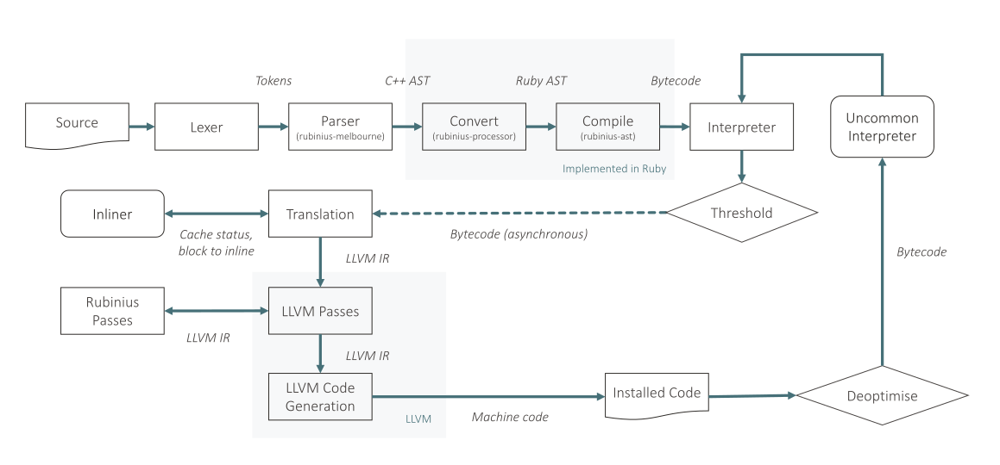

Rubinius began as a metacircular implementation of Ruby and was billed as *Ruby in Ruby*. Today the core and much of the standard library, parser, bytecode compiler, and other components are implemented in Ruby, but the interpreter, runtime, GC and other components, are written in C++.

Rubinius [removed their JIT in 2016][rbx-remove-jit], [due to a lack of experienced developers and bugs in the implementation][rbx-why-jit-removed]. Several possible replacements have been proposed and a private proof-of-concept was apparently implemented, but none has been realised yet and today any public Rubinius development in general has stalled. In this survey we discuss the JIT as it was in the final release before it was removed.

[rbx-remove-jit]: https://github.com/ruby-compiler-survey/rubinius/commit/e4cbba00d433757808700b160d589660841b1b6c
[rbx-why-jit-removed]: https://gitter.im/rubinius/rubinius?at=5cbfffb8c7f2960f5c2dd5fc

The Rubinius JIT is written in C++ and emits LLVM IR using the C++ API, and then LLVM compiles that IR to native code. Rubinius includes a couple of simple extra phases that plug into LLVM's optimisations and are specific to the code they generate.

Rubinius does not have any form of intermediate representation for optimisations beyond the same bytecode that the intepreter uses, and the LLVM IR which it can manipulate with custom LLVM passes. Rubinius is essentially a template compiler, running a linear scan and translating bytecode instructions to LLVM IR through a peephole.

Rubinius possibly had a larger deployment in production in the past, but it's likely there were very few users at the time of the JIT being removed as there was almost no public note of the change in performance which would have been extremely significant for them.

The Rubinius JIT was originally written by Evan Phoenix, with contributions from Dirkjan Bussink, Brian Shirai (né Ford), and others.

## Orientation

The Rubinius source code is available at [our mirror](https://github.com/ruby-compiler-survey/rubinius) or the [original repository](https://github.com/rubinius/rubinius). In order to understand the compilation front-end, you also need to look at a separate repository of supporting gems, also available at [our mirror](https://github.com/ruby-compiler-survey/rubinius-code) or the [original repository](https://github.com/rubinius/rubinius-code). We'll use the prefix `rbx/` or `rbx-code/` to differentiate when talking about code paths.  We have also archived the LLVM source code, available in [our mirror](https://github.com/ruby-compiler-survey/llvm), or an [original repository](https://github.com/llvm/llvm-project).

We're discussing Rubinius 3.19, `1cc41ddc7c2`, 28 February 2016, which is the last release with the JIT, as previously described. Rubinius uses LLVM 3.5, `d355b771d6e0`, Subversion `216954` (but we're using the build provided by Ubuntu which will possibly have patches applied.)

The frontend in Rubinius is written as a set of gems using both C++ in `rbx-code/ext/rubinius/code/melbourne` and Ruby in `rbx-code/lib/rubinius/code`. The VM is implemented in C++ in `rbx/vm` and the JIT itself in `rbx/vm/llvm`. The Rubinius core library is in `rbx/core`.

Ruby code is parsed by a modified version of the MRI parser as a C++ extension gem, into a C++ AST data structure. This is then read by a visitor into a Ruby structure and transformed into an internal bytecode format. When this meets compilation thresholds, it is translated using a template compiler into LLVM IR. Standard and custom LLVM optimisation passes are run, and machine code is generated and installed. Rubinus can deoptimise back to the interpreter if needed.

<figure>

</figure>

## Building and running

To build Rubinius you need specific versions of several complex dependencies, including LLVM, MRI, Bundler, and many third-party gems as well as gems specific to Rubinius. With all of these in place you should then be able to `./configure`, `rake build` and `rake install` to get a native build of the Rubinius interpreter, which you can then run in the same way as MRI.

We'll use these flags to help us understand what the Rubinius JIT is doing:

* `-Xjit.show` to show when the JIT is running
* `-Xjit.debug` to show more JIT information
* `-Xjit.dump_code=...` with `1` to print initial LLVM IR, `2` the optimized LLVM IR, `4` the machine code disassembly
* `-Xjit.inline.debug` to see what is being inlined
* `-Xjit.inline.generic=false` to disable inlining of normal user methods

Note that `-Xjit.log=` doesn't appear to work.

To view the AST for a file, use `rbx compile --print-ast file.rb`. To print bytecode use `--print-bytecode`.

More details on [building and running Rubinius](building) are available in the appendix.

## Frontend

Rubinius re-uses the Ruby parser from MRI but packages it as a C++ extension in a gem. It parses to an AST represented using C++ structures. A visitor written in C++ then executes callbacks to Ruby code which re-creates the AST as Ruby objects. This avoids the need for the C++ code to have the complexity of creating Ruby objects, or the Ruby code to have the complexity of reading native structures.

```cpp
case NODE_RETURN: {
  VALUE expr = Qnil;

  if (node->nd_stts) {
    expr = process_parse_tree(parser_state, ptp, node->nd_stts, locals);
  }
  tree = rb_funcall(ptp, rb_intern("process_return"), 2, line, expr);
  break;
}
```

<p class="coderef"><a href="https://github.com/ruby-compiler-survey/rubinius-code/blob/13abf5de03151d4e411e04eb0b8f3ae8007e9e3a/ext/rubinius/code/melbourne/visitor.cpp#L388-L396">rbx-code/ext/rubinius/code/melbourne/visitor.cpp:388-396</a></p>

```ruby
def process_return(line, value)
  AST::Return.new line, value
end
```

<p class="coderef"><a href="https://github.com/ruby-compiler-survey/rubinius-code/blob/13abf5de03151d4e411e04eb0b8f3ae8007e9e3a/lib/rubinius/code/processor/processor.rb#L531-L533">rbx-code/lib/rubinius/code/processor/processor.rb:531-533</a></p>

We can print the Ruby version of the AST for `fib.rb`. The Rubinius AST is verbose, so here we show just `fib(n - 1)` and have simplified.

```
SendWithArguments
  @name: :fib
  @block: nil
  @privately: true
  @vcall_style: false
  @arguments: \
    Arguments
      @splat: nil
      @array: [
        SendWithArguments [0]
          @name: :-
          @block: nil
          @privately: false
          @vcall_style: false
          @arguments: \
            Arguments
              @splat: nil
              @array: [
                FixnumLiteral [0]
                  @value: 1
              ]
              @line: 5
          @receiver: \
            LocalVariableAccess
              @name: :n
              @variable: nil
      ]
```

The AST is then translated to Rubinius' internal, stack-based bytecode format. This isn't significantly different from the YARV bytecode format used in MRI. Each node in the AST has a `bytecode` method which emits instructions for the node recursively.

```ruby
class Return < Node
  attr_accessor :value

  def bytecode(g, force=false)
    g.ret
  end
end
```

<p class="coderef"><a href="https://github.com/ruby-compiler-survey/rubinius-code/blob/13abf5de03151d4e411e04eb0b8f3ae8007e9e3a/lib/rubinius/code/ast/control_flow.rb#L679-L732">rbx-code/lib/rubinius/code/ast/control_flow.rb:679-732</a></p>

The Rubinius bytecode for `fib.rb` is compact so we can show it all.

```
0000:  push_local                 0    # n
0002:  meta_push_2                
0003:  send_stack                 :<=, 1
0006:  goto_if_false              0011:
0008:  meta_push_1                
0009:  goto                       0036:
0011:  push_self                  
0012:  push_local                 0    # n
0014:  meta_push_1                
0015:  send_stack                 :-, 1
0018:  allow_private              
0019:  send_stack                 :fib, 1
0022:  push_self                  
0023:  push_local                 0    # n
0025:  meta_push_2                
0026:  send_stack                 :-, 1
0029:  allow_private              
0030:  send_stack                 :fib, 1
0033:  send_stack                 :+, 1
0036:  ret                        
```

An unusual aspect of the Rubinius bytecode is that there is an extra system of state, shown in the `allow_private` instruction. This modifies the following `send_stack` instruction to say that private methods can be called.

And another interesting design feature of Rubinius here is that Ruby code can include inline Rubinius bytecode instructions for some primitive operations which are difficult to express in Ruby. These `Rubinius.asm` blocks are written like a DSL with Ruby methods for each operand, as in the `Generator`. The tricky bit is that the frontend needs to run that block during parsing when only the AST is available and before the generation of the bytecode which the VM can execute. The solution is that the Rubinius frontend includes an AST interpreter to evaluate the `Rubinius.asm` block at parse-time. Rubinius therefore actually has three modes of execution - the frontend AST interpreter, the VM bytecode interpreter (and there are really even multiple of these, as we'll discuss later), and then the JIT.

The Rubinius frontend can persist the bytecode produced by the frontend to binary `.rbc` files. This removes the overhead of parsing Ruby code, but the persisted bytecode still needs to be deserialised when it is loaded, and JIT compiled machine code from later in the pipeline is not persisted.

The code implementing the frontend is persisted to bytecode during the build so that it doesn't itself need the frontend in order to run. This solves the bootstrap problem of who would parse the parser.

## Interpreter and profiling

The Rubinius bytecode interpreter uses [*computed gotos*][rbx-goto], an extension to the C++ language that allows a program to jump to a label picked from an expression, such as indexing an array by a bytecode operation.

[rbx-goto]: https://en.wikipedia.org/wiki/Goto#Computed_GOTO_and_Assigned_GOTO

```cpp
goto *insn_locations[stream[call_frame->inc_ip()]];
```

<p class="coderef"><a href="https://github.com/ruby-compiler-survey/rubinius/blob/1cc41ddc7c2d3f4a2a70cc39a49e45233f7bc4b3/vm/instructions.cpp#L99">vm/instructions.cpp:99</a></p>

The `switch` branches are generated from a definition file which contain the C code to imperatively implement the instruction, as well as meta-information such as their effect on the stack which are used by the [bytecode verifier][rbx-verify].

[rbx-verify]: https://github.com/ruby-compiler-survey/rubinius/blob/1cc41ddc7c2d3f4a2a70cc39a49e45233f7bc4b3/vm/bytecode_verification.cpp

```
instruction ret() [ value -- value ] => return
  if(call_frame->scope->made_alias_p()) {
    call_frame->scope->flush_to_heap(state);
  }
  return stack_top();
end
```

<p class="coderef"><a href="https://github.com/ruby-compiler-survey/rubinius/blob/1cc41ddc7c2d3f4a2a70cc39a49e45233f7bc4b3/vm/instructions.def#L272-L290">rbx/vm/instructions.def:272-290</a></p>

Rubinius actually includes five generated interpreters, specialised for different runtime configurations: `interpreter`, `debugger_interpreter`, `debugger_interpreter_continue`, `uncommon_interpreter`, `tooling_interpreter`. The difference between them is the code around the instruction loop.

For example the `debugger_interpreter` also checks for breakpoints on each instruction.

```cpp
if(Object* bp = call_frame->find_breakpoint(state)) {
  if(!Helpers::yield_debugger(state, gct, call_frame, bp)) goto exception;
}
goto *insn_locations[stream[call_frame->inc_ip()]];
```

<p class="coderef"><a href="https://github.com/ruby-compiler-survey/rubinius/blob/1cc41ddc7c2d3f4a2a70cc39a49e45233f7bc4b3/vm/instructions.cpp#L388-L392">rbx/vm/instructions.cpp:388-392</a></p>

Relevant to the JIT is `uncommon_interpreter` which is able to resume interpretation in the middle of a method. We'll describe this functionality later when we talk about deoptimisation in Rubinius.

Profiling in Rubinius is performed by storing pointers to profile objects in the instruction stream. In practice these are only implemented for call sites, or equivalents such as calls to primitives. These are known as `CallSite` objects, and implement polymorphic caches. To some extent they're *inline caches*, but indirection is still needed to reach the cache in the interpreter.

```cpp
CallSite* call_site = reinterpret_cast<CallSite*>(literal);
call_site->execute(state, call_frame, args)
```

<p class="coderef"><a href="https://github.com/ruby-compiler-survey/rubinius/blob/1cc41ddc7c2d3f4a2a70cc39a49e45233f7bc4b3/vm/instructions.def#L1073-L1084">rbx/vm/instructions.def:1073-1084</a></p>

The `PolyInlineCache` subclass of `CallSite` implements caching by comparing the receiver class against up to `3` previously seen receivers, calling the cached method if matched, or a fallback if not.

```cpp
InlineCacheEntry* get_entry(Class* const recv_class) const {
  uint64_t recv_data = recv_class->data_raw();
  for(int i = 0; i < cTrackedICHits; ++i) {
    InlineCacheEntry* ice = entries_[i];
    if(likely(ice && ice->receiver_data_raw() == recv_data)) return ice;
  }
  return NULL;
}

...

InlineCacheEntry* entry = cache->get_entry(recv_class);

if(entry) {
  Executable* meth = entry->method();
  Module* mod = entry->stored_module();
  return meth->execute(state, call_frame, meth, mod, args);
} else {
  return cache->fallback(state, call_frame, args);
}
```

<p class="coderef"><a href="https://github.com/ruby-compiler-survey/rubinius/blob/1cc41ddc7c2d3f4a2a70cc39a49e45233f7bc4b3/vm/builtin/poly_inline_cache.cpp#L94-L112">rbx/vm/builtin/poly_inline_cache.cpp:94-112</a></p>

Rubinius does not profile branches or values, and it does not duplicate, or split, `CallSite` profiles when code is inlined. This means that there is only one copy of a call site profile for each call site that appears in the source code. For example method such as `puts` that calls `to_s` on many different objects will use a single profile for all `to_s` calls and will quickly megamorphise the cache.

Rubinius will compile to machine code up to 3 versions of a method for different receiver classes, called *specializations*, which allow operations such as instance variable lookup to be specialised for the class layout. However inline caches are not split when doing this, and the interpreter is not run again to generate independent profiling results.

As well as gathering profiling data for compilation, call site caches are also making the interpreter faster until compilation can run.

We'll discuss invalidation of these caches when we talk about deoptimisation later.

## Compilation threshold

Compilation of methods is triggered in Rubinius by a count of how many times the method has been called. The `check_interrupts` instruction, used in loops, also triggers the call count to be incremented.

```cpp
if(mcode->call_count >= state->shared().config.jit_threshold_compile) {
  jit->compile_callframe(state, code, frame);
} else {
  mcode->call_count++;
}
```

<p class="coderef"><a href="https://github.com/ruby-compiler-survey/rubinius/blob/1cc41ddc7c2d3f4a2a70cc39a49e45233f7bc4b3/vm/machine_code.cpp#L769-L777">rbx/vm/machine_code.cpp:769-777</a></p>

When a method meets the compilation threshold (BUT WHAT IS IT?), a search starts to find which method in the current call stack to compile. This search uses a number of heuristics, and will stop moving up the call stack when it finds a method that has unusual arguments, that hasn't been called enough, that has too many call sites, or so on. We believe that the intention is that the search finds the outermost method that when compiled will inline the method which originally met the compilation threshold, but we aren't sure how it is ensured that it always does so.

```cpp
// Now start looking at callers.

while(depth-- > 0) {
  CompiledCode* cur = call_frame->compiled_code;

  MachineCode* mcode = cur->machine_code();

  if(mcode->required_args != mcode->total_args) {
    return callee;
  }

  if(mcode->call_count < config_.jit_threshold_inline) {
    return callee;
  }

  if(mcode->jitted_p()) {
    return callee;
  }

  if(mcode->no_inline_p()) {
    return callee;
  }

  if(call_frame->jitted_p() || call_frame->inline_method_p()) {
    return callee;
  }

  if(mcode->call_site_count() > eMaxInlineSendCount) {
    return call_frame;
  }

  CallFrame* prev = call_frame->previous;

  if(!prev) {
    return call_frame;
  }

  callee = call_frame;
  call_frame = prev;
}
````

<p class="coderef"><a href="https://github.com/ruby-compiler-survey/rubinius/blob/1cc41ddc7c2d3f4a2a70cc39a49e45233f7bc4b3/vm/llvm/state.cpp#L602-L777">rbx/vm/llvm/state.cpp:602-777</a></p>

With the method chosen for compilation, it is then added to a queue for background translation to LLVM IR and then machine code by a single compiler worker thread, while the interpreter continues in the foreground.

## Translation to LLVM IR

Rubinius translates from its bytecode format to LLVM *intermediate representation* (IR). LLVM IR is a directed cyclic *control flow graph* (CFG) of linear *basic blocks* of instructions in *single static assignment* (SSA) format.
Rubinius finds basic blocks within its bytecode, and translates each of these to an LLVM basic block. Bytecode instructions within each basic block are then visited and symbolically executed, producing LLVM instructions to perform their semantic action rather than directly executing them. What was the stack of values in the interpreter becomes a stack of LLVM SSA registers, pushed when a value is produced, and popped to use them. These values also store their types.

The same system which generates the interpreter from definition files also generates the infrastructure for the visitor for instructions. There is then one `visit_` method for each bytecode instruction.

For example, the `push_nil` instruction pushes the constant value `nil` onto the symbolic execution stack.

```cpp
void visit_push_nil() {
  stack_push(constant(cNil), type::KnownType::nil());
}
```

<p class="coderef"><a href="https://github.com/ruby-compiler-survey/rubinius/blob/1cc41ddc7c2d3f4a2a70cc39a49e45233f7bc4b3/vm/llvm/jit_visit.hpp#L474-L476">rbx/vm/llvm/jit_visit.hpp:474-476</a></p>

The machine integer value of the constant - the pointer to `nil` - is converted to an LLVM pointer value.

```cpp
Value* constant(Object* obj) {
  return b().CreateIntToPtr(
      ConstantInt::get(ctx_->IntPtrTy, (intptr_t)obj),
      ObjType, "const_obj");
}
```

<p class="coderef"><a href="https://github.com/ruby-compiler-survey/rubinius/blob/1cc41ddc7c2d3f4a2a70cc39a49e45233f7bc4b3/vm/llvm/jit_operations.hpp#L1276-L1280">rbx/vm/llvm/jit_operations.hpp:1276-1280</a></p>

The value is then pushed onto the symbolic execution stack, representing what would have been on the stack if the program was still running as bytecode.

A method call, via an instruction like `send_stack`, both pops argument values off the symbolic execution stack, and then pushes a result back onto it. While the constant value `nil` was an actual constant, the value pushed from a method call will be a value representing what the value will be when the call is actually made, in the future, when the compiled code actually runs. As well as thinking of it as a *symbolic* value you could also think of it as a *future* value.

```cpp
Value* invoke_call_site(opcode& which) {
  CallSite** call_site_ptr = reinterpret_cast<CallSite**>(&which);

  Value* call_site_ptr_const = b().CreateIntToPtr(
      clong(reinterpret_cast<uintptr_t>(call_site_ptr)),
      ptr_type(ptr_type("CallSite")), "cast_to_ptr");

  Value* call_site_const = b().CreateLoad(call_site_ptr_const, "cache_const");

  Value* execute_pos_idx[] = {
    cint(0),
    cint(offset::CallSite::executor),
  };

  Value* execute_pos = b().CreateGEP(call_site_const,
      execute_pos_idx, "execute_pos");

  Value* execute = b().CreateLoad(execute_pos, "execute");

  Value* call_args[] = {
    state_,
    call_site_const,
    call_frame_,
    out_args_
  };

  flush_ip();
  return b().CreateCall(execute, call_args, "call_site_execute");
}
```

<p class="coderef"><a href="https://github.com/ruby-compiler-survey/rubinius/blob/1cc41ddc7c2d3f4a2a70cc39a49e45233f7bc4b3/vm/llvm/jit_visit.hpp#L655-L683">rbx/vm/llvm/jit_visit.hpp:655-683</a></p>

Here the JIT is using the `CallSites` that the interpreter populated during profiling. This is the non-inlined case, and Rubinius emits a call to the same `CallSite::execute` method that the interpreter would use. This is why we say that these caches aren't *inline*. The pointer to the `CallSite` is stored inline, but the cache entries may be multiple levels of indirection away.

Some common core library methods have special *meta* versions of instructions, to implement them more directly. For example `Fixnum#+` is implemented as part of the `meta_send_op_plus` instruction. It generates the complete code for a `Fixnum#+` directly as LLVM IR, rather than relying on the Ruby code to be inlined, or making a call to a runtime routine. The code it generates is this pseudo-code.

```ruby
if a.is_a?(Fixnum) && b.is_a?(Fixnum)
  value = untag(a) + untag(b)
  if value overflowed into Bignum
    return Bignum(value)
  else
    return tag(value)
  end
else
  return a.send(:+, b)
end
```

```cpp
void visit_meta_send_op_plus(opcode& name) {
  Value* recv = stack_back(1);
  Value* arg =  stack_top();

  BasicBlock* fast     = new_block("fast");
  BasicBlock* dispatch = new_block("dispatch");
  BasicBlock* bignum   = new_block("bignum");
  BasicBlock* tagnow   = new_block("tagnow");
  BasicBlock* cont     = new_block("cont");

  check_fixnums(recv, arg, fast, dispatch);

  set_block(dispatch);

  Value* called_value = inline_call_site_execute(1, name);
  BasicBlock* send_bb = check_for_exception_then(called_value, cont);

  set_block(fast);

  Value* recv_int = fixnum_strip(recv);
  Value* arg_int  = fixnum_strip(arg);

  Value* sum = b().CreateAdd(recv_int, arg_int, "fixnum.add");

  Value* cmp = check_if_fits_fixnum(sum);

  create_conditional_branch(tagnow, bignum, cmp);

  set_block(bignum);
  Value* big_value = promote_to_bignum(sum);
  b().CreateBr(cont);

  set_block(tagnow);
  Value* imm_value = fixnum_tag(sum);
  b().CreateBr(cont);

  set_block(cont);

  PHINode* phi = b().CreatePHI(ObjType, 3, "addition");
  phi->addIncoming(called_value, send_bb);
  phi->addIncoming(big_value, bignum);
  phi->addIncoming(imm_value, tagnow);

  stack_remove(2);
  stack_push(phi);
}
```

<p class="coderef"><a href="https://github.com/ruby-compiler-survey/rubinius/blob/1cc41ddc7c2d3f4a2a70cc39a49e45233f7bc4b3/vm/llvm/jit_visit.hpp#L986-L1032">rbx/vm/llvm/jit_visit.hpp:986-1032</a></p>

(Note that we aren't sure this particular meta-instruction is actually ever emitted by Rubinius, and probably a conventional send with an inlined primitive is used instead, but showing the logic is still instructive.)

```cpp
void check_fixnums(Value* left, Value* right, BasicBlock* if_true,
                   BasicBlock* if_false) {
  Value* mask = clong(TAG_FIXNUM_MASK);
  Value* tag  = clong(TAG_FIXNUM);

  Value* lint = cast_int(left);
  Value* rint = cast_int(right);
  Value* both =   b().CreateAnd(lint, rint, "both");
  Value* masked = b().CreateAnd(both, mask, "masked");

  Value* cmp = b().CreateICmpEQ(masked, tag, "are_fixnums");

  b().CreateCondBr(cmp, if_true, if_false);
}
```

<p class="coderef"><a href="https://github.com/ruby-compiler-survey/rubinius/blob/1cc41ddc7c2d3f4a2a70cc39a49e45233f7bc4b3/vm/llvm/jit_visit.hpp#L597-L610">rbx/vm/llvm/jit_visit.hpp:597-610</a></p>

Rubinius uses tagged integers for `Fixnum`, as MRI does. These support routines generate the LLVM IR snippets for tagging and untagging (called *stripping* here) a small integer. The tag operation is creating LLVM IR for `untagged < 1 | 1`, and the untag operation `tagged > 1`.

```cpp
Value* fixnum_tag(Value* obj) {
  Value* native_obj = b().CreateZExt(
      obj, NativeIntTy, "as_native_int");
  Value* one = ConstantInt::get(NativeIntTy, 1);
  Value* more = b().CreateShl(native_obj, one, "shl");
  Value* tagged = b().CreateOr(more, one, "or");

  return b().CreateIntToPtr(tagged, ObjType, "as_obj");
}

Value* fixnum_strip(Value* obj) {
  Value* i = b().CreatePtrToInt(
      obj, NativeIntTy, "as_int");

  return b().CreateAShr(i, One, "ashr");
}
```

<p class="coderef"><a href="https://github.com/ruby-compiler-survey/rubinius/blob/1cc41ddc7c2d3f4a2a70cc39a49e45233f7bc4b3/vm/llvm/jit_operations.hpp#L1310-L1329">rbx/vm/llvm/jit_operations.hpp:1310-1329</a></p>

Branch (called `goto` in Rubinius) or return instructions only appear at the end of basic blocks.

```cpp
void visit_goto_if_true(opcode ip) {
  Value* value = stack_pop();
  Value* i = b().CreatePtrToInt(
      value, ctx_->IntPtrTy, "as_int");

  Value* anded = b().CreateAnd(i,
      clong(FALSE_MASK), "and");

  Value* cmp = b().CreateICmpNE(anded,
      clong(reinterpret_cast<long>(cFalse)), "is_true");

  BasicBlock* cont = new_block("continue");
  BasicBlock* bb = block_map_[ip].block;
  if(!bb) branch_location_missing(llvm_state(), ip, "visit_goto_if_true");
  b().CreateCondBr(cmp, bb, cont);

  set_block(cont);
}
```

<p class="coderef"><a href="https://github.com/ruby-compiler-survey/rubinius/blob/1cc41ddc7c2d3f4a2a70cc39a49e45233f7bc4b3/vm/llvm/jit_visit.hpp#L2843-L2860">rbx/vm/llvm/jit_visit.hpp:2843-2860</a></p>

At this point the LLVM IR for a method that adds two values looks like this, with the code simplified to show just the method body logic for the fast path of adding together two `Fixnum` objects.

```ruby
def add(a, b)
  a + b
end
```

```
define %"::Object"* @"_X_Object#addk@1"(...) {
  ...
method_body:
  %stack_load = ... a
  %stack_load24 = ... b
  %cast = ptrtoint %"::Object"* %stack_load to i64, !dbg !11        # Value* lint = cast_int(left);
  %cast25 = ptrtoint %"::Object"* %stack_load24 to i64, !dbg !11    # Value* rint = cast_int(right);
  %fixnums_anded = and i64 %cast, %cast25, !dbg !11                 # Value* both = b().CreateAnd(lint, rint, "both");
  %masked = and i64 %fixnums_anded, 1, !dbg !11                     # Value* masked = b().CreateAnd(both, mask, "masked");
  %is_fixnum = icmp eq i64 %masked, 1, !dbg !11                     # Value* cmp = b().CreateICmpEQ(masked, tag, "are_fixnums");
  br i1 %is_fixnum, label %push_add, label %fallback, !dbg !11      # b().CreateCondBr(cmp, if_true, if_false);
push_add:
  %as_int = ptrtoint %"::Object"* %stack_load to i64, !dbg !11
  %ashr = ashr i64 %as_int, 1, !dbg !11
  %as_int26 = ptrtoint %"::Object"* %stack_load24 to i64, !dbg !11
  %ashr27 = ashr i64 %as_int26, 1, !dbg !11
  %fixnum.add = add i64 %ashr, %ashr27, !dbg !11
  %48 = icmp sle i64 %fixnum.add, 4611686018427387903, !dbg !11
  %49 = icmp sge i64 %fixnum.add, -4611686018427387903, !dbg !11
  %fits_fixnum = and i1 %48, %49, !dbg !11
  br i1 %fits_fixnum, label %tagnow, label %bignum, !dbg !11
tagnow:
  %shl = shl i64 %fixnum.add, 1, !dbg !11
  %or = or i64 %shl, 1, !dbg !11
  %as_obj = inttoptr i64 %or to %"::Object"*, !dbg !11
  ret %"::Object"* %as_obj, !dbg !11
  ...
}
```

We've marked up the lines of IR that came from `check_fixnums` as an example to show how they can be found in the generated IR.

## Inlining

Due to the mechanism to find a method higher up the call stack from the original hot method, and due to the implementation of the Ruby core library in Ruby itself, inlining is essential for a good compilation result. Some operations are implemented with meta instructions as already described, but it wouldn't be tractable to do this for all of the core library, and it wouldn't work for user-defined methods.

The inlining logic in Rubinius is relatively substantial, making up more than a fifth of the code in the JIT. Rubinius will inline both method calls and yields to blocks, and it has special support for inlining basic core library support routines (on top of the meta instructions such as `meta_send_op_plus` already described) and common small methods such as accessors.

<!-- 15203 SLOC in rbx/vm/llvm, 3285 for *inline*, = 22% -->

Inlining of basic method calls begins in the implementation of the relevant
`send` instruction.

```cpp
void visit_send_stack(opcode& which, opcode args) {
  CallSite** call_site_ptr = reinterpret_cast<CallSite**>(&which);
  CallSite*  call_site = *call_site_ptr;
  BasicBlock* class_failure = new_block("class_fallback");
  BasicBlock* serial_failure = new_block("serial_fallback");
  BasicBlock* cont = new_block("continue");
  Inliner inl(ctx_, *this, call_site_ptr, args, class_failure, serial_failure);
  MonoInlineCache* mono = try_as<MonoInlineCache>(call_site);
  PolyInlineCache* poly = try_as<PolyInlineCache>(call_site);

  bool res = false;
  if(mono) {
    res = inl.consider_mono();
  } else if(poly) {
    res = inl.consider_poly();
  }

  BasicBlock* cur = b().GetInsertBlock();

  set_block(class_failure);
  emit_uncommon();

  set_block(serial_failure);
  emit_uncommon(true);

  set_block(cur);
  stack_remove(args+1);
  if(inl.check_for_exception()) {
    check_for_exception(inl.result());
  }
  stack_push(inl.result());

  if(mono) {
    type::KnownType kt = inl.guarded_type();

    if(kt.local_source_p() && kt.known_p()) {
      current_jbb_->add_local(kt.local_id(), kt);
    }
  }

  b().CreateBr(cont);

  set_block(cont);
}
```

<p class="coderef"><a href="https://github.com/ruby-compiler-survey/rubinius/blob/1cc41ddc7c2d3f4a2a70cc39a49e45233f7bc4b3/vm/llvm/jit_visit.hpp#L1561-L1662">rbx/vm/llvm/jit_visit.hpp:1561-1662</a></p>

The JIT process is conceptually simple - the same routine that generates a top-level method is called again and the resulting IR inserted at the call site. The arguments are still pushed to the symbolic stack as usual, and come back off there in the inlined code.

```cpp
void Inliner::inline_generic_method(Class* klass, ClassData data, Module* defined_in,
                                    CompiledCode* code, MachineCode* mcode, int hits) {
  // This is the guard that the class is as expected and unmodified since compilation
  check_recv(klass, data);

  JITMethodInfo info(ctx_, code, mcode);
  prime_info(info);
  info.hits = hits;
  info.self_type = guarded_type_;
  info.set_self_class(klass);
  jit::RuntimeData* rd = new jit::RuntimeData(code, call_site_->name(), defined_in);
  ctx_->add_runtime_data(rd);
  jit::InlineMethodBuilder work(ops_.context(), info, rd);
  work.valid_flag = ops_.valid_flag();
  Value* blk = 0;

  std::vector<Value*> args;
  if(block_on_stack_) {
    blk = ops_.stack_top();
    for(int i = count_; i >= 1; i--) {
      args.push_back(ops_.stack_back(i));
    }
  } else {
    blk = ops_.constant(cNil);
    for(int i = count_ - 1; i >= 0; i--) {
      args.push_back(ops_.stack_back(i));
    }
  }

  BasicBlock* entry = work.setup_inline(recv(), blk, args);

  // This is the same generate_body method, which calls the visitor, as you'd use for a top-level method
  work.generate_body();

  // Calling the method becomes just branching to that newly generated block
  ops_.create_branch(entry);

  ops_.set_block(info.return_pad());
  set_result(info.return_phi());
  ops_.llvm_state()->vm()->metrics().jit.inlined_methods++;
}
```

<p class="coderef"><a href="https://github.com/ruby-compiler-survey/rubinius/blob/1cc41ddc7c2d3f4a2a70cc39a49e45233f7bc4b3/vm/llvm/inline.cpp#L601-L659">rbx/vm/llvm/inline.cpp:601-659</a></p>

`check_recv` generates the guard that the class is as expected and unmodified since the method was compiled. We'll discuss what happens if it isn't when we talk about deoptimisation later.

Rubinius additionally has [specific support for inlining FFI calls][rbx-inline-ffi], which we think may be unique in Ruby compilers.

[rbx-inline-ffi]: https://github.com/ruby-compiler-survey/rubinius/blob/1cc41ddc7c2d3f4a2a70cc39a49e45233f7bc4b3/vm/llvm/inline.cpp#L759-L1062

## Optimisation passes

Rubinius then runs a set of standard LLVM optimization passes over the generated IR, such as global value numbering and dead code elimination. Rubinius also runs three custom-written LLVM passes that have a special understanding of Ruby semantics and the generated IR.

`RubiniusAliasAnalysis` subclasses LLVM's alias analysis phase and modifies it to make LLVM understand that an object's class and `object_id` [are constant][rbx-constant] even though LLVM cannot see this for itself, and to stop LLVM [confusing tagged integers with pointers][rbx-false-alias] and making false aliasing decisions based on this.

[rbx-constant]: https://github.com/ruby-compiler-survey/rubinius/commit/03fd4d9df8e4b8dc87aa99c7ba22ea1e4245b097
[rbx-false-alias]: https://github.com/ruby-compiler-survey/rubinius/commit/6c65838aa0a9f013caca737fb289031e246052fd

```cpp
AliasAnalysis::AliasResult alias(const Location &LocA, const Location &LocB)
{
  // Indicate that tagged fixnums can't alias anything.
  if(const IntToPtrInst* ip = dyn_cast<IntToPtrInst>(LocA.Ptr)) {
    if(ip->getType() == object_type_) {
      if(const ConstantInt* ci = dyn_cast<ConstantInt>(ip->getOperand(0))) {
        const APInt& cv = ci->getValue();
        APInt one(cv.getBitWidth(), 1);

        if(cv.And(one) == one) return NoAlias;
      }
    }
  }

  return AliasAnalysis::alias(LocA, LocB);
}
```

<p class="coderef"><a href="https://github.com/ruby-compiler-survey/rubinius/blob/1cc41ddc7c2d3f4a2a70cc39a49e45233f7bc4b3/vm/llvm/passes.cpp#L369-L385">rbx/vm/llvm/passes.cpp:369-385</a></p>

`OverflowConstantFolder` [folds additions of two constants][rbx-constant-fold], with an understanding of Rubinius' tagging mechanism and Ruby's overflow semantics.

[rbx-constant-fold]: https://github.com/ruby-compiler-survey/rubinius/commit/92781d7bc76df72489f40587a568f4f128ddaddd

```cpp
if(called_function->getIntrinsicID() == Intrinsic::sadd_with_overflow) {
  if(try_to_fold_addition(f.getContext(), call)) {
    if(call->use_empty()) {
      to_remove.push_back(call);
      changed = true;
    }
  }
}
```

<p class="coderef"><a href="https://github.com/ruby-compiler-survey/rubinius/blob/1cc41ddc7c2d3f4a2a70cc39a49e45233f7bc4b3/vm/llvm/passes.cpp#L293-L300">rbx/vm/llvm/passes.cpp:293-300</a></p>

`GuardEliminator` [removes checks that a value is a `Float`][rbx-guard-eliminate] when it can statically prove that it is.

[rbx-guard-eliminate]: https://github.com/ruby-compiler-survey/rubinius/commit/a44e405af26dd7fcc011fb64e2c8581e33681ae3

One other pass, `AllocationEliminator`, is implemented but doesn't appear to be used. It would have [removed the allocation of a Rubinius `Float` object][rbx-alloc-elminate] if the object then is just read from again and never leaves the method.

[rbx-alloc-eliminate]: https://github.com/ruby-compiler-survey/rubinius/commit/a44e405af26dd7fcc011fb64e2c8581e33681ae3

We can see LLVM's optimisations working for us on our `add` example. The simple version of the code emitted by Rubinius checks that an integer can fit into a `Fixnum` by doing `value <= 4611686018427387903 && value >= -4611686018427387903`. We can see that LLVM has optimised this code into `x = value + 4611686018427387903; x < 9223372036854775807` - LLVM must have some model that tells it that an addition and one comparison is cheaper than two comparisons.

```
push_add:
  %ashr_a = ashr i64 %a, 1, !dbg !11
  %ashr_b = ashr i64 %b, 1, !dbg !11
  %added = add i64 %ashr_a, %ashr_b, !dbg !11
  %48 = icmp sle i64 %added, 4611686018427387903, !dbg !11
  %49 = icmp sge i64 %added, -4611686018427387903, !dbg !11
  %fits_fixnum = and i1 %48, %49, !dbg !11
  br i1 %fits_fixnum, label %tagnow, label %bignum, !dbg !11
```

```
push_add:
  %ashr_a = ashr i64 %a, 1, !dbg !11
  %ashr_b = ashr i64 %b, 1, !dbg !11
  %added = add nsw i64 %ashr_a, %ashr_b, !dbg !11
  %x = add i64 %added, 4611686018427387903, !dbg !11
  %fits_fixnum = icmp ult i64 %x, 9223372036854775807, !dbg !11
  br i1 %fits_fixnum, label %tagnow, label %bignum, !dbg !11
```

We can look at the LLVM source code and see that this optimisation is implemented by recognising the pattern that Rubinius emits - two integer compares combined with an `and` - as a range test operation in [`FoldAndOfICmps`][rbx-fold-and-of-icmps], and then emitting the alternative code for it in [`InsertRangeTest`][rbx-insert-range-test].

[rbx-fold-and-of-icmps]: https://github.com/ruby-compiler-survey/llvm/blob/d355b771d6e0ff9638aed38b9289f70642857f5d/llvm/lib/Transforms/InstCombine/InstCombineAndOrXor.cpp#L790-L1022
[rbx-insert-range-test]: https://github.com/ruby-compiler-survey/llvm/blob/d355b771d6e0ff9638aed38b9289f70642857f5d/llvm/lib/Transforms/InstCombine/InstCombineAndOrXor.cpp#L263-L304

## Compilation by LLVM

The generated IR is now passed to LLVM for conventional compilation to machine code, just as if the IR had come from something like a C frontend. This include scheduling, instruction selection, register allocation, assembly generation, and machine code encoding.

LLVM is also responsible for allocating the executable memory and installing the machine code for Rubinius. Rubinius gets back a function pointer which it can call to jump into the compiled code.

## Deoptimisation

There are several forms of deoptimisation in Rubinius.

As we've already described, Rubinius has multiple generated interpreters with specialisations. For example the debugging interpreter runs a check for breakpoints before executing each instruction.

```cpp
if(Object* bp = call_frame->find_breakpoint(state)) {
  if(!Helpers::yield_debugger(state, gct, call_frame, bp))
    goto exception;
}
```

It's possible to enter the debugging interpreter from either another interpreter, or from compiled code, because its signature accepts an instruction pointers and interpreter state to resume executing at.

```cpp
Object* MachineCode::debugger_interpreter_continue(STATE,
                                                   MachineCode* const mcode,
                                                   CallFrame* const call_frame,
                                                   int sp,
                                                   InterpreterState& is,
                                                   UnwindInfoSet& thread_unwinds)
```

<p class="coderef"><a href="https://github.com/ruby-compiler-survey/rubinius/blob/1cc41ddc7c2d3f4a2a70cc39a49e45233f7bc4b3/vm/instructions.cpp#L501-L506">rbx/vm/instructions.cpp:501-506</a></p>

Code compiled by the JIT will check for a debugging flag after returning from method calls, and will call the `rbx_continue_debugging` helper, which resumes in this interpreter. This flag is actually only checked if the `-Xjit.check_debugging` flag is set, which is needed to install breakpoints in JIT compiled code.

Rubinius also has an *uncommon interpreter* that is used for cases that the compiled code did not handle, and for handling the case where a method has been redefined. `rbx_continue_uncommon` is the runtime routine to enter the uncommon interpreter, called by a call generated in `emit_uncommon`. Rubinius only uses this in the case ofan inlined call site cache miss.

The most complicated part of deoptimization, reconstructing the call frame from a native stack and registers, doesn't need to be implemented in Rubinius, as call frames are always heap-allocated.

Method redefinitions are detected by guards that check class serial numbers. This code loads the class serial number and uses a compare and conditional branch. The branch could go to a fallback case, or the `emit_uncommon` as already described.

```cpp
void check_reference_class(Value* obj, uint32_t class_id, uint32_t serial_id,
                           BasicBlock* class_id_failure, BasicBlock* serial_id_failure) {
  Value* is_ref = check_is_reference(obj);
  BasicBlock* cont = new_block("check_class_id");
  BasicBlock* body = new_block("correct_class");
  BasicBlock* serial = new_block("correct_serial");

  create_conditional_branch(cont, class_id_failure, is_ref);

  set_block(cont);

  Value* klass = reference_class(obj);
  Value* class_match = create_equal(get_class_id(klass), cint(class_id), "check_class_id");

  create_conditional_branch(body, class_id_failure, class_match);

  set_block(body);
  class_id_failure->moveAfter(body);

  Value* serial_match = create_equal(get_serial_id(klass), cint(serial_id), "check_serial_id");

  create_conditional_branch(serial, serial_id_failure, serial_match);

  set_block(serial);

  serial_id_failure->moveAfter(serial);
}
```

<p class="coderef"><a href="https://github.com/ruby-compiler-survey/rubinius/blob/1cc41ddc7c2d3f4a2a70cc39a49e45233f7bc4b3/vm/llvm/jit_operations.hpp#L981-L1007">rbx/vm/llvm/jit_operations.hpp:981-1007</a></p>

Rubinius usually chooses to generate slow-paths in compiled code rather than use deoptimisation, possibly to reduce code churn due to their limited call site caching mechanism.

## Garbage collection

Garbage collection in Rubinius is generational, compacting, and concurrent. Collection is by Baker's copying algorithm for the young generation, and Blackburn's *Immix* algorithm for the old generation, both implemented in C++ in the VM.

Potential references from the old generation back to the young generation, and concurrent modification of references, means that Rubinius needs barriers when writing references. These are emitted as LLVM IR inserted when for example writing an instance variable. A fast path checks the need for the write barrier and then makes a runtime call if it's needed.

```cpp
void write_barrier(Value* obj, Value* val) {
  Value* is_ref = check_is_reference(val);

  BasicBlock* cont = new_block("reference_obj");
  BasicBlock* cont_notscan = new_block("object_not_scanned");

  BasicBlock* run_barrier = new_block("run_barrier");
  BasicBlock* done = new_block("done");

  create_conditional_branch(cont, done, is_ref);

  set_block(cont);

  // Check if obj is scanned already
  Value* object_memory_mark = b().CreateLoad(object_memory_mark_pos_, "object_memory_mark");
  Value* flags = object_flags(obj);

  Value* mark_mask  = ConstantInt::get(ctx_->Int64Ty, (7UL << (OBJECT_FLAGS_MARKED - 2)));
  Value* mark_masked = b().CreateAnd(flags, mark_mask, "mark_mask");
  Value* scan_val   = b().CreateIntCast(
                        b().CreateAdd(object_memory_mark, cint(1), "scan_mark"),
                        ctx_->Int64Ty, false);

  Value* scan_mark = b().CreateShl(scan_val, llvm::ConstantInt::get(ctx_->Int64Ty, OBJECT_FLAGS_MARKED - 2), "lshr");
  Value* is_scanned = b().CreateICmpEQ(mark_masked, scan_mark, "is_scanned");

  create_conditional_branch(run_barrier, cont_notscan, is_scanned);
  set_block(cont_notscan);

  Value* zone_mask  = ConstantInt::get(ctx_->Int64Ty, (3UL << (OBJECT_FLAGS_GC_ZONE - 1)));
  Value* young_mask = ConstantInt::get(ctx_->Int64Ty, YoungObjectZone << (OBJECT_FLAGS_GC_ZONE - 1));

  Value* zone_masked = b().CreateAnd(flags, zone_mask, "zone_mask");
  Value* is_young = b().CreateICmpEQ(zone_masked, young_mask, "is_young");

  create_conditional_branch(done, run_barrier, is_young);
  set_block(run_barrier);

  Signature wb(ctx_, ObjType);
  wb << StateTy;
  wb << ObjType;
  wb << ObjType;

  if(obj->getType() != ObjType) {
    obj = b().CreateBitCast(obj, ObjType, "casted");
  }

  Value* call_args[] = { state_, obj, val };
  wb.call("rbx_write_barrier", call_args, 3, "", b());

  create_branch(done);
  set_block(done);
}
```

<p class="coderef"><a href="https://github.com/ruby-compiler-survey/rubinius/blob/1cc41ddc7c2d3f4a2a70cc39a49e45233f7bc4b3/vm/llvm/jit_operations.hpp#L1626-L1680">rbx/vm/llvm/jit_operations.hpp:1626-1680</a></p>

## Evaluation

We run **`fib.rb`** with `-Xjit.inline.generic=false` otherwise Rubinius will inline very deep into the recursive `fib` method. Rubinius compiles the `n - 1` into a `dec` instruction, and interestingly it compiles the `n - 2` into a `lea` - a *load effective address* of `n - 2` as if `n` were an address, an instruction meant for loading elements of an array of elements of a structure. LLVM uses it because you can encode the constant `-2` in the instruction rather than having to load it into a register.

```
0x7f0860782250  decq %rcx               # n - 1
...
0x7f0860782266  lea -0x2(%rax), %rax    # n - 2
...
0x7f0860782473  add %rcx, %rax          # +
...
```

Rubinius doesn't appear to use hardware overflow detection - we think this is because the intrinsics for this are only used in the `visit_meta_send_op_plus` instruction which isn't actually used.

As we disabled inlining for this experiment, calls are indirect and to the `CallSite#execute` method.

**`area.rb`** uses `mulsd` to multiply, but calls the `Float#**` method via a slow-path call site and doesn't appear to attempt to inline this - it has no special support in the primitive inliner to do so. The constant `Math::PI` is read via a `ConstantCache` similar to a `CallSite`, and the constant is not inlined into the machine code - only the pointer to the constant cache is.

`r**2` returns a `Fixnum` when `r` is `1`, so here we can also see the guarding of that, and the untagging and promotion to a native `double` using `cvtsi2sdq`. A runtime call `rbx_float_allocate` is then used to create a `Float` object.

```
...
0x7f328ec1d2e8  testb $0x1, %al         
0x7f328ec1d2eb  jz 0x317                 ; 0x7f328ec1d327
0x7f328ec1d2f1  sarq $0x1, %rax         
0x7f328ec1d2f4  cvtsi2sdq %rax, %xmm0   
0x7f328ec1d2f9  mulsd 0x18(%rcx), %xmm0
0x7f328ec1d2fe  movsd %xmm0, -0x100(%rbp)
0x7f328ec1d306  mov $0x7dbc50, %rax      ; rbx_float_allocate
...
```

We were not able to make much sense of the machine code generated for **`sum-simple.rb`**. Rubinius is effective at inlining its Ruby implementation of `Array#[]`, but because even basic code such as this has many code paths and corner cases, and Rubinius does not profile branches and includes so many slow-paths, the result is 268 basic blocks of generated code.

```
JIT: compiling Object#sum (1580862383.417881)
| inlining: Array#size into sum
|| inline ivar read: Array#@total (slot: 0)
| inlining: Fixnum#< into sum. primitive fixnum_compare_operation (Fixnum)
| inlining: Array#[] into sum
|| inlining: Fixnum#=== into []. primitive fixnum_s_eqq (<nil>)
|| inlining: Fixnum#< into []. primitive fixnum_compare_operation (Fixnum)
|| inline ivar read: Array#@total (slot: 0)
|| inlining: Fixnum#+ into []. primitive fixnum_add (Fixnum)
|| NOT inlining: Rubinius::Type#coerce_to_collection_index into []. too few sends: (2 / 34963) (<nil>) (interp)
|| inlining: Fixnum#< into []. primitive fixnum_compare_operation (Fixnum)
|| inline ivar read: Array#@total (slot: 0)
|| inlining: Fixnum#>= into []. primitive fixnum_compare_operation (Fixnum)
|| inline ivar read: Array#@total (slot: 0)
|| inlining: Fixnum#< into []. primitive fixnum_compare_operation (Fixnum)
|| inlining: Fixnum#+ into []. primitive fixnum_add (Fixnum)
|| inline ivar read: Array#@total (slot: 0)
|| inlining: Fixnum#> into []. primitive fixnum_compare_operation (Fixnum)
|| inline ivar read: Array#@total (slot: 0)
|| inline ivar read: Array#@start (slot: 2)
|| inlining: Fixnum#+ into []. primitive fixnum_add (Fixnum)
|| inlining: Array#new_range into []. generic primitive: jit_stub_array_new_range (Array)
||+ eliding redundant guard: class Array (6)
|| inline ivar read: Array#@total (slot: 0)
|| inlining: Fixnum#>= into []. primitive fixnum_compare_operation (Fixnum)
|| inline ivar read: Array#@tuple (slot: 1)
|| inline ivar read: Array#@start (slot: 2)
|| inlining: Fixnum#+ into []. primitive fixnum_add (Fixnum)
|| inlining: Rubinius::Tuple#[] into []. primitive tuple_at (Rubinius::Tuple)
|| inline ivar read: Array#@total (slot: 0)
|| inline ivar read: Array#@total (slot: 0)
|| inline ivar read: Array#@total (slot: 0)
|| inline ivar read: Array#@total (slot: 0)
|| inline ivar read: Array#@total (slot: 0)
|| inline ivar read: Array#@tuple (slot: 1)
|| inline ivar read: Array#@start (slot: 2)
| inlining: Fixnum#+ into sum. primitive fixnum_add (Fixnum)
| inlining: Fixnum#+ into sum. primitive fixnum_add (Fixnum)
```

Even the innermost primitive here, `tuple_at`, generates three new basic-blocks if you look at the [implementation][rbx-tuple-at], and we observed basic-blocks with as many as sixteen predecessors. The generated code defeated even a commercial diassembler's attempt at recovering the control flow and we were not able to isolate the actual `while` loop.

[rbx-tuple-at]: https://github.com/ruby-compiler-survey/rubinius/blob/1cc41ddc7c2d3f4a2a70cc39a49e45233f7bc4b3/vm/llvm/inline_primitive.cpp#L61-L63

*Simple sum CFG*

The inlining log from **`sum-block.rb`** shows us that it successfully inlined `Array#each`, the `tuple_at` primitive, and the user's block. This code doesn't use `Array#[]`, with its extremely complicated semantics, so the inlining graph is much simpler.

```
JIT: compiling Object#sum (1580862898.649681)
| inlining: Array#each into sum (w/ inline block)
|| inline ivar read: Array#@start (slot: 2)
|| inline ivar read: Array#@total (slot: 0)
|| inlining: Fixnum#+ into each. primitive fixnum_add (Fixnum)
|| inline ivar read: Array#@tuple (slot: 1)
|| inlining: Fixnum#< into each. primitive fixnum_compare_operation (Fixnum)
|| inlining: Rubinius::Tuple#[] into each. primitive tuple_at (Rubinius::Tuple)
|| inlining block into: each
||| inlining: Fixnum#+ into sum. primitive fixnum_add (Fixnum)
|| inlining: Fixnum#+ into each. primitive fixnum_add (Fixnum)
```

The generated IR is around four times larger, but machine code four times smaller. The control-flow graph is simpler here but we were still not able to isolate the `while` loop.

The object allocation in **`point.rb`** in `create_point` shows us the runtime call to `rbx_create_instance` - object allocation is not inlined even though it is bump-pointer allocation.

```cpp
Address allocate(size_t bytes) {
  Address addr = current_;
  Address new_current = addr + bytes;

  if(new_current >= end_) return 0;

  ++allocations_;
  current_ = new_current;

  return addr;
}
```

<p class="coderef"><a href="https://github.com/ruby-compiler-survey/rubinius/blob/1cc41ddc7c2d3f4a2a70cc39a49e45233f7bc4b3/vm/gc/slab.hpp#L79-L89">rbx/vm/gc/slab.hpp:79-89</a></p>

We can see the logic of the instance variable writes. (Note that Rubinius confusingly uses the temporary name `visit_push_ivar` when the instruction is actually `visit_set_ivar`). We have a fully inlined native memory store instruction in the best case, followed by the logic for the write barrier. This examines the tag if it's a reference object it runs the write barrier, which itself then has a fallback slow-path case, `run_barrier`.

```
  %obj_array = bitcast %"struct.rubinius::Object"* %self to %"struct.rubinius::Object"**, !dbg !19
  %field_pos = getelementptr %"struct.rubinius::Object"** %obj_array, i32 3, !dbg !19
  store %"struct.rubinius::Object"* %stack_load147, %"struct.rubinius::Object"** %field_pos, !dbg !19         # <--- instance variable write
  %cast159 = ptrtoint %"struct.rubinius::Object"* %stack_load147 to i64, !dbg !19
  %masked160 = and i64 %cast159, 3, !dbg !19
  %is_reference161 = icmp eq i64 %masked160, 0, !dbg !19
  br i1 %is_reference161, label %reference_obj, label %done162, !dbg !19

reference_obj:                                    ; preds = %correct_class153
  %object_memory_mark = load i32* inttoptr (i64 54237888 to i32*), !dbg !19
  %word_pos163 = getelementptr %"struct.rubinius::Object"* %self, i32 0, i32 0, i32 0, i32 0, !dbg !19
  %flags164 = load i64* %word_pos163, !dbg !19
  %mark_mask = and i64 %flags164, 3670016, !dbg !19
  %scan_mark = add i32 %object_memory_mark, 1, !dbg !19
  %87 = zext i32 %scan_mark to i64, !dbg !19
  %lshr = shl i64 %87, 19, !dbg !19
  %is_scanned = icmp eq i64 %mark_mask, %lshr, !dbg !19
  br i1 %is_scanned, label %run_barrier, label %object_not_scanned, !dbg !19

run_barrier:
  ...

continue148:
  ...
```

The inline log for `print_point` is confusing - it inlines `Point#to_s`, and we see the reference to the two instance variables, but no reference to anything from the string interpolation.

```
JIT: compiling Object#print_point (1580863252.172073)
| inlining: Point#to_s into print_point
|| inline ivar read: Point#@x (packed index: 0, 24)
|| inline ivar read: Point#@y (packed index: 1, 32)
```

Rubinius uses a specific instruction for interpolation - `string_build`, which takes a number of string to concatenate. This turns into a runtime call, `rbx_string_build`.

In **`monkey.rb`** Rubibinius inlines the correct primitive after monkey patching, with the user's `Fixnum#*` showing up as well in the inline log.

```
JIT: compiling Object#multiply (1580863438.311772)
| inlining: Fixnum#* into multiply. primitive fixnum_mul (Fixnum)
```

```
JIT: compiling Object#multiply (1559697597.851703)
| inlining: Fixnum#* into multiply
|| inlining: Fixnum#+ into *. primitive fixnum_add (Fixnum)
```

The latter generated code includes additional guards, but both end in the relevant native operation.

(Note that we must monkey patch `Fixnum` rather than `Integer` on Rubinius, as it defines arithmetic operators on subclasses. This is non-standard Ruby but is probably reasonable for a core implemented in Ruby.)

The compilation of **`capture.rb`** is impressive when the looking at the optimized IR - after the guards it is returning the constant value `42`, already tagged into the integer `85`.

```
  ...
  %return_phi = ... inttoptr (i64 85 to %"struct.rubinius::Object"*) ...
  ret %"struct.rubinius::Object"* %return_phi, !dbg !14
```

The block is allocated using the runtime call `rbx_create_block`.

`capture-meta.rb` and `capture-meta-alias.rb` work correctly in Rubinius. Local variables are always stored on the heap in Rubinius - but then how did the arithmetic in `capture.rb` fold? LLVM is seeing the writes into the heap memory, and the reads from it, from the same addresses, and is re-using the value it wrote, rather than reading it back. This works even though the heap structure isn't subject to scalar replacement.

What is left in all the `capture` programs is the multiple guards, and the writes of the local variables even though they aren't written back. LLVM does not know that nobody else is reading the frame.

For **`canary.rb`** Rubinius inlines `Enumerable#min`, but not the call to `each`, which remains as an opaque call due to the large block. Rubinius therefore fails the canary test.

```
JIT: compiling Object#canary (1580863999.887700)
| inlining: Enumerable#min into canary (Array)
|+ eliding redundant guard: class Array (6)
|| inlining: NilClass#nil? into min
|| NOT inlining: block was too complex
|| inlining: Kernel#equal? into min. primitive object_equal (<nil>)
```

If we look at the definition of `Enumerable#min` in Ruby, there's more calls there than seem to be considered for inlining. Why doesn't Rubinius tell us if it's considering inlining the calls to `sort` in the `else` branch? It's because they haven't been called and so their caches are empty and they are not considered for inlining. Rubinius could see the empty cache and emit an uncommon trap rather than the call.

```ruby
def min(n=nil)
  if n.nil?
    min = undefined
    each do
      element = Rubinius.single_block_arg
      if undefined.equal? min
        min = element
      else
        comp = block_given? ? yield(element, min) : element <=> min
        unless comp
          raise ArgumentError, "comparison of #{element.class} with #{min} failed"
        end

        if Comparable.compare_int(comp) < 0
          min = element
        end
      end
    end

    undefined.equal?(min) ? nil : min
  else
    if block_given?
      sort { |a, b| yield a, b }.take n
    else
      sort.take n
    end
  end
end
```

<p class="coderef"><a href="https://github.com/ruby-compiler-survey/rubinius/blob/1cc41ddc7c2d3f4a2a70cc39a49e45233f7bc4b3/core/enumerable.rb#L588-L615">rbx/core/enumerable.rb:588-615</a></p>

When executing **`render.rb`**, Rubinius does not JIT compile the `eval` code, so the string concatenation in it is interpreted each time.

In general, Rubinius tends to make good micro-optimisations thanks to LLVM, such as `lea` instead of arithmetic using registers, but these are swamped by the opaque calls for fundamental runtime operations such as `rbx_float_allocate` which appear as a black-box to subsequent optimisations.

However useful code like this is swamped by deep branches of slow-paths within slow-paths, which could be moved to deoptimisation. These likely do affect code quality even when not executed, as control-flow merges and then LLVM has to account for values produced by possibly either the slow-path or the fast-path. Instruction cache is also likely determinally effected.

Something that stands out is that Rubinius doesn't combine guards. Checking that a class is as expected for a method call checks the *class* and the *serial*, when if the serial was globally unique checking just the serial would be enough. Rubinius also checks for raised exceptions separately, and separately again the debugger flag. Even the `rbx_prologue_check` runtime routine, called at the start of all methods, checks two separate flags for interrupts and GC safepoints. All these flags could be combined to reduce the number of instructions executed and the risk of cache trashing, as all these flags are located in different areas of memory.

The burden of guards is also moved into the compiled code, rather than the code that causes a guard to fail. The compiled code must explicitly read the guard variables, and then has control flow to handle when they have been modified.

Combining guards and pruning uncommon paths would make the current JIT design in Rubinius much more effective.

## History

We've described the Rubinius JIT was it was in the final release before it was removed in 2016, but Rubinius has a very interesting development history before this. Four very different approaches were tried to implement the JIT, and the broader history of Rubinius includes several other interesting ideas that are worth documenting.

The [earliest surviving commit][rbx-first-commit] for Rubinius, from 2006, shows the early idea of a VM for Ruby implemented almost entirely in Ruby. Experiments at this stage included prototypes of several GC algorithms implemented in Ruby and the start of a process to translate Ruby ASTs to C code. The [`inline` gem][rbx-inline] may have being used to experiment with generated C and supporting runtime routines.

[rbx-first-commit]: https://github.com/ruby-compiler-survey/rubinius/commit/3adc277cb1ac964ffb1d72226555b34a5d803cc0
[rbx-inline]: https://github.com/seattlerb/rubyinline

```ruby
def sweep
  each_object do |obj|
    if object_marked?(obj)
      unmark_object obj
    else
      reclaim_address obj.address
    end
  end
end
```

<p class="coderef"><a href="https://github.com/ruby-compiler-survey/rubinius/blob/3adc277cb1ac964ffb1d72226555b34a5d803cc0/lib/mark_sweepgc.rb#L79-L87">rbx/lib/mark_sweepgc.rb:79-87</a></p>

```ruby
def process_if(x)
  cond = process x.shift
  thn = process x.shift
  els = process x.shift

  "if(#{cond}) {\n  #{thn}\n} else {\n  #{els}\n}"
end
```

<p class="coderef"><a href="https://github.com/ruby-compiler-survey/rubinius/blob/3adc277cb1ac964ffb1d72226555b34a5d803cc0/lib/translation/to_c.rb#L229-L235">rbx/lib/translation/to_c.rb:229-235</a></p>

This idea of using Ruby to implement Ruby only really contibued forward for the core library and the frontend of Rubinius. The Rubinius JIT has never been written in Ruby.

A [native VM implemented in C was added later][rbx-shotgun] in 2006. This bytecode interpreter and VM had a code name - [*Shotgun*][rbx-shotgun-name] - and the name still exists in a couple of files in Rubinius today. The initial idea was to have this VM just as part of a bootstrap process, and in time it would be re-implemented in a restricted dialect of Ruby amenable to type inference and which could be statically translated to C. This [Slang][rbx-slang]-style langauge would was inteded to be called *Cuby*, or later *Garnet*. It would fulfil the same role as [RPython][rbx-rpython] in the implementation of PyPy and would in the future be used in the development of [Topaz](#topaz). This language dialect and static translation was never implemented though.

[rbx-shotgun]: https://github.com/ruby-compiler-survey/rubinius/commit/67e52a37b18ffd458a35987c71437981b1bddc5f
[rbx-shotgun-name]: https://github.com/ruby-compiler-survey/rubinius/blob/152cc4c4a31ac6500f8782d7ea05d7fa2562cc9c/doc/vm/shotgun.txt
[rbx-slang]: http://wiki.squeak.org/squeak/slang
[rbx-rpython]: https://rpython.readthedocs.io/en/latest/rpython.html

The VM was later [rewritten into C++][rbx-c-to-cpp] in 2008, still as a bytecode interpreter, in order to be able to use the C++ Standard Library data strutures, to implement Ruby classes as C++ classes, and to re-use the exception system.

[rbx-c-to-cpp]: https://github.com/ruby-compiler-survey/rubinius/commit/29c77ac1965c1dbd25050aa5b5ce1b264c7112a7

The [first effort to write a JIT for Rubinius][rbx-first-jit], implemented in 2008, had a C function to implement each bytecode instruction. These functions still used a stack in the same way as a bytecode interpreter would. The JIT emitted a call to the corresponding C function for each instruction in the method being compiled. Control flow was handled separately. The file containing the implementation of each instruction was compiled to LLVM bitcode, which was shipped with Rubinius and loaded into the compiler so that LLVM could potentially inline each of these calls, trace value reads and writes through the stack, and produce efficient code.

[rbx-first-jit]: https://github.com/ruby-compiler-survey/rubinius/commit/152cc4c4a31ac6500f8782d7ea05d7fa2562cc9c

```c
void push_local(Task* task, struct jit_state* const js, int index) {
  stack_push(task->stack->field[index]);
}
```

<p class="coderef"><a href="https://github.com/ruby-compiler-survey/rubinius/blob/152cc4c4a31ac6500f8782d7ea05d7fa2562cc9c/vm/llvm/instructions.cpp#L67-L69">rbx/vm/llvm/instructions.cpp:67-69</a></p>

```cpp
void VMLLVMMethod::compile() {
  ...

  for(std::vector<Opcode*>::iterator i = ops.begin(); i != ops.end(); i++) {
    Opcode* op = *i;

    ...

    switch(op->op) {
    case InstructionSequence::insn_goto:
      BranchInst::Create(blocks[ops[op->arg1]->block], cur);
      break;
    case InstructionSequence::insn_goto_if_true:
    case InstructionSequence::insn_goto_if_false: {
      /* Remove the argument from being used, since we used it directly
       * here. */
      op->args--;
      call = call_operation(op, task, js, cur);
      call->setName("goto");
      ICmpInst* cmp = new ICmpInst(ICmpInst::ICMP_EQ, call,
          ConstantInt::get(Type::Int8Ty, 1), "cmp", cur);
      BasicBlock* bb = BasicBlock::Create("span", func);
      bb->moveAfter(cur);
      BranchInst::Create(blocks[ops[op->arg1]->block], bb, cmp, cur);
      cur = bb;
      break;
    }
    ...
    default:
      call = call_operation(op, task, js, cur);
    }

    ...
  }

  ...
}
```

<p class="coderef"><a href="https://github.com/ruby-compiler-survey/rubinius/blob/152cc4c4a31ac6500f8782d7ea05d7fa2562cc9c/vm/llvm.cpp#L234-L350">rbx/vm/llvm.cpp:234-350</a></p>

Initially the instruction functions were hand-written, but [then it was realised][rbx-unified-insns] that with a file declaring the C++ code that implements each instruction, the functions could be automatically generated during the build of Rubinius, as could [the interpreter dispatch loop][rbx-generate-interp], using the same code. Only one version of the code for each instruction could be written, this way.

[rbx-unified-insns]: https://github.com/ruby-compiler-survey/rubinius/commit/f69d10f11e6bd74c97dc218022405ac797736cdf
[rbx-generate-interp]: https://github.com/ruby-compiler-survey/rubinius/blob/f69d10f11e6bd74c97dc218022405ac797736cdf/vm/instructions.rb#L95-L123

```ruby
def push_local(index)
  <<-CODE
  OBJECT obj = task->stack->field[index];
  stack_push(obj);
  CODE
end
```

<p class="coderef"><a href="https://github.com/ruby-compiler-survey/rubinius/blob/f69d10f11e6bd74c97dc218022405ac797736cdf/vm/instructions.rb#L736-L741">rbx/vm/instructions.rb:736-741</a></p>

A special C++ processor was developed to run inline Ruby to generate and include the C++ instruction code, so Rubinius has at one point had C inline in Ruby, and also at one point Ruby inline in C++.

```cpp
extern "C" {

  #ruby <<CODE
    require 'stringio'
    require 'instructions.rb'
    si = Instructions.new
    impl = si.decode_methods
    io = StringIO.new
    si.generate_functions impl, io
    puts io.string
  CODE

}
```

<p class="coderef"><a href="https://github.com/ruby-compiler-survey/rubinius/blob/f69d10f11e6bd74c97dc218022405ac797736cdf/vm/llvm/instructions.cpp#L28-L36">rbx/vm/llvm/instructions.cpp:28-36</a></p>

A [second approach to implementing the JIT][rbx-second-jit], also in 2008, was to directly generate machine code from the bytecode, in C++, using a [native assembler library developed by Phoenix][rbx-native-assembler]. This is similar to what for example HotSpot or V8 does, and we believe it's the only time a Ruby JIT has been attempted without any separate supporting compiler framework.

[rbx-second-jit]: https://github.com/ruby-compiler-survey/rubinius/commit/a2ef6b419fc46122938a086dcb8a556f64f86e1b
[rbx-native-assembler]: https://github.com/ruby-compiler-survey/rubinius/commit/855846c8850bc22ac1b90e1c5bfbdb5c517efdae

```cpp
  ...
  case InstructionSequence::insn_goto_if_true:
    cache_stack();
    s.load_nth(esi, 0);
    ops.jump_if_true(esi, labels[vmm->opcodes[i + 1]]);
    break;
  ...
```

<p class="coderef"><a href="https://github.com/ruby-compiler-survey/rubinius/blob/a2ef6b419fc46122938a086dcb8a556f64f86e1b/vm/assembler/jit.cpp#L85-L89">rbx/vm/assembler/jit.cpp:85-89</a></p>

```cpp
void load_nth(Register &dst, int which) {
  a.mov(dst, a.address(sp, which * EntryWidth));
}
```

<p class="coderef"><a href="https://github.com/ruby-compiler-survey/rubinius/blob/a2ef6b419fc46122938a086dcb8a556f64f86e1b/vm/assembler/operations.hpp#L56-L58">rbx/vm/assembler/operations.hpp:56-58</a></p>


```cpp
void mov(Register &dst, Register &src) {
  rex_rb(dst, src);
  emit(0x8b);
  emit_modrm(3, dst.code(), src.code());
}
```

<p class="coderef"><a href="https://github.com/ruby-compiler-survey/rubinius/blob/855846c8850bc22ac1b90e1c5bfbdb5c517efdae/vm/assembler/assembler_x8664.hpp#L103-L107">rbx/vm/assembler/assembler_x8664.hpp:103-107</a></p>

This attempt didn't go beyond these initial prototype commits.

The [start of the final version of the LLVM JIT][rbx-final-jit-added] as we have already described in the previous sections was added in 2009.

[rbx-final-jit-added]: https://github.com/ruby-compiler-survey/rubinius/commit/a3526242f9419fa3561d3aa27897b17489c3ff53

One [other approach was also explored][rbx-ir] in early 2011. Phoenix began to write code for a custom IR for Ruby, implemented in Ruby. This would have run to apply high-level global optimisation passes before LLVM IR was generated. This example phase removes redundant loads of local variables that have already been read into a register and have not been later modified, and the register is still live, by copying the original register instead of issuing a new load.

[rbx-ir]: https://github.com/ruby-compiler-survey/rubinius/commit/6ffd6d4364af4b537fbcbf5a177737219a8e55bc

```ruby
class Analysis::RedundentLoad < Analysis::Pass
  def run_on_block(pc, block)
    registers = {}

    changed = false

    remove = []

    block.each do |i|
      case i
      when GetLocal
        reg, obj = registers.find do |k,v|
          v.kind_of?(GetLocal) and v.local == i.local
        end

        if obj
          i.replace Copy.new(i.destination, reg)
          changed = true
        else
          registers[i.destination] = i
        end
      when Store
        # If we're doing the same store, eliminate it
        if registers[i.destination] == i
          remove << i
        else
          registers[i.destination] = i
        end
      end
    end

    remove.each { |i| i.remove! }

    changed || !remove.empty?
  end
end
```

<p class="coderef"><a href="https://github.com/ruby-compiler-survey/rubinius/blob/6ffd6d4364af4b537fbcbf5a177737219a8e55bc/lib/rubinius/jit/analysis/redundent_load.rb#L2-L37">rbx/lib/rubinius/jit/analysis/redundent_load.rb:2-37</a></p>

The IR did not go beyond this prototype.

Phoenix handed over leadership of Rubinius to Shirai in 2012, making his last commit at the end of that year.

In 2016, the JIT was [abruptly removed][rbx-jit-removed]. The stated reason was that it was buggy and few people had the experience to improve it. Rubinius was also still using LLVM's *legacy JIT* API. Two newer LLVM APIs for writing JITs, *MCJIT* (machine code JIT) and *ORC* (on request compilation) were developed later but Rubinius never adapted to use these. The legacy API was then removed after LLVM 3.5, and while some work was underway to move Rubinius to MCJIT, being stuck on an API no longer available in modern versions of LLVM was probably a contributing factor to the JIT being removed.

[rbx-jit-removed]: https://github.com/ruby-compiler-survey/rubinius/commit/e4cbba00d433757808700b160d589660841b1b6c

Following the removal of the JIT, Rubinius development in general has apparently stalled, with just a few commits over the last year. A new JIT has always been planned, and a prototype was promised within a week of the old one being removed, but it never materialised. It seems unlikely anyone is able to use Rubinius in production without the JIT, and contributors and other activity dropped off over the following years.

## Commentary

The Rubinius JIT never really achieved the potential it had in its earlier years. Their initial approach used ideas which had been already been proven historically by Smalltalk and Self, and were being reproven at the time by PyPy, with their RPython translator and later their JIT. The walking back from the idea of using Ruby for everything meant that the VM and large number of runtime primitives needed to support the Ruby core library became a substantial C++ codebase that was not visible to the JIT for optimisation and so the ideas they were building on did not apply in the same way.

The Ruby IR idea from 2011 was in retrospect probably the missing piece of the Rubinius JIT. It has been shown many times that it's not realistic to emit LLVM directly from a language AST or bytecode and expect it to apply the optimisations needed to remove abstraction, except in the case of low-level language like C or C++. A custom IR is needed before LLVM IR is emitted in order to express language-specific semantics which LLVM is not aware of. For example, Rust uses [MIR][rbx-mir], and FTL only emits LLVM after [their own CPS and SSA phases and representations][rbx-ftl]. Rubinius needed the Ruby IR.

[rbx-mir]: https://blog.rust-lang.org/2016/04/19/MIR.html
[rbx-ftl]: http://blog.llvm.org/2014/07/ftl-webkits-llvm-based-jit.html

Why was the Rubinius JIT never written in Ruby? Over four different efforts, and starting from an initial goal of *Ruby in Ruby*, they always chose C++ over Ruby for this component.

## Corporate support

Rubinius was [supported by Engine Yard][rbx-engineyard] from 2007 to 2013, when the majority of the work on the JIT was done, [Enova][rbx-enova] from 2014 to 2015, and [GitLab][rbx-gitlab] since 2015. The *Rubinius, Inc* benefit corporation [was formed to support the project in 2015][rbx-inc].

[rbx-engineyard]: https://www.engineyard.com/blog/the-future-of-rubinius
[rbx-enova]: https://github.com/rubinius/rubinius-website-archive/blob/cf54187d421275eec7d2db0abd5d4c059755b577/_posts/2014-01-06-happy-2014.markdown
[rbx-gitlab]: https://twitter.com/gitlab/status/649578326009466881
[rbx-inc]: https://github.com/rubinius/rubinius-website-archive/blob/cf54187d421275eec7d2db0abd5d4c059755b577/_posts/2015-10-27-rubinius-inc-a-benefit-company.markdown

## Building and running

See the [appendix on building and running Rubinius](building).
